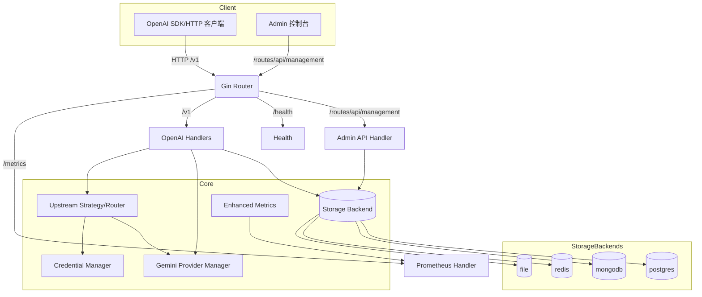

# 架构总览

本项目将 Gemini Code Assist 暴露为 OpenAI 兼容与 Gemini 原生双端点网关，提供凭证调度、模型注册、装配路由与可观测性。

## 总体架构

## 关键数据流
- OpenAI 兼容：/v1/chat/completions → 请求验证 → 翻译为 Gemini → 路由策略选择凭证/后端 → 生成/流式 → 统一用量统计与指标
- 管理 API：/routes/api/management → 鉴权（密钥/会话）→ 凭证/模型/配置操作 → 持久化到存储
- 指标：中间件采集 HTTP/上游/流式等指标 → /metrics 暴露 Prometheus 文本格式

## 模块边界
- internal/handlers/openai：对外协议、请求校验、翻译与响应整形
- internal/upstream：Gemini 客户端与 Provider 管理，含路由策略
- internal/storage：统一接口 + file/redis/mongodb/postgres 实现
- internal/middleware：Auth、Metrics、Recovery、RateLimit 等
- internal/monitoring：增强指标（存储/计划执行/连接池）
- internal/server：路由装配、管理资源、守卫

## 安全与并发
- SQL：全部参数化查询；批量使用 PrepareContext
- XSS：默认 textContent 渲染；innerHTML 仅用于可信模板，需 escapeHTML
- 并发：RWMutex/atomic/信号量；I/O 均支持 Context 取消与超时

## 路由一览
- OpenAI：/v1/models、/v1/chat/completions、/v1/completions、/v1/responses、/v1/images/generations
- 管理：/routes/api/management 下见 API 文档；含 system/health/metrics/credentials/config/models...

