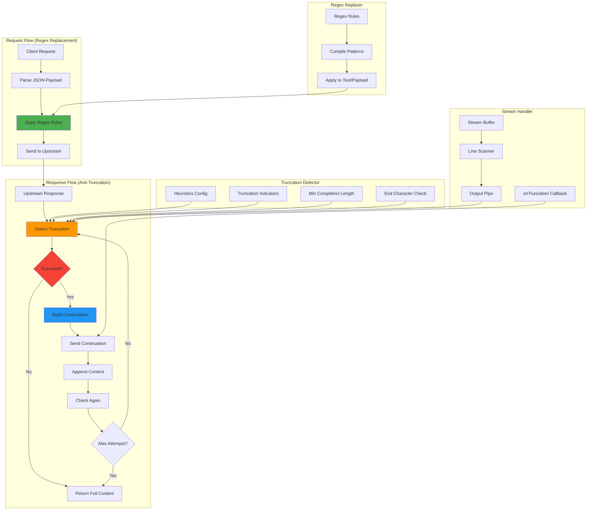

# Antitrunc 模块文档

## 模块定位与职责

Antitrunc 模块是 gcli2api-go 的**抗截断与文本预处理核心**，负责检测响应截断、自动续写和正则替换：

- **截断检测**：基于启发式规则检测响应是否被截断（长度、结束符、截断标记）
- **自动续写**：检测到截断后自动构建续写请求，追加到原响应
- **正则替换**：在请求发送前对文本内容应用正则表达式替换规则
- **流式支持**：支持流式和非流式两种模式的抗截断处理
- **配置化规则**：支持动态更新截断指示符和正则替换规则
- **多次重试**：支持配置最大续写次数，避免无限循环

## 目录结构与文件职责

```
internal/antitrunc/
├── shared.go                    # 截断检测、续写请求构建、配置管理
├── regex_replacer.go            # 正则替换器（规则管理、文本/Payload 替换）
└── *_test.go                    # 单元测试文件

internal/features/
├── antitruncation.go            # 抗截断处理器（流式/非流式、重试逻辑）
└── format_detector.go           # 格式检测（辅助功能）
```

## 核心设计与数据流

### 1. 抗截断工作流程

```
原始响应
    ↓
截断检测（AppearsTruncated）
    ↓
是否截断？
    ├─ 否 → 返回原响应
    └─ 是 → 构建续写请求（BuildContinuationPayload）
            ↓
        发送续写请求到上游
            ↓
        追加续写内容
            ↓
        再次检测截断
            ↓
        达到最大次数？
            ├─ 是 → 返回累积内容
            └─ 否 → 继续续写
```

### 2. 截断检测启发式规则

`AppearsTruncated()` 使用以下规则判断截断：

**排除规则**（不是截断）：
1. 文本为空
2. 包含 `[DONE]` 标记
3. 以句号、感叹号、问号、引号等结束符结尾
4. 长度 < 1000 字符

**截断规则**（是截断）：
1. 以截断指示符结尾（`...`、`[truncated]`、`[继续]`、`[未完]` 等）
2. 长度 > 1000 字符且无明确结束符

### 3. 续写请求构建

`BuildContinuationPayload()` 构建续写请求：

```json
{
  "model": "gemini-2.5-pro",
  "project": "project-id",
  "request": {
    "contents": [
      // ... 原始对话历史
      {
        "role": "model",
        "parts": [{"text": "已生成的内容（清理后）"}]
      },
      {
        "role": "user",
        "parts": [{"text": "continue"}]
      }
    ]
  }
}
```

**关键步骤**：
1. 克隆原始 Payload
2. 清理已生成内容（移除 `[DONE]` 标记、Sanitize）
3. 追加 `model` 角色消息（已生成内容）
4. 追加 `user` 角色消息（`"continue"` 指令）

### 4. 正则替换流程

```
请求 Payload
    ↓
解析 JSON（request.contents[].parts[].text）
    ↓
应用正则规则（按顺序）
    ↓
替换文本内容
    ↓
重新序列化 JSON
    ↓
发送到上游
```

**应用时机**：
- 在请求发送到上游**之前**
- 在模型回退重试**之前**
- 支持流式和非流式请求

### 5. 流式抗截断

`StreamHandler.WrapStream()` 包装流式响应：

```
原始 Stream Reader
    ↓
逐行读取并缓冲
    ↓
同时写入输出 Pipe
    ↓
流结束后检测截断
    ↓
如果截断 → 调用 onTruncation 回调
    ↓
读取续写流并追加到输出
    ↓
重复检测直到完成或达到最大次数
```

## 关键类型与接口

### Config 结构

```go
type Config struct {
    MinCompletionLen     int      // 最小完成长度（默认 50）
    TruncationIndicators []string // 截断指示符列表
    RegexReplacer        *RegexReplacer // 可选的正则替换器
}
```

### RegexRule 结构

```go
type RegexRule struct {
    Name        string         // 规则名称
    Pattern     string         // 正则表达式模式
    Replacement string         // 替换文本
    Enabled     bool           // 是否启用
    compiled    *regexp.Regexp // 编译后的正则（内部）
}
```

### RegexReplacer 结构

```go
type RegexReplacer struct {
    rules []RegexRule  // 规则列表
    mu    sync.RWMutex // 读写锁
}
```

**核心方法**：
- `ApplyToText(text string) string`：对纯文本应用替换
- `ApplyToPayload(payload []byte) []byte`：对 JSON Payload 应用替换
- `UpdateRules(rules []RegexRule) error`：动态更新规则

### AntiTruncationConfig 结构

```go
type AntiTruncationConfig struct {
    MaxAttempts int  // 最大续写次数（默认 3）
    Enabled     bool // 是否启用
}
```

### TruncationDetector 结构

```go
type TruncationDetector struct {
    config     AntiTruncationConfig
    heuristics antitrunc.Config
}
```

**核心方法**：
- `IsTruncated(content string) bool`：检测内容是否截断

### StreamHandler 结构

```go
type StreamHandler struct {
    detector *TruncationDetector
    config   AntiTruncationConfig
}
```

**核心方法**：
- `WrapStream(ctx, reader, onTruncation) (io.Reader, error)`：包装流式响应
- `DetectAndHandle(ctx, content, onTruncation) (string, error)`：处理非流式响应

## 重要配置项

### 抗截断配置

| 配置项 | 类型 | 默认值 | 说明 |
|--------|------|--------|------|
| `anti_truncation_enabled` | bool | `false` | 是否启用抗截断 |
| `anti_truncation_max` | int | `3` | 最大续写次数 |

### 截断指示符（默认）

| 指示符 | 说明 |
|--------|------|
| `...` | 省略号 |
| `[truncated]` | 截断标记 |
| `[continued]` | 继续标记 |
| `[incomplete]` | 不完整标记 |
| `<truncated>` | XML 风格截断标记 |
| `[to be continued]` | 待续标记 |
| `[继续]` | 中文继续标记 |
| `[continue]` | 继续标记 |
| `[未完]` | 中文未完标记 |

### 正则替换配置

通过配置文件定义：

```yaml
regex_replacements:
  - name: "remove_markdown_comments"
    pattern: "<!--.*?-->"
    replacement: ""
    enabled: true
  - name: "normalize_quotes"
    pattern: "["""]"
    replacement: "\""
    enabled: true
```

## 与其他模块的依赖关系

### 依赖的模块

- **common**：使用 `HasDoneMarker()`、`StripDoneMarker()` 检测和清理 `[DONE]` 标记
- **translator**：使用 `SanitizeOutputText()` 清理续写文本
- **models**：使用 `IsAntiTruncation()` 检测模型名称是否包含抗截断前缀

### 被依赖的模块

- **handlers/openai**：在 `/v1/chat/completions` 中使用 `StreamHandler.DetectAndHandle()`
- **handlers/gemini**：在 Gemini 端点中使用 `ApplyRegexReplacements()`
- **upstream**：在请求发送前应用正则替换

## 可执行示例

### 示例 1：检测截断

```go
package main

import (
    "fmt"
    "gcli2api-go/internal/antitrunc"
)

func main() {
    cfg := antitrunc.DefaultConfig()
    
    // 测试不同的响应
    responses := []string{
        "这是一个完整的句子。",
        "这是一个未完成的句子...",
        "这是一个很长的响应" + strings.Repeat("内容", 500),
        "这是一个截断的响应[truncated]",
    }
    
    for i, resp := range responses {
        truncated := cfg.AppearsTruncated(resp)
        fmt.Printf("%d. Truncated: %v (len=%d)\n", i+1, truncated, len(resp))
    }
    
    // 输出：
    // 1. Truncated: false (len=27)
    // 2. Truncated: true (len=33)
    // 3. Truncated: true (len=1012)
    // 4. Truncated: true (len=39)
}
```

### 示例 2：构建续写请求

```go
package main

import (
    "encoding/json"
    "fmt"
    "gcli2api-go/internal/antitrunc"
)

func main() {
    // 原始请求 Payload
    original := map[string]interface{}{
        "model":   "gemini-2.5-pro",
        "project": "my-project",
        "request": map[string]interface{}{
            "contents": []interface{}{
                map[string]interface{}{
                    "role": "user",
                    "parts": []interface{}{
                        map[string]interface{}{"text": "写一篇长文章"},
                    },
                },
            },
        },
    }
    
    origBytes, _ := json.Marshal(original)
    
    // 已生成的内容（被截断）
    soFar := "这是文章的开头部分..."
    
    // 构建续写请求
    continuation := antitrunc.BuildContinuationPayload(origBytes, soFar, "continue")
    
    var result map[string]interface{}
    json.Unmarshal(continuation, &result)
    
    jsonData, _ := json.MarshalIndent(result, "", "  ")
    fmt.Println(string(jsonData))
}
```

### 示例 3：创建正则替换器

```go
package main

import (
    "fmt"
    "gcli2api-go/internal/antitrunc"
)

func main() {
    // 定义替换规则
    rules := []antitrunc.RegexRule{
        {
            Name:        "remove_html_tags",
            Pattern:     "<[^>]+>",
            Replacement: "",
            Enabled:     true,
        },
        {
            Name:        "normalize_whitespace",
            Pattern:     "\\s+",
            Replacement: " ",
            Enabled:     true,
        },
    }
    
    // 创建替换器
    replacer, err := antitrunc.NewRegexReplacer(rules)
    if err != nil {
        panic(err)
    }
    
    // 应用替换
    text := "<p>Hello   World</p>"
    result := replacer.ApplyToText(text)
    
    fmt.Printf("Original: %s\n", text)
    fmt.Printf("Result: %s\n", result)
    
    // 输出：
    // Original: <p>Hello   World</p>
    // Result: Hello World
}
```

### 示例 4：应用正则替换到 Payload

```go
package main

import (
    "encoding/json"
    "fmt"
    "gcli2api-go/internal/antitrunc"
)

func main() {
    // 创建替换器
    rules := []antitrunc.RegexRule{
        {
            Name:        "remove_emojis",
            Pattern:     "[😀-🙏]",
            Replacement: "",
            Enabled:     true,
        },
    }
    
    replacer, _ := antitrunc.NewRegexReplacer(rules)
    
    // 原始 Payload
    payload := map[string]interface{}{
        "model":   "gemini-2.5-pro",
        "project": "my-project",
        "request": map[string]interface{}{
            "contents": []interface{}{
                map[string]interface{}{
                    "role": "user",
                    "parts": []interface{}{
                        map[string]interface{}{"text": "Hello 😀 World 🙏"},
                    },
                },
            },
        },
    }
    
    payloadBytes, _ := json.Marshal(payload)
    
    // 应用替换
    result := replacer.ApplyToPayload(payloadBytes)
    
    var resultMap map[string]interface{}
    json.Unmarshal(result, &resultMap)
    
    jsonData, _ := json.MarshalIndent(resultMap, "", "  ")
    fmt.Println(string(jsonData))
}
```

### 示例 5：非流式抗截断处理

```go
package main

import (
    "context"
    "fmt"
    "gcli2api-go/internal/features"
)

func main() {
    // 创建 StreamHandler
    config := features.AntiTruncationConfig{
        MaxAttempts: 3,
        Enabled:     true,
    }
    handler := features.NewStreamHandler(config)

    // 模拟被截断的响应
    content := "这是一个很长的响应内容..."

    // 定义续写回调
    onTruncation := func(ctx context.Context) (string, error) {
        // 模拟续写请求
        return "这是续写的内容。", nil
    }

    // 检测并处理截断
    fullContent, err := handler.DetectAndHandle(context.Background(), content, onTruncation)
    if err != nil {
        panic(err)
    }

    fmt.Printf("Original: %s\n", content)
    fmt.Printf("Full: %s\n", fullContent)

    // 输出：
    // Original: 这是一个很长的响应内容...
    // Full: 这是一个很长的响应内容...这是续写的内容。
}
```

### 示例 6：动态更新正则规则

```go
package main

import (
    "fmt"
    "gcli2api-go/internal/antitrunc"
)

func main() {
    // 创建初始替换器
    rules := []antitrunc.RegexRule{
        {
            Name:        "rule1",
            Pattern:     "foo",
            Replacement: "bar",
            Enabled:     true,
        },
    }

    replacer, _ := antitrunc.NewRegexReplacer(rules)

    text := "foo baz"
    fmt.Printf("Before: %s\n", replacer.ApplyToText(text))

    // 动态更新规则
    newRules := []antitrunc.RegexRule{
        {
            Name:        "rule2",
            Pattern:     "baz",
            Replacement: "qux",
            Enabled:     true,
        },
    }

    replacer.UpdateRules(newRules)

    fmt.Printf("After: %s\n", replacer.ApplyToText(text))

    // 输出：
    // Before: bar baz
    // After: foo qux
}
```

### 示例 7：完整的抗截断流程（OpenAI Handler）

```go
package main

import (
    "context"
    "encoding/json"
    "gcli2api-go/internal/antitrunc"
    "gcli2api-go/internal/features"
    "gcli2api-go/internal/models"
)

func main() {
    model := "流式抗截断/gemini-2.5-pro"

    // 检查是否启用抗截断
    if models.IsAntiTruncation(model) {
        // 创建 StreamHandler
        sh := features.NewStreamHandler(features.AntiTruncationConfig{
            MaxAttempts: 3,
            Enabled:     true,
        })

        // 模拟原始响应
        textOut := "这是一个被截断的响应..."

        // 定义续写回调
        contFn := func(ctx context.Context) (string, error) {
            // 构建续写请求
            gemReq := map[string]interface{}{
                "contents": []interface{}{
                    map[string]interface{}{
                        "role": "user",
                        "parts": []interface{}{
                            map[string]interface{}{"text": "原始问题"},
                        },
                    },
                },
            }

            cont := gemReq
            carr, _ := cont["contents"].([]interface{})

            // 追加已生成内容
            if seed := antitrunc.CleanContinuationText(textOut); seed != "" {
                carr = append(carr, map[string]interface{}{
                    "role": "model",
                    "parts": []interface{}{
                        map[string]interface{}{"text": seed},
                    },
                })
            }

            // 追加续写指令
            carr = append(carr, map[string]interface{}{
                "role": "user",
                "parts": []interface{}{
                    map[string]interface{}{"text": "continue"},
                },
            })
            cont["contents"] = carr

            // 构建完整 Payload
            payload := map[string]interface{}{
                "model":   "gemini-2.5-pro",
                "project": "my-project",
                "request": cont,
            }

            // 发送续写请求（模拟）
            // resp, _ := upstream.Call(ctx, payload)

            return "续写的内容。", nil
        }

        // 检测并处理截断
        full, err := sh.DetectAndHandle(context.Background(), textOut, contFn)
        if err == nil && full != "" {
            textOut = full
        }

        fmt.Printf("Final: %s\n", textOut)
    }
}
```

### 示例 8：清理续写文本

```go
package main

import (
    "fmt"
    "gcli2api-go/internal/antitrunc"
)

func main() {
    // 包含 [DONE] 标记的文本
    text := "这是响应内容[DONE]"

    // 清理文本
    cleaned := antitrunc.CleanContinuationText(text)

    fmt.Printf("Original: %s\n", text)
    fmt.Printf("Cleaned: %s\n", cleaned)

    // 输出：
    // Original: 这是响应内容[DONE]
    // Cleaned: 这是响应内容
}
```

### 示例 9：检测响应完整性

```go
package main

import (
    "fmt"
    "gcli2api-go/internal/antitrunc"
)

func main() {
    cfg := antitrunc.DefaultConfig()

    // 测试不同的响应
    responses := map[string]string{
        "完整句子":   "这是一个完整的句子。",
        "短文本":    "短",
        "包含DONE": "响应内容[DONE]",
        "长文本":    "这是一个很长的响应" + strings.Repeat("内容", 100),
    }

    for name, resp := range responses {
        complete := cfg.ResponseComplete(resp)
        fmt.Printf("%s: Complete=%v\n", name, complete)
    }

    // 输出：
    // 完整句子: Complete=true
    // 短文本: Complete=false
    // 包含DONE: Complete=true
    // 长文本: Complete=true
}
```

### 示例 10：获取正则规则列表

```go
package main

import (
    "fmt"
    "gcli2api-go/internal/antitrunc"
)

func main() {
    // 创建替换器
    rules := []antitrunc.RegexRule{
        {
            Name:        "rule1",
            Pattern:     "foo",
            Replacement: "bar",
            Enabled:     true,
        },
        {
            Name:        "rule2",
            Pattern:     "baz",
            Replacement: "qux",
            Enabled:     false,
        },
    }

    replacer, _ := antitrunc.NewRegexReplacer(rules)

    // 获取规则列表（仅包含启用的规则）
    activeRules := replacer.GetRules()

    fmt.Printf("Active rules: %d\n", len(activeRules))
    for _, rule := range activeRules {
        fmt.Printf("- %s: %s → %s\n", rule.Name, rule.Pattern, rule.Replacement)
    }

    // 输出：
    // Active rules: 1
    // - rule1: foo → bar
}
```

## 架构示意图



## 已知限制

1. **启发式检测不精确**
   - 基于长度和结束符的检测可能误判
   - 解决方案：支持自定义截断指示符和最小长度

2. **续写次数固定**
   - 最大续写次数硬编码为 3 次
   - 解决方案：通过配置项 `anti_truncation_max` 调整

3. **续写指令固定**
   - 续写指令固定为 `"continue"`
   - 解决方案：支持配置自定义续写指令

4. **正则替换性能**
   - 每次请求都重新解析 JSON 并应用替换
   - 解决方案：缓存编译后的正则表达式，优化 JSON 解析

5. **流式抗截断延迟**
   - 流式模式需要等待流结束才能检测截断
   - 解决方案：实现增量检测，提前触发续写

6. **无上下文保留**
   - 续写请求不保留原始请求的所有参数（如 temperature、top_p）
   - 解决方案：完整克隆原始请求参数

7. **并发安全性**
   - RegexReplacer 使用读写锁，高并发下可能成为瓶颈
   - 解决方案：使用 Copy-on-Write 策略

8. **错误处理不完善**
   - 续写失败时直接返回部分内容，无重试机制
   - 解决方案：支持续写失败时的回退策略

## 最佳实践

1. **谨慎启用抗截断**：仅在必要时启用，避免额外的 API 调用和延迟
2. **调整最大次数**：根据模型特性调整 `anti_truncation_max`（Pro 模型建议 2-3 次，Flash 模型建议 1-2 次）
3. **使用模型前缀**：通过 `流式抗截断/` 前缀为特定请求启用抗截断
4. **监控续写频率**：通过 `monitoring.AntiTruncationAttemptsTotal` 指标监控续写频率
5. **优化正则规则**：避免过于复杂的正则表达式，影响性能
6. **测试截断检测**：使用实际响应测试截断检测的准确性
7. **配置截断指示符**：根据实际使用场景补充自定义截断指示符
8. **限制续写长度**：避免续写内容过长导致 Token 超限
9. **日志记录**：启用 Debug 日志查看截断检测和续写过程
10. **A/B 测试**：对比启用/禁用抗截断的效果，评估必要性

## 截断检测规则速查表

| 条件 | 判断结果 | 说明 |
|------|----------|------|
| 文本为空 | 不截断 | 无内容 |
| 包含 `[DONE]` | 不截断 | 明确完成标记 |
| 以 `.!?"')` 结尾 | 不截断 | 明确结束符 |
| 长度 < 50 | 不截断 | 太短，无法判断 |
| 以 `...` 结尾 | **截断** | 省略号 |
| 以 `[truncated]` 结尾 | **截断** | 截断标记 |
| 以 `[继续]` 结尾 | **截断** | 中文继续标记 |
| 长度 > 1000 且无结束符 | **截断** | 长文本无明确结束 |

## 正则替换常见场景

| 场景 | Pattern | Replacement | 说明 |
|------|---------|-------------|------|
| 移除 HTML 标签 | `<[^>]+>` | `""` | 清理 HTML |
| 规范化空白 | `\\s+` | `" "` | 多个空格合并为一个 |
| 移除 Markdown 注释 | `<!--.*?-->` | `""` | 清理注释 |
| 规范化引号 | `["""]` | `"\""` | 统一引号样式 |
| 移除 Emoji | `[😀-🙏]` | `""` | 清理表情符号 |
| 移除 URL | `https?://[^\\s]+` | `""` | 清理链接 |
```


