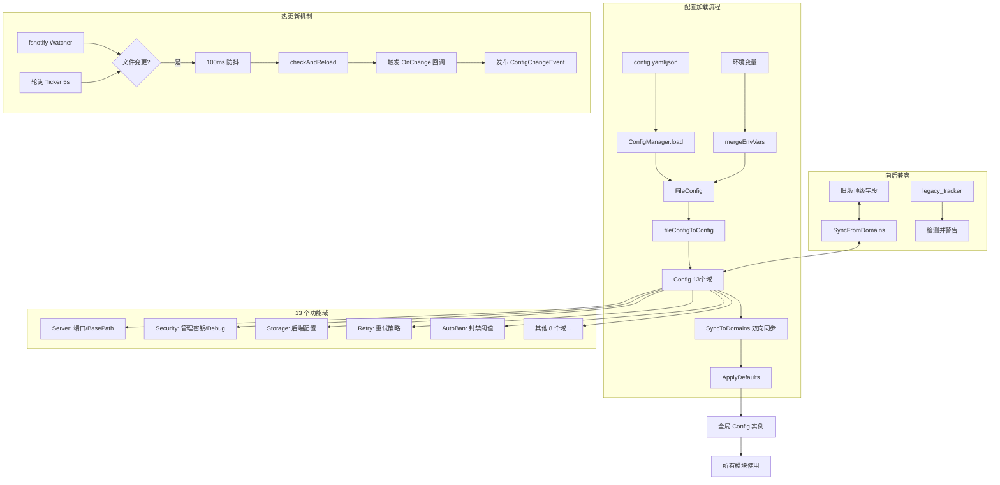

# Config 模块文档

## Phase 1-3 改进功能

### Header 白名单配置（Phase 1）

**配置项**：`security.header_passthrough_config`

**功能**：替代旧的 `header_passthrough` 布尔值，提供更精细的 Header 透传控制。

**配置示例**：
```yaml
security:
  header_passthrough_config:
    enabled: true
    allow_list:
      - "X-Request-ID"
      - "X-Correlation-ID"
      - "X-Trace-ID"
    deny_list:
      - "Authorization"
      - "Cookie"
      - "X-API-Key"
    audit_log: true
```

**字段说明**：
- `enabled`：是否启用 Header 透传（默认 false）
- `allow_list`：允许透传的 Header 列表（白名单）
- `deny_list`：禁止透传的 Header 列表（黑名单）
- `audit_log`：是否记录 Header 过滤审计日志（默认 false）

**过滤逻辑**：
1. 如果 `enabled=false`，不透传任何 Header
2. 如果 Header 在 `deny_list` 中，拒绝透传
3. 如果 `allow_list` 为空，允许所有未被拒绝的 Header
4. 如果 `allow_list` 不为空，只允许列表中的 Header

**向后兼容**：
- 旧配置 `header_passthrough: true` 自动转换为 `header_passthrough_config.enabled: true`
- 旧配置 `header_passthrough: false` 自动转换为 `header_passthrough_config.enabled: false`

### 管理端点只读密钥与路径级写操作（Phase 1）

**配置项**：`management_readonly_key`，`security.management_write_path_allowlist`，`security.management_write_path_blocklist`

**功能**：为管理端点提供只读权限密钥，区分只读和管理员权限。

**配置示例**：
```yaml
management_key: "admin-secret-key"
management_readonly_key: "readonly-secret-key"
security:
  management_write_path_blocklist:
    - "/routes/api/management/deploy*"
    - "/routes/api/management/import*"
    - "*/trigger-reindex"
  management_write_path_allowlist:
    - "/routes/api/management/logs*"
```

**权限级别**：
- `management_key`：管理员权限，允许所有操作（包括写操作）
- `management_readonly_key`：只读权限，只允许 GET 请求和查询操作

**写操作判定（兜底）**：
- 非 `GET/HEAD/OPTIONS` 一律视为写操作。
- 对只读方法：
  - 命中 `management_write_path_allowlist` 视为“读”。
  - 否则命中 `management_write_path_blocklist` 视为“写”。
  - 优先级：Allowlist > Blocklist。

**使用场景**：
- 监控系统使用只读密钥访问指标和状态
- 管理员使用管理密钥进行配置变更
- 审计系统使用只读密钥查询历史记录

### 配置热重载（Phase 3）

**功能**：自动监听配置文件变化并重新加载。

**实现方式**：
- 使用 `fsnotify` 监听 `config.yaml` 文件变化
- 防抖动机制（100ms）避免频繁重载
- 同时监听配置文件和配置目录（捕获原子写操作）

**配置变更事件**：
- 通过 `ConfigManager.OnChange()` 注册回调函数
- 通过 `events.Publisher` 发布配置变更事件

**日志记录**：
- 记录变更的配置项和新旧值
- 记录重载成功/失败状态

**示例**：
```go
configMgr.OnChange(func(newConfig *config.FileConfig) {
    log.Info("Config reloaded")
    // 处理配置变更
})
```

### 凭证文件监听（Phase 3）

**功能**：自动监听凭证目录变化并重新加载凭证。

**实现方式**：
- 使用 `fsnotify` 监听 `auth_dir` 目录变化
- 防抖动机制（300ms）避免频繁重载
- 只监听 `.json` 文件变化，忽略 `.state.json` 文件

**凭证变更事件**：
- 通过 `events.Publisher` 发布凭证变更事件
- 触发缓存失效钩子

**日志记录**：
- 记录凭证加载成功/失败状态
- 记录新增/删除/更新的凭证

**示例**：
```go
credMgr.WatchAuthDirectory(ctx)
```


# Config 模块文档

## 模块定位

Config 模块是 gcli2api-go 的配置管理核心，负责：
- 从 YAML/JSON 文件加载配置
- 从环境变量覆盖配置
- 热更新配置（基于 fsnotify）
- 域化配置结构（Domain-based Configuration）
- 向后兼容旧版顶级字段

**设计理念**：
- **域驱动设计**：将配置按功能域（Server、Security、Storage 等）组织，提高可维护性
- **双向同步**：支持旧版顶级字段与新版域结构的双向同步，确保平滑迁移
- **环境变量优先**：环境变量可覆盖文件配置，便于容器化部署
- **热更新**：配置文件变更时自动重载，无需重启服务

---

## 目录结构与文件职责

```
internal/config/
├── config.go                  # 主配置结构体 Config，包含 13 个域配置
├── config_types.go            # FileConfig 结构体（文件格式）
├── config_domains.go          # 13 个域配置结构体定义
├── config_manager.go          # ConfigManager：热更新管理器
├── config_watcher.go          # fsnotify 文件监听与轮询回退
├── config_loader.go           # YAML/JSON 文件加载与保存
├── config_env.go              # 环境变量合并到 FileConfig
├── env_loader.go              # 纯环境变量加载（无文件时）
├── env_helpers.go             # 环境变量解析辅助函数
├── defaults.go                # 集中式默认值定义（DefaultValues）
├── config_defaults.go         # 默认配置生成（含正则替换规则）
├── file_convert.go            # FileConfig → Config 转换
├── legacy_tracker.go          # 旧版字段使用追踪与警告
├── update_table.go            # 表驱动的配置更新逻辑
├── validator.go               # 配置验证（端口、路径等）
├── parse.go                   # 解析辅助函数（端口、整数等）
└── management.go              # 管理 API 配置辅助函数
```

---

## 核心设计

### 1. 双层配置结构

#### FileConfig（文件层）
- 直接映射 YAML/JSON 文件结构
- 扁平化字段，便于序列化
- 示例：`openai_port: 8317`

#### Config（运行时层）
- 包含 13 个域配置子结构体
- 保留顶级字段用于向后兼容（标记为 Deprecated）
- 示例：`cfg.Server.OpenAIPort` 和 `cfg.OpenAIPort`（同步）

### 2. 13 个功能域

| 域名 | 结构体 | 职责 |
|------|--------|------|
| Server | `ServerConfig` | 端口、BasePath、WebAdmin、RunProfile |
| Upstream | `UpstreamConfig` | 上游凭证（OpenAI/Gemini Key、CodeAssist、GoogleToken） |
| Security | `SecurityConfig` | 管理密钥、远程访问控制、HeaderPassThrough、Debug |
| Execution | `ExecutionConfig` | 并发控制、轮换策略、环境凭证自动加载 |
| Storage | `StorageConfig` | 存储后端（file/redis/mongodb/postgres/git） |
| Retry | `RetryConfig` | 重试策略、超时配置 |
| RateLimit | `RateLimitConfig` | 速率限制、用量重置策略 |
| APICompat | `APICompatConfig` | OpenAI 兼容性、模型偏好、禁用列表 |
| ResponseShaping | `ResponseShapingConfig` | 抗截断、假流式、兼容模式、正则替换 |
| OAuth | `OAuthConfig` | OAuth 客户端凭证、刷新策略 |
| AutoBan | `AutoBanConfig` | 自动封禁阈值、自动恢复策略 |
| AutoProbe | `AutoProbeConfig` | 定时活性探测配置 |
| Routing | `RoutingConfig` | 路由粘性、冷却策略、状态持久化 |

### 3. 配置加载流程

```
1. 查找配置文件
   ├─ 指定路径（命令行参数）
   ├─ 当前目录：config.yaml / config.yml / config.json
   ├─ 用户目录：~/.gcli2api/config.yaml
   └─ 系统目录：/etc/gcli2api/config.yaml

2. 解析文件（YAML/JSON）
   └─ 生成 FileConfig

3. 合并环境变量
   └─ 环境变量覆盖文件配置

4. 转换为 Config
   ├─ FileConfig → Config（file_convert.go）
   ├─ 应用 RunProfile（prod/production 强制关闭 pprof）
   └─ 双向同步：SyncToDomains()

5. 应用默认值
   └─ ApplyDefaults()

6. 启动热更新监听
   ├─ fsnotify（优先）
   └─ 轮询（回退，5 秒间隔）
```

### 4. 热更新机制

**fsnotify 监听**：
- 监听配置文件和所在目录（捕获原子写入）
- 100ms 防抖，避免多次触发
- 失败时自动回退到轮询模式

**轮询模式**：
- 每 5 秒检查文件修改时间
- 适用于 fsnotify 不可用的环境（如某些容器）

**变更通知**：
- 回调函数：`ConfigManager.OnChange(func(*FileConfig))`
- 事件发布：通过 `events.Publisher` 广播 `ConfigChangeEvent`

### 5. 向后兼容策略

**双向同步**：
- `SyncFromDomains()`：域结构 → 顶级字段
- `SyncToDomains()`：顶级字段 → 域结构

**弃用警告**：
- `legacy_tracker.go` 使用反射检测旧字段使用
- 首次使用时记录警告日志
- 建议迁移路径：`legacy_field → domain.field`

**弃用计划**：
```
v2.x（当前）：保留，双向同步正常工作
v3.0（计划）：标记 @deprecated，编译时警告
v4.0（未来）：完全移除
```

---

## 关键类型与接口

### Config 结构体

<augment_code_snippet path="gcli2api-go/internal/config/config.go" mode="EXCERPT">
````go
type Config struct {
    // 13 个核心配置域
    Server          ServerConfig
    Upstream        UpstreamConfig
    Security        SecurityConfig
    Execution       ExecutionConfig
    Storage         StorageConfig
    Retry           RetryConfig
    RateLimit       RateLimitConfig
    APICompat       APICompatConfig
    ResponseShaping ResponseShapingConfig
    OAuth           OAuthConfig
    AutoBan         AutoBanConfig
    AutoProbe       AutoProbeConfig
    Routing         RoutingConfig

    // 向后兼容的顶级字段（Deprecated）
    OpenAIPort string
    GeminiPort string
    // ... 100+ 个旧字段
}
````
</augment_code_snippet>

### ConfigManager 结构体

<augment_code_snippet path="gcli2api-go/internal/config/config_manager.go" mode="EXCERPT">
````go
type ConfigManager struct {
    mu         sync.RWMutex
    config     *FileConfig
    configPath string
    stopCh     chan struct{}
    onChange   []func(*FileConfig)
    lastMod    time.Time
    publisher  events.Publisher
}
````
</augment_code_snippet>

### 域配置示例

<augment_code_snippet path="gcli2api-go/internal/config/config_domains.go" mode="EXCERPT">
````go
// ServerConfig 服务器和端点配置
type ServerConfig struct {
    OpenAIPort      string
    GeminiPort      string
    BasePath        string
    WebAdminEnabled bool
    RunProfile      string
}

// SecurityConfig 安全和管理访问配置
type SecurityConfig struct {
    ManagementKey            string
    ManagementKeyHash        string
    ManagementReadOnly       bool
    ManagementAllowRemote    bool
    ManagementRemoteTTlHours int
    ManagementRemoteAllowIPs []string
    AuthDir                  string
    HeaderPassThrough        bool
    Debug                    bool
    LogFile                  string
}
````
</augment_code_snippet>

---

## 重要配置项

### 服务器配置（Server）

| 配置项 | 环境变量 | 默认值 | 说明 |
|--------|----------|--------|------|
| `server.openai_port` | `OPENAI_PORT` | `8317` | OpenAI 兼容端点监听端口 |
| `server.gemini_port` | `GEMINI_PORT` | `8318` | Gemini 原生端点监听端口 |
| `server.base_path` | `BASE_PATH` | `""` | API 路径前缀（如 `/api`） |
| `server.web_admin_enabled` | `WEB_ADMIN_ENABLED` | `true` | 是否启用 Web 管理控制台 |
| `server.run_profile` | `RUN_PROFILE` | `""` | 运行配置（`prod` 强制关闭 pprof） |

### 安全配置（Security）

| 配置项 | 环境变量 | 默认值 | 说明 |
|--------|----------|--------|------|
| `security.management_key` | `MANAGEMENT_KEY` | `""` | 管理 API 密钥（明文） |
| `security.management_key_hash` | `MANAGEMENT_KEY_HASH` | `""` | 管理 API 密钥（bcrypt 哈希） |
| `security.management_allow_remote` | `MANAGEMENT_ALLOW_REMOTE` | `false` | 是否允许远程访问管理 API |
| `security.header_passthrough` | `HEADER_PASSTHROUGH` | `false` | 是否透传请求头到上游（**风险开关**） |
| `security.debug` | `DEBUG` | `false` | 调试模式 |

**安全约束**：
- 当 `management_allow_remote=true` 时，`header_passthrough` 强制设为 `false`（防止头注入攻击）

### 存储配置（Storage）

| 配置项 | 环境变量 | 默认值 | 说明 |
|--------|----------|--------|------|
| `storage.backend` | `STORAGE_BACKEND` | `file` | 存储后端：`file`/`redis`/`mongodb`/`postgres` |
| `storage.base_dir` | `STORAGE_BASE_DIR` | `~/.gcli2api/storage` | 文件存储根目录 |
| `storage.redis_addr` | `REDIS_ADDR` | `localhost:6379` | Redis 地址 |
| `storage.mongo_uri` | `MONGODB_URI` | `""` | MongoDB 连接字符串 |
| `storage.postgres_dsn` | `POSTGRES_DSN` | `""` | PostgreSQL DSN |

### 重试配置（Retry）

| 配置项 | 环境变量 | 默认值 | 说明 |
|--------|----------|--------|------|
| `retry.enabled` | `RETRY_429_ENABLED` | `true` | 是否启用重试 |
| `retry.max` | `RETRY_429_MAX_RETRIES` | `3` | 最大重试次数 |
| `retry.interval_sec` | `RETRY_429_INTERVAL` | `1` | 初始重试间隔（秒） |
| `retry.max_interval_sec` | `RETRY_MAX_INTERVAL` | `8` | 最大重试间隔（秒，指数退避） |
| `retry.on_5xx` | `RETRY_5XX_ENABLED` | `true` | 是否对 5xx 错误重试 |

### 自动封禁配置（AutoBan）

| 配置项 | 环境变量 | 默认值 | 说明 |
|--------|----------|--------|------|
| `auto_ban.enabled` | `AUTO_BAN_ENABLED` | `true` | 是否启用自动封禁 |
| `auto_ban.ban_429_threshold` | `AUTO_BAN_429_THRESHOLD` | `3` | 429 错误阈值 |
| `auto_ban.ban_403_threshold` | `AUTO_BAN_403_THRESHOLD` | `5` | 403 错误阈值 |
| `auto_ban.consecutive_fails` | `AUTO_BAN_CONSECUTIVE_FAILS` | `10` | 连续失败阈值 |
| `auto_ban.recovery_enabled` | `AUTO_RECOVERY_ENABLED` | `true` | 是否启用自动恢复 |
| `auto_ban.recovery_interval_min` | `AUTO_RECOVERY_INTERVAL_MIN` | `10` | 恢复检查间隔（分钟） |

---

## 与其他模块的依赖关系

### 被依赖方（Config 提供配置给）

- **所有模块**：Config 是全局配置源，所有模块都依赖它
- **server**：读取端口、BasePath、WebAdmin 配置
- **credential**：读取 AuthDir、OAuth、AutoBan、AutoProbe 配置
- **upstream**：读取 CodeAssist、Retry、Timeout 配置
- **storage**：读取 Storage 域配置
- **middleware**：读取 RateLimit、Security 配置
- **handlers**：读取 APICompat、ResponseShaping 配置

### 依赖方（Config 依赖）

- **events**：用于广播配置变更事件（`events.Publisher`）
- **constants**：读取默认超时常量（`constants.DefaultDialTimeout`）

---

## 可执行示例

### 示例 1：基本配置文件（config.yaml）

```yaml
# 服务器配置
openai_port: 8317
gemini_port: 8318
base_path: ""
web_admin_enabled: true

# 认证配置
auth_dir: ~/.gcli2api/auths
management_key: your-secret-key
management_allow_remote: false

# 存储配置
storage_backend: file
storage_base_dir: ~/.gcli2api/storage

# 重试配置
retry_enabled: true
retry_max: 3
retry_interval_sec: 1

# 自动封禁配置
auto_ban_enabled: true
auto_ban_429_threshold: 3
auto_recovery_enabled: true
auto_recovery_interval_min: 10
```

### 示例 2：使用域结构（推荐）

```yaml
server:
  openai_port: 8317
  gemini_port: 8318
  base_path: /api
  web_admin_enabled: true
  run_profile: prod

security:
  management_key: your-secret-key
  management_allow_remote: false
  header_passthrough: false
  debug: false

storage:
  backend: redis
  redis_addr: localhost:6379
  redis_password: ""
  redis_db: 0
  redis_prefix: "gcli2api:"

retry:
  enabled: true
  max: 3
  interval_sec: 1
  max_interval_sec: 8
  on_5xx: true
  on_network_error: true

auto_ban:
  enabled: true
  ban_429_threshold: 3
  ban_403_threshold: 5
  consecutive_fails: 10
  recovery_enabled: true
  recovery_interval_min: 10
```

### 示例 3：环境变量覆盖

```bash
# 服务器配置
export OPENAI_PORT=9000
export GEMINI_PORT=9001
export BASE_PATH=/api/v1

# 安全配置
export MANAGEMENT_KEY=my-secret-key
export MANAGEMENT_ALLOW_REMOTE=false
export DEBUG=true

# 存储配置
export STORAGE_BACKEND=redis
export REDIS_ADDR=redis:6379
export REDIS_PASSWORD=mypassword

# 启动服务（环境变量优先级高于文件）
./gcli2api-go
```

### 示例 4：代码中使用配置

```go
package main

import (
    "gcli2api-go/internal/config"
    "log"
)

func main() {
    // 加载配置（自动查找文件 + 环境变量）
    cfg := config.Load()

    // 推荐：使用域结构访问
    log.Printf("OpenAI Port: %s", cfg.Server.OpenAIPort)
    log.Printf("Storage Backend: %s", cfg.Storage.Backend)
    log.Printf("Retry Enabled: %v", cfg.Retry.Enabled)

    // 兼容：使用顶级字段（Deprecated）
    log.Printf("OpenAI Port (legacy): %s", cfg.OpenAIPort)

    // 获取 ConfigManager 用于热更新
    cm := config.GetConfigManager()
    if cm != nil {
        cm.OnChange(func(newCfg *config.FileConfig) {
            log.Println("Config reloaded!")
        })
    }
}
```

### 示例 5：动态更新配置

```go
package main

import (
    "gcli2api-go/internal/config"
    "log"
)

func main() {
    cfg := config.Load()
    cm := config.GetConfigManager()

    // 动态更新配置
    updates := map[string]interface{}{
        "debug":              true,
        "request_log":        true,
        "calls_per_rotation": 20,
    }

    if err := cm.UpdateConfig(updates); err != nil {
        log.Fatalf("Failed to update config: %v", err)
    }

    // 配置已保存到文件并触发热更新回调
    log.Println("Config updated successfully")
}
```

---

## 架构图



---

## 已知限制

1. **配置文件格式**：
   - 仅支持 YAML 和 JSON
   - 不支持 TOML、INI 等格式

2. **热更新限制**：
   - 某些配置项（如端口）需要重启服务才能生效
   - 热更新不会重新初始化已创建的对象（如 HTTP 服务器）

3. **环境变量命名**：
   - 环境变量名固定，不支持自定义前缀
   - 部分环境变量名与 YAML 字段名不完全一致（历史原因）

4. **域结构迁移**：
   - 旧版顶级字段仍在使用中，完全移除需等到 v4.0
   - 双向同步有性能开销（每次访问都需同步）

5. **配置验证**：
   - 当前验证较弱，部分无效配置可能导致运行时错误
   - 缺少配置 schema 验证

6. **并发安全**：
   - `ConfigManager` 使用读写锁保护，但频繁更新可能影响性能
   - 热更新回调在锁外执行，需注意回调函数的线程安全

---

## 最佳实践

1. **优先使用域结构**：
   ```go
   // 推荐
   port := cfg.Server.OpenAIPort

   // 不推荐（Deprecated）
   port := cfg.OpenAIPort
   ```

2. **环境变量用于敏感信息**：
   ```bash
   export MANAGEMENT_KEY=secret
   export REDIS_PASSWORD=password
   ```

3. **生产环境使用 RunProfile**：
   ```yaml
   server:
     run_profile: prod  # 自动关闭 pprof，强制 header_passthrough=false
   ```

4. **注册热更新回调**：
   ```go
   cm.OnChange(func(newCfg *config.FileConfig) {
       // 重新初始化需要更新的组件
   })
   ```

5. **配置文件版本控制**：
   - 提交 `config.example.yaml` 到版本库
   - 将 `config.yaml` 加入 `.gitignore`
