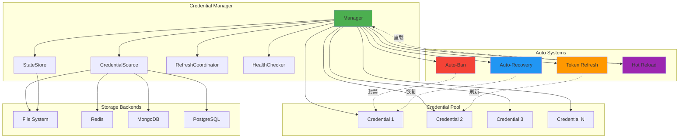

# Credential 模块文档

## 模块定位与职责

Credential 模块是 gcli2api-go 的**凭证管理核心**，负责 OAuth 凭证的全生命周期管理，包括：

- **凭证池管理**：多凭证轮换、健康检查、智能选择
- **自动封禁（Auto-Ban）**：基于错误码阈值的自动禁用机制
- **自动恢复（Auto-Recovery）**：定期尝试恢复被封禁的凭证
- **Token 刷新**：OAuth token 自动刷新与提前刷新策略
- **状态持久化**：凭证运行时状态（失败次数、封禁状态等）的持久化
- **并发控制**：每凭证并发限制，防止单凭证过载
- **热重载**：监听凭证文件变化，自动重新加载
- **健康评分**：基于成功率、响应时间、错误码等多维度的健康评分系统
- **缓存失效钩子**：凭证变更时自动触发缓存失效，确保缓存一致性

## 目录结构与文件职责

```
internal/credential/
├── manager.go                    # Manager 核心结构与初始化
├── types.go                      # Credential 类型定义与健康评分逻辑
├── source.go                     # 凭证来源接口定义
├── source_file.go                # 文件系统凭证来源实现
├── env_source.go                 # 环境变量凭证来源实现
├── manager_selection.go          # 凭证选择策略（轮换、健康检查）
├── manager_refresh.go            # OAuth token 刷新逻辑
├── manager_recovery.go           # 自动恢复逻辑
├── manager_locking.go            # 并发安全的凭证操作
├── manager_concurrency.go        # 每凭证并发控制
├── manager_batch.go              # 批量操作（启用/禁用/删除/恢复）
├── manager_watch.go              # 文件监听与热重载
├── manager_persist.go            # 状态持久化
├── health_checker.go             # 健康检查器
├── refresh_coordinator.go        # 刷新协调器（防止重复刷新）
├── state_store.go                # 状态存储接口与文件实现
└── adapter/
    ├── adapter.go                # 存储适配器接口定义
    ├── file_adapter.go           # 文件存储适配器
    ├── redis_adapter.go          # Redis 存储适配器
    ├── mongodb_adapter.go        # MongoDB 存储适配器
    └── postgres_adapter.go       # PostgreSQL 存储适配器
```

## 核心设计与数据流

### 1. 凭证生命周期

```
加载 → 健康检查 → 选择使用 → 标记结果 → 自动封禁/恢复 → 刷新 → 持久化
  ↑                                                              ↓
  └──────────────────── 热重载 ←──────────────────────────────────┘
                                    ↓
                              触发缓存失效钩子
```

### 2. 自动封禁机制

当凭证遇到特定错误码时，根据配置的阈值自动封禁：

| 错误码 | 默认阈值 | 封禁时长 | 触发原因 |
|--------|---------|---------|---------|
| 429    | 3 次    | 30 分钟 | 速率限制 |
| 403    | 5 次    | 1 小时  | 权限不足 |
| 401    | 3 次    | 2 小时  | 认证失败 |
| 5xx    | 10 次   | 15 分钟 | 服务器错误 |
| 连续失败 | 10 次  | 1 小时  | 连续失败 |

### 3. 健康评分算法

凭证健康评分（0.0-1.0）基于以下因素：

- **成功率**：`SuccessCount / TotalRequests`
- **最近失败惩罚**：10 分钟内失败降低分数
- **最近成功奖励**：5 分钟内成功提升分数
- **连续失败惩罚**：每次连续失败降低 20%
- **错误码惩罚**：429 降低 50%，403 降低 30%，500 降低 20%
- **配额惩罚**：使用率 >90% 降低 90%，>75% 降低 50%
- **失败权重惩罚**：基于错误严重度的累积权重（半衰期 10 分钟）

### 4. Token 刷新策略

- **提前刷新**：在 token 过期前 180 秒（可配置）自动刷新
- **刷新协调**：使用 `InflightCoordinator` 防止并发重复刷新
- **周期刷新**：可选的定期扫描过期 token 并刷新
- **恢复时刷新**：自动恢复时如果 token 过期则先刷新

### 5. 凭证选择策略

```go
// 第一轮：从当前索引开始，寻找健康凭证
for attempts < len(credentials) {
    if credential.ShouldRotate() {
        rotate()
        continue
    }
    if credential.IsHealthy() {
        return credential
    }
    nextIndex()
}

// 第二轮：如果没有健康凭证，选择评分最高的
return findBestCredential()
```

## 关键类型与接口

### 6. 缓存失效机制

Credential Manager 提供了缓存失效钩子机制，确保凭证变更时自动清理相关缓存：

**触发场景**：

| 场景 | 失效原因 | 触发时机 |
|------|---------|---------|
| OAuth Token 刷新 | `credential_refresh` | 刷新成功后 |
| 手动启用凭证 | `credential_enabled` | 启用成功后 |
| 手动禁用凭证 | `credential_disabled` | 禁用成功后 |
| 凭证恢复 | `credential_recovered` | 恢复成功后 |
| 凭证删除 | `credential_deleted` | 删除成功后 |
| 热重载 | `credential_reloaded` | 重新加载后 |

**钩子注册**：

```go
// 注册缓存失效钩子
credMgr.RegisterInvalidationHook(func(credID string, reason string) {
    // 清理客户端缓存
    handler.invalidateClientCache(credID)

    // 记录指标
    metrics.RecordCacheInvalidation(credID, reason)
})
```

**工作流程**：

1. 凭证状态变更（刷新/启用/禁用/恢复/删除/重载）
2. Manager 调用 `triggerInvalidation(credID, reason)`
3. 遍历所有已注册的钩子函数
4. 钩子函数清理缓存并记录指标
5. 确保后续请求使用最新凭证状态


### Credential 结构

```go
type Credential struct {
    // 基础信息
    ID           string
    Type         string // "oauth" or "api_key"
    Source       string // 来源标识
    Email        string
    ProjectID    string

    // OAuth 字段
    ClientID     string
    ClientSecret string
    TokenURI     string
    AccessToken  string
    RefreshToken string
    ExpiresAt    time.Time

    // API Key 字段
    APIKey       string

    // 状态跟踪
    Disabled      bool
    FailureCount  int
    LastFailure   time.Time
    LastSuccess   time.Time
    TotalRequests int64
    SuccessCount  int64

    // 自动封禁
    AutoBanned       bool
    BannedAt         time.Time
    BannedReason     string
    BanUntil         time.Time
    ConsecutiveFails int

    // 错误码跟踪
    ErrorCodes      []int       // 最近 20 个错误码
    ErrorCodeCounts map[int]int // 错误码计数
    LastErrorCode   int

    // 健康评分
    HealthScore            float64
    LastScoreCalc          time.Time
    FailureWeight          float64   // 失败权重（半衰期衰减）
    LastFailureWeightDecay time.Time

    // 配额管理
    DailyLimit     int64
    DailyUsage     int64
    QuotaResetTime time.Time

    // 轮换计数
    CallsSinceRotation int32

    mu sync.RWMutex
}
```

### Manager 结构

```go
type Manager struct {
    credentials       []*Credential
    currentIndex      int
    rotationThreshold int32
    mu                sync.RWMutex
    authDir           string
    autoBan           AutoBanConfig
    sources           []CredentialSource
    credSource        map[string]CredentialSource

    // 自动恢复
    autoRecoveryEnabled  bool
    autoRecoveryInterval time.Duration
    recoveryTicker       *time.Ticker
    stopRecovery         chan struct{}

    // 热重载
    reloadCh    chan struct{}
    watchOnce   sync.Once
    watcher     *fsnotify.Watcher

    // 并发控制
    maxConcPerCred int
    sems           map[string]chan struct{}
    semMu          sync.Mutex

    // Token 刷新
    refreshAheadSec int

    // 可选组件
    stateStore   StateStore
    refreshCoord RefreshCoordinator
    publisher    events.Publisher

    // 缓存失效钩子
    invalidationHooks []InvalidationHook
}
```

### 凭证来源接口

```go
// CredentialSource 定义凭证的统一读取接口
type CredentialSource interface {
    Name() string
    Load(ctx context.Context) ([]*Credential, error)
}

// WritableCredentialSource 支持将凭证回写至来源
type WritableCredentialSource interface {
    CredentialSource
    Save(ctx context.Context, cred *Credential) error
    Delete(ctx context.Context, id string) error
}

// StatefulCredentialSource 负责持久化运行时状态
type StatefulCredentialSource interface {
    CredentialSource
    RestoreState(ctx context.Context, cred *Credential) error
    PersistState(ctx context.Context, cred *Credential, state *CredentialState) error
    DeleteState(ctx context.Context, id string) error
}
```

## 重要配置项

### AutoBanConfig

| 字段 | 类型 | 默认值 | 说明 |
|------|------|--------|------|
| `Enabled` | bool | true | 是否启用自动封禁 |
| `Threshold429` | int | 3 | 429 错误阈值 |
| `Threshold403` | int | 5 | 403 错误阈值 |
| `Threshold401` | int | 3 | 401 错误阈值 |
| `Threshold5xx` | int | 10 | 5xx 错误阈值 |
| `ConsecutiveFailLimit` | int | 10 | 连续失败阈值 |

### Manager Options

| 字段 | 类型 | 默认值 | 说明 |
|------|------|--------|------|
| `AuthDir` | string | - | 凭证文件目录 |
| `RotationThreshold` | int32 | 100 | 轮换阈值（调用次数） |
| `AutoBan` | AutoBanConfig | 见上表 | 自动封禁配置 |
| `AutoRecoveryEnabled` | bool | false | 是否启用自动恢复 |
| `AutoRecoveryInterval` | time.Duration | 10m | 自动恢复检查间隔 |
| `Sources` | []CredentialSource | - | 凭证来源列表 |
| `MaxConcurrentPerCredential` | int | 0 | 每凭证最大并发数（0=无限制） |
| `RefreshAheadSeconds` | int | 180 | 提前刷新秒数 |
| `StateStore` | StateStore | nil | 状态存储（可选） |
| `RefreshCoordinator` | RefreshCoordinator | nil | 刷新协调器（可选） |

## 与其他模块的依赖关系

### 依赖的模块

- **config**：读取 `AutoBanConfig`、`AutoProbeConfig`、`RoutingConfig` 等配置
- **oauth**：使用 `oauth.Manager` 进行 token 刷新和验证
- **events**：发布凭证变更事件（启用/禁用/删除/封禁/恢复）
- **storage**：可选的状态持久化后端（redis/mongodb/postgres）

### 被依赖的模块

- **upstream**：使用 `Manager.GetCredential()` 获取可用凭证
- **handlers**：通过 upstream 间接使用凭证
- **monitoring**：读取 `Manager.GetCredentialStats()` 获取凭证统计信息
- **server**：在启动时初始化 Manager 并启动自动恢复/热重载

## 可执行示例

### 示例 1：基础初始化与加载

```go
package main

import (
    "context"
    "log"
    "time"

    "gcli2api-go/internal/credential"
)

func main() {
    // 创建 Manager
    mgr := credential.NewManager(credential.Options{
        AuthDir:           "/path/to/credentials",
        RotationThreshold: 100,
        AutoBan: credential.AutoBanConfig{
            Enabled:              true,
            Threshold429:         3,
            Threshold403:         5,
            Threshold401:         3,
            Threshold5xx:         10,
            ConsecutiveFailLimit: 10,
        },
        AutoRecoveryEnabled:  true,
        AutoRecoveryInterval: 10 * time.Minute,
        RefreshAheadSeconds:  180,
    })

    // 加载凭证
    if err := mgr.LoadCredentials(); err != nil {
        log.Fatalf("Failed to load credentials: %v", err)
    }

    // 启动自动恢复
    ctx := context.Background()
    mgr.StartAutoRecovery(ctx)

    // 启动热重载
    mgr.WatchAuthDirectory()

    // 获取凭证
    cred, err := mgr.GetCredential()
    if err != nil {
        log.Fatalf("Failed to get credential: %v", err)
    }
    log.Printf("Got credential: %s", cred.ID)
}
```

### 示例 2：手动启用/禁用凭证

```go
// 禁用凭证
if err := mgr.DisableCredential("credential-id"); err != nil {
    log.Printf("Failed to disable credential: %v", err)
}

// 启用凭证
if err := mgr.EnableCredential("credential-id"); err != nil {
    log.Printf("Failed to enable credential: %v", err)
}

// 批量启用
results := mgr.BatchEnableCredentials(ctx, []string{"cred1", "cred2", "cred3"})
for _, r := range results {
    if r.Success {
        log.Printf("Enabled %s", r.ID)
    } else {
        log.Printf("Failed to enable %s: %v", r.ID, r.Err)
    }
}
```

### 示例 3：标记成功/失败

```go
// 获取凭证
cred, err := mgr.GetCredential()
if err != nil {
    log.Fatalf("No credential available: %v", err)
}

// 使用凭证进行 API 调用
resp, err := callAPI(cred.AccessToken)
if err != nil {
    // 标记失败
    cred.MarkFailure(err.Error(), 429)
    log.Printf("API call failed: %v", err)
} else {
    // 标记成功
    cred.MarkSuccess()
    log.Printf("API call succeeded")
}
```

### 示例 4：自定义凭证来源

```go
// 实现自定义凭证来源
type CustomSource struct {
    name string
}

func (s *CustomSource) Name() string {
    return s.name
}

func (s *CustomSource) Load(ctx context.Context) ([]*credential.Credential, error) {
    // 从数据库/API/配置中心加载凭证
    creds := []*credential.Credential{
        {
            ID:           "custom-1",
            Type:         "oauth",
            Email:        "user@example.com",
            ProjectID:    "project-123",
            AccessToken:  "ya29.xxx",
            RefreshToken: "1//xxx",
            ExpiresAt:    time.Now().Add(time.Hour),
        },
    }
    return creds, nil
}

// 使用自定义来源
mgr := credential.NewManager(credential.Options{
    Sources: []credential.CredentialSource{
        &CustomSource{name: "custom-db"},
    },
})
```

### 示例 5：健康检查

```go
// 创建健康检查器
checker := credential.NewHealthChecker("gemini-2.5-flash", 10*time.Second)

// 检查单个凭证
result := checker.CheckCredential(ctx, cred)
log.Printf("Credential %s health: %.2f (healthy: %v)",
    result.CredentialID, result.Score, result.Healthy)

// 批量检查
creds := mgr.GetAllCredentials()
results := checker.BatchCheckCredentials(ctx, creds)
for id, result := range results {
    log.Printf("%s: score=%.2f healthy=%v", id, result.Score, result.Healthy)
}

// 获取健康摘要
summary := checker.GetHealthSummary()
log.Printf("Total: %d, Healthy: %d, Unhealthy: %d, Avg Score: %.2f",
    summary["total_credentials"],
    summary["healthy"],
    summary["unhealthy"],
    summary["average_score"])
```

### 示例 6：并发控制

```go
// 配置每凭证最大并发数
mgr := credential.NewManager(credential.Options{
    AuthDir:                    "/path/to/credentials",
    MaxConcurrentPerCredential: 5, // 每个凭证最多 5 个并发请求
})

// 使用凭证时获取并发槽
cred, err := mgr.GetCredential()
if err != nil {
    log.Fatalf("No credential available: %v", err)
}

// 获取并发槽（会阻塞直到有可用槽）
release := mgr.Acquire(cred.ID)
defer release() // 确保释放

// 执行 API 调用
resp, err := callAPI(cred.AccessToken)
// ...
```

## 架构示意图



## 已知限制

1. **文件监听限制**
   - 在某些文件系统（如网络文件系统）上，fsnotify 可能不工作
   - 解决方案：使用轮询模式（300ms 间隔）

2. **并发刷新**
   - 如果未配置 `RefreshCoordinator`，可能出现并发重复刷新
   - 解决方案：使用 `NewInflightCoordinator()` 防止重复刷新

3. **状态持久化延迟**
   - 状态持久化有 10 秒防抖，可能丢失最近 10 秒的状态变更
   - 解决方案：在关闭前调用 `persistCredentialState(cred, true)` 强制持久化

4. **健康评分计算开销**
   - 健康评分计算涉及多个因素，有 1 分钟缓存
   - 影响：评分更新可能有最多 1 分钟延迟

5. **自动恢复时机**
   - 自动恢复默认 10 分钟检查一次，可能延迟恢复
   - 解决方案：调整 `AutoRecoveryInterval` 或手动调用 `ForceRecoverOne()`

6. **凭证来源优先级**
   - 多个来源加载时，后加载的同 ID 凭证会被跳过
   - 解决方案：确保凭证 ID 唯一，或调整来源顺序

## 最佳实践

1. **启用自动恢复**：生产环境建议启用自动恢复，避免凭证长期不可用
2. **配置合理阈值**：根据实际 API 限制调整 `AutoBanConfig` 阈值
3. **使用刷新协调器**：避免并发重复刷新，节省 API 配额
4. **监控凭证健康**：定期调用 `GetCredentialStats()` 监控凭证状态
5. **持久化状态**：配置 `StateStore` 确保重启后保留凭证状态
6. **并发控制**：对于高并发场景，配置 `MaxConcurrentPerCredential` 防止单凭证过载
7. **热重载**：启用 `WatchAuthDirectory()` 支持动态添加/删除凭证
8. **错误处理**：调用 `GetCredential()` 后检查错误，处理无可用凭证的情况


