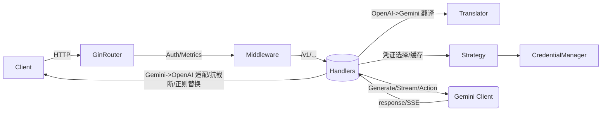

# Handlers 模块（internal/handlers/*）

适用版本：以当前仓库主分支为准（参见 internal/server/builder.go 与 routes_* 挂载点）。

## 模块定位

Handlers 模块负责对外提供 HTTP API（两套协议）：
- OpenAI 兼容端点（internal/handlers/openai）
- Gemini 原生端点（internal/handlers/gemini）
- 管理与装配端点（internal/handlers/management）
- 公共工具（错误序列化、请求解析、SSE、用量统计抽取等，internal/handlers/common）

其职责是把 HTTP 请求经鉴权、解析、翻译（OpenAI -> Gemini）、上游调用（Gemini CLI）、回包转换/流式输出（Gemini -> OpenAI），并记录回退/用量等指标。

## 目录结构与文件职责

- internal/handlers/openai
  - handlers.go：OpenAI 兼容 Handler 结构与构造（依赖 config、credential.Manager、usage/stats、upstream.Manager、store、策略路由、正则替换器）
  - openai_chat.go：POST /v1/chat/completions（流式与非流式）
  - openai_completions.go：POST /v1/completions（流式/非流式、抗截断续写）
  - responses.go：POST /v1/responses（统一解析，再派发 fake/stream/final）
  - images.go：POST /v1/images/generations（Gemini 图像模型）
  - openai_models.go：GET /v1/models 与 /v1/models/:id
  - openai_client.go：按凭证缓存上游客户端、凭证选择、缓存失效
  - 其余拆分文件：fallback/usage/utils 等（若存在）
- internal/handlers/gemini
  - handler.go：Gemini 原生 Handler 结构与构造、凭证绑定客户端缓存
  - generate.go/stream_handler.go：:generateContent / :streamGenerateContent
  - count_tokens.go：:countTokens
  - models.go：/v1/models 与 /v1/models/:id（Gemini 风格）
  - actions.go：loadCodeAssist/onboardUser 动作代理
- internal/handlers/common
  - api_errors.go：统一错误序列化（自动判别 OpenAI/Gemini 响应格式）
  - request_parser.go：OpenAI/Gemini 请求统一解析与校验；SSE、流式扫描等工具
- internal/handlers/management：管理 API（装配台、自动探活、会话等）

路由挂载见 internal/server/routes_openai.go 与 routes_gemini.go（由 internal/server/builder.go 注册）。

## 对外 API 路由

以下路径均位于 BasePath（缺省为""）下：

- OpenAI 兼容
  - GET /v1/models
  - GET /v1/models/:id
  - POST /v1/chat/completions
  - POST /v1/completions
  - POST /v1/responses
  - POST /v1/images/generations
- Gemini 原生
  - GET /v1/models
  - GET /v1/models/:id
  - POST /v1/models/:model:generateContent
  - POST /v1/models/:model:streamGenerateContent
  - POST /v1/models/:model:countTokens
  - 兼容 v1beta：GET /v1beta/models 与 /v1beta/models/:id

鉴权：
- 默认使用单 Key 方案：OpenAI 侧读取 cfg.Upstream.OpenAIKey；Gemini 侧读取 cfg.Upstream.GeminiKey
- 如果运行时配置文件（ConfigManager）提供 APIKeys（多密钥），则优先启用 MultiKeyAuth

## 核心设计与数据流

- 统一凭证与路由：OpenAI 与 Gemini Handler 共享 route.Strategy；策略旋转时会清理两侧的客户端缓存
- 上游客户端缓存：按 Credential.ID 缓存 upstream/gemini.Client，避免每次构造
- Header 透传：仅在安全前提下允许（见 cfg.Security.HeaderPassThrough；若 ManagementAllowRemote=true 会强制关闭）
- 正则替换与抗截断：根据 cfg.RegexReplacements 构造 RegexReplacer；OpenAI 文本补全内置抗截断检测与“继续”续写
- SSE 流式：使用 common.PrepareSSE/NewSSEScanner，边读边组装 OpenAI 或 Gemini 风格增量
- 回退与观测：
  - Fallback：当基础模型不可用时尝试候选模型（记录到 middleware.RecordFallback）
  - 用量：从 Gemini usageMetadata 中提取 token 统计并记录到 usage/stats
  - 路由调试：当 cfg.Routing.DebugHeaders=true 时，返回 X-Routing-* 头部

## 关键类型（选摘）

- openai.Handler
  - 依赖：cfg、credMgr、usageStats、usageTracker、providers、store、router、regexReplacer
  - 方法：New/NewWithStrategy、SetUsageTracker、InvalidateCachesFor、ChatCompletions、Completions、Responses、ImagesGenerations、ListModels/GetModel
- gemini.Handler
  - 依赖：cfg、credMgr、usageStats、usageTracker、store、router、regexReplacer
  - 方法：New/NewWithStrategy、SetUsageTracker、InvalidateCacheFor、GenerateContent、StreamGenerateContent、CountTokens、Models/ModelInfo

## 重要配置项（与 Handlers 直接相关）

- Upstream.OpenAIKey / Upstream.GeminiKey：各通道鉴权所需 API Key（当未使用 MultiKeyAuth 时）
- Routing.DebugHeaders：是否在响应头暴露路由与粘性信息
- Security.HeaderPassThrough：是否允许将来访请求头透传给上游
- AntiTruncationEnabled / AntiTruncationMax：抗截断启用与最大续写次数
- FakeStreamingEnabled：是否启用假流式（仅针对特定“fake”模型变体）
- RegexReplacements：输出内容的正则替换规则
- OpenAIImagesIncludeMIME / AutoImagePlaceholder：图像生成返回是否包含 MIME、是否自动占位

以上字段以 config.Config 结构与 config.yaml 生效；细节见 config 模块文档（待补充）。

## 与其他模块的依赖关系

- translator（internal/translator）：OpenAI <-> Gemini 请求/响应转换
- upstream（internal/upstream）：与 Gemini CLI 通信（生成/流式/计数/动作）
- credential（internal/credential）：凭证管理、自动刷新/封禁/恢复
- middleware（internal/middleware）：统一鉴权、指标、SSE、限流等
- models（internal/models）：模型注册与能力检测、变体映射
- stats/usage/monitoring：用量与指标

## 示例

以下示例假设服务监听 http://localhost:8317，BasePath 为空，使用单 Key 鉴权：

- OpenAI Chat 非流式：

```bash
curl -sS -H 'Authorization: Bearer $OPENAI_KEY' -H 'Content-Type: application/json' \
  -X POST http://localhost:8317/v1/chat/completions \
  -d '{"model":"gemini-2.5-pro","messages":[{"role":"user","content":"Hello!"}]}'
```

- OpenAI Chat 流式（SSE）：

```bash
curl -N -H 'Authorization: Bearer $OPENAI_KEY' -H 'Content-Type: application/json' \
  -X POST http://localhost:8317/v1/chat/completions \
  -d '{"model":"gemini-2.5-pro","stream":true,"messages":[{"role":"user","content":"Explain SSE."}]}'
```

- Gemini 原生 generateContent：

```bash
curl -sS -H 'Authorization: Bearer $GEMINI_KEY' -H 'Content-Type: application/json' \
  -X POST http://localhost:8317/v1/models/gemini-2.5-pro:generateContent \
  -d '{"contents":[{"role":"user","parts":[{"text":"你好"}]}]}'
```

- OpenAI Images：

```bash
curl -sS -H 'Authorization: Bearer $OPENAI_KEY' -H 'Content-Type: application/json' \
  -X POST http://localhost:8317/v1/images/generations \
  -d '{"prompt":"a cat in space","size":"1024x1024","n":1,"model":"gemini-2.5-flash-image"}'
```

## 架构示意（Mermaid）



## 已知限制

- 上游仅对接 Gemini Code Assist（单一上游）；不支持多上游聚合
- Header 透传在远程管理开启时会被强制关闭
- OpenAI Images 仅映射到 Gemini 图像模型，不代理外部图像提供商

## Phase 1-3 改进功能

### 管理端点权限控制（Phase 1）

管理端点支持两级权限控制：

#### 权限级别

1. **只读权限** (`ReadOnly`)
   - 配置项：`management_readonly_key`
   - 允许访问所有 GET 端点和查询操作
   - 禁止访问写操作端点（POST/PUT/DELETE）
   - 适用场景：监控、审计、只读查询

2. **管理员权限** (`Admin`)
   - 配置项：`management_key`
   - 允许访问所有管理端点，包括写操作
   - 适用场景：配置变更、计划应用、凭证管理

#### 认证方式

支持多种认证方式（优先级从高到低）：
1. Bearer Token：`Authorization: Bearer <token>`
2. API Key Header：`x-api-key: <token>`
3. Query Parameter：`?api_key=<token>`

#### 写操作判定（方法级 + 路径级兜底）

- 方法级规则（默认）：非 `GET/HEAD/OPTIONS` 一律视为写操作；只读密钥在此类请求上被拒绝。
- 路径级兜底（可选）：用于防止“具有副作用的 GET”之类特例。配置项见 `security.management_write_path_allowlist` 与 `security.management_write_path_blocklist`。
  - 匹配语义：支持精确、前缀（`prefix*`）、后缀（`*suffix`）。
  - 优先级：Allowlist > Blocklist。
  - 推荐策略：将所有可能产生变更的 GET/HEAD 端点纳入 Blocklist，例如导入、触发器、重建索引等；确认为安全的查询性 GET 可加入 Allowlist。

示例（YAML）：

```yaml
security:
  management_write_path_blocklist:
    - "/routes/api/management/deploy*"
    - "/routes/api/management/import*"
    - "*/trigger-reindex"
  management_write_path_allowlist:
    - "/routes/api/management/logs*"
```

### Header 白名单（Phase 1）

配置项 `security.header_passthrough_config` 替代旧的 `header_passthrough` 布尔值：

```yaml
security:
  header_passthrough_config:
    enabled: true
    allow_list:
      - "X-Request-ID"
      - "X-Correlation-ID"
    deny_list:
      - "Authorization"
      - "Cookie"
    audit_log: true
```

### 抗截断调试端点（Phase 2）

**端点**：`POST /api/management/antitrunc/dry-run`

**权限**：只读权限即可访问

**功能**：
- 调试抗截断规则应用效果
- 支持 `X-Debug-Antitrunc` Header 启用详细调试信息
- 返回命中规则、替换详情、匹配示例

**请求体**：
```json
{
  "text": "待测试的文本内容",
  "payload": {
    "model": "gemini-2.5-pro",
    "messages": [...]
  }
}
```

**响应**：
```json
{
  "original_text": "原始文本",
  "processed_text": "处理后文本",
  "rules_applied": [
    {
      "pattern": "正则表达式",
      "replacement": "替换内容",
      "matches": 3,
      "examples": ["示例1", "示例2"]
    }
  ],
  "summary": {
    "total_rules": 5,
    "rules_matched": 2,
    "total_replacements": 3
  }
}
```

### 缓存失效钩子（Phase 2）

**实现状态**：✅ 已完成

Handler 在构造时自动注册缓存失效钩子，确保凭证变更时自动清理缓存：

**OpenAI Handler**：

```go
// internal/handlers/openai/handlers.go
func New(cfg *config.Config, credMgr *credential.Manager, ...) *Handler {
    // ... 初始化 handler ...

    // 注册缓存失效钩子
    if credMgr != nil {
        credMgr.RegisterInvalidationHook(func(credID string, reason string) {
            h.invalidateClientCache(credID)
            h.invalidateProviderCache(credID)

            // 记录缓存失效指标
            if metrics := monitoring.DefaultMetrics(); metrics != nil {
                metrics.RecordCacheInvalidation(credID, reason)
            }
        })
    }

    return h
}
```

**Gemini Handler**：

```go
// internal/handlers/gemini/handler.go
func New(cfg *config.Config, credMgr *credpkg.Manager, ...) *Handler {
    // ... 初始化 handler ...

    // 注册缓存失效钩子
    if credMgr != nil {
        credMgr.RegisterInvalidationHook(func(credID string, reason string) {
            h.invalidateClientCache(credID)

            // 记录缓存失效指标
            if metrics := monitoring.DefaultMetrics(); metrics != nil {
                metrics.RecordCacheInvalidation(credID, reason)
            }
        })
    }

    return h
}
```

**触发场景**：

| 场景 | 失效原因 | 说明 |
|------|---------|------|
| OAuth Token 刷新 | `credential_refresh` | Token 刷新后需要使用新 Token |
| 手动启用凭证 | `credential_enabled` | 凭证状态变更 |
| 手动禁用凭证 | `credential_disabled` | 凭证状态变更 |
| 凭证恢复 | `credential_recovered` | 从封禁状态恢复 |
| 凭证删除 | `credential_deleted` | 凭证已删除 |
| 热重载 | `credential_reloaded` | 凭证文件重新加载 |

**指标记录**：

所有缓存失效事件都会记录到 Prometheus 指标 `gcli2api_cache_invalidations_total{credential_id, reason}`，可通过 `/metrics` 端点查询。

### 配置热重载（Phase 3）

配置文件监听功能已内置，支持：
- fsnotify 监听 `config.yaml` 文件变化
- 防抖动机制（100ms）
- 自动重新加载配置
- 配置变更事件发布

### 凭证文件监听（Phase 3）

凭证目录监听功能已内置，支持：
- fsnotify 监听 `auth_dir` 目录变化
- 防抖动机制（300ms）
- 自动重新加载凭证
- 凭证变更事件发布

