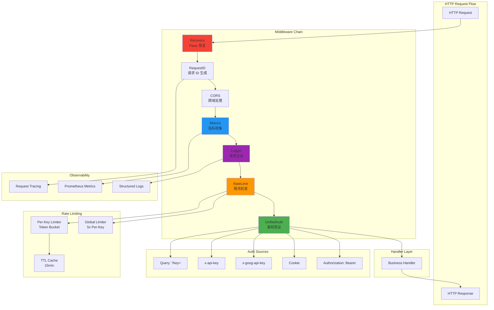

# Middleware 模块文档

## 模块定位与职责

Middleware 模块是 gcli2api-go 的 **HTTP 请求处理中间件层**，提供请求生命周期管理、安全防护、可观测性和流量控制功能：

- **统一鉴权**：支持多种 API Key 格式（Bearer Token、x-goog-api-key、x-api-key、Query 参数、Cookie）
- **请求日志**：记录 HTTP 请求的路径、方法、状态码、延迟、API Key、模型等信息
- **指标收集**：Prometheus 指标（请求计数、延迟直方图、SSE 行数、工具调用、上游请求）
- **限流保护**：基于 Token Bucket 算法的全局和 Per-Key 限流
- **Panic 恢复**：捕获 panic 并返回 500 错误，防止服务崩溃
- **请求 ID**：生成或传递 X-Request-ID，便于追踪请求链路
- **CORS 支持**：跨域资源共享配置（管理端点除外）
- **SSE 指标**：流式响应的行数、工具调用、断开原因统计
- **上游指标**：上游请求延迟、重试次数、错误原因、模型使用统计

## 目录结构与文件职责

```
internal/middleware/
├── unified_auth.go              # 统一鉴权中间件（多源 API Key 验证）
├── logger.go                    # 请求日志中间件
├── metrics.go                   # HTTP 指标中间件（请求计数、延迟）
├── metrics_handler.go           # Prometheus 指标暴露端点
├── metrics_sse.go               # SSE 相关指标记录函数
├── metrics_upstream.go          # 上游请求指标记录函数
├── ratelimit.go                 # 限流中间件（全局 + Per-Key）
├── recovery.go                  # Panic 恢复中间件 + 安全 Goroutine 工具
├── requestid.go                 # 请求 ID 中间件
├── cors.go                      # CORS 中间件
└── *_test.go                    # 单元测试文件
```

## 核心设计与数据流

### 1. 中间件执行顺序

典型的中间件链（从外到内）：

```
Request → Recovery → RequestID → CORS → Metrics → Logger → RateLimit → Auth → Handler
```

- **Recovery**：最外层，捕获所有 panic
- **RequestID**：生成请求 ID，便于日志关联
- **CORS**：处理跨域预检请求（OPTIONS）
- **Metrics**：记录请求开始时间，计算延迟
- **Logger**：记录请求详情（路径、方法、状态码、延迟）
- **RateLimit**：限流检查，超限返回 429
- **Auth**：鉴权检查，失败返回 401
- **Handler**：业务逻辑处理

### 2. 统一鉴权设计

`UnifiedAuth` 支持多种 API Key 来源（按优先级）：

1. **Authorization Header**：`Authorization: Bearer <token>`
2. **Cookie**：`Cookie: <cookie_name>=<token>`（可选，用于管理端）
3. **x-goog-api-key Header**：`x-goog-api-key: <token>`（Gemini 风格）
4. **x-api-key Header**：`x-api-key: <token>`（Claude/Anthropic 风格）
5. **Query Parameter**：`?key=<token>`

支持自定义验证器（`CustomValidator`）和多 Key 验证（`MultiKeyAuth`）。

### 3. 限流策略

#### RateLimiter（基于 IP）

- 使用 `golang.org/x/time/rate` 的 Token Bucket 算法
- 每个 IP 独立限流
- 配置：`rps`（每秒请求数）、`burst`（突发容量）

#### RateLimiterAutoKey（基于 API Key + IP）

- 优先使用 API Key 作为限流键，回退到 IP
- 全局限流器（5x Per-Key 限制）+ Per-Key 限流器
- TTL 缓存（15 分钟未使用自动清理）
- 定期清理过期限流器（每 2 分钟）

### 4. 指标体系

#### HTTP 指标

- `http_requests_total`：请求计数（按 server、method、path、status_class）
- `http_request_duration_seconds`：请求延迟直方图
- `http_requests_in_flight`：当前处理中的请求数

#### SSE 指标

- `sse_lines_total`：SSE 行数（按 server、path）
- `tool_calls_total`：工具调用次数
- `sse_disconnects_total`：SSE 断开次数（按 reason）
- `model_fallbacks_total`：模型回退次数（from → to）
- `thinking_removed_total`：Thinking 配置移除次数
- `anti_truncation_attempts_total`：抗截断续写尝试次数

#### 上游指标

- `upstream_requests_total`：上游请求计数（按 provider、status_class）
- `upstream_request_duration_seconds`：上游请求延迟直方图
- `upstream_request_duration_by_server_seconds`：按 server 分组的延迟
- `upstream_retry_attempts_total`：重试次数（按 provider、outcome）
- `upstream_errors_total`：上游错误计数（按 provider、reason）
- `upstream_model_requests_total`：按模型统计的上游请求

#### 限流指标

- `rate_limit_keys_gauge`：当前限流器数量
- `rate_limit_sweeps_total`：限流器清理次数

### 5. Panic 恢复机制

#### Recovery 中间件

- 捕获 HTTP Handler 中的 panic
- 记录堆栈跟踪、请求路径、客户端 IP、User-Agent
- 返回 500 错误（JSON 格式）

#### 安全 Goroutine 工具

- `SafeGo(fn)`：启动带 panic 恢复的 goroutine
- `SafeGoWithContext(name, fn)`：带名称标签的安全 goroutine
- `SafeCall(fn)`：同步调用函数并捕获 panic
- `SafeCallWithValue[T](fn)`：泛型版本，支持返回值

## 关键类型与接口

### AuthConfig 结构

```go
type AuthConfig struct {
    // RequiredKey 是期望的 API Key（为空则禁用鉴权）
    RequiredKey string
    
    // AllowMultipleSources 启用多源检查（同时检查多个 Header/Query）
    AllowMultipleSources bool
    
    // CustomValidator 自定义验证函数
    CustomValidator func(key string) bool
    
    // AcceptCookieName Cookie 名称（用于管理端会话 Token）
    AcceptCookieName string
}
```

### 限流器缓存

```go
type limiterEntry struct {
    lim      *rate.Limiter  // Token Bucket 限流器
    lastSeen time.Time      // 最后访问时间
}

type ttlLimiterCache struct {
    mu        sync.RWMutex
    items     map[string]*limiterEntry
    ttl       time.Duration  // 默认 15 分钟
    lastSweep time.Time      // 上次清理时间
}
```

## 重要配置项

### 鉴权配置

| 配置项 | 类型 | 默认值 | 说明 |
|--------|------|--------|------|
| `RequiredKey` | string | "" | 期望的 API Key（为空则禁用鉴权） |
| `AllowMultipleSources` | bool | false | 是否允许多源检查 |
| `CustomValidator` | func | nil | 自定义验证函数 |
| `AcceptCookieName` | string | "" | Cookie 名称（管理端会话） |

### 限流配置

| 配置项 | 类型 | 默认值 | 说明 |
|--------|------|--------|------|
| `rps` | int | 10 | 每秒请求数（Per-Key） |
| `burst` | int | 20 | 突发容量（Per-Key） |
| `globalRPS` | int | rps*5 | 全局限流（自动计算） |
| `globalBurst` | int | burst*5 | 全局突发容量（自动计算） |
| `ttl` | duration | 15m | 限流器缓存 TTL |

### CORS 配置

| Header | 值 | 说明 |
|--------|-----|------|
| `Access-Control-Allow-Origin` | `*` | 允许所有来源 |
| `Access-Control-Allow-Credentials` | `false` | 不允许携带凭证 |
| `Access-Control-Allow-Headers` | `Content-Type, Authorization, ...` | 允许的请求头 |
| `Access-Control-Allow-Methods` | `POST, GET, PUT, DELETE, ...` | 允许的 HTTP 方法 |

**注意**：管理端点（`/api/management`）不设置 CORS 头，仅允许同源访问。

## 与其他模块的依赖关系

### 依赖的模块

- **errors**：统一错误格式（`apperrors.New`）
- **httpformat**：检测响应格式（OpenAI/Gemini）
- **logging**：结构化日志（`logging.WithReq`）
- **monitoring**：Prometheus 指标定义（`monitoring.HTTPRequestsTotal`）

### 被依赖的模块

- **server**：在路由构建时装配中间件链
- **handlers**：业务 Handler 依赖中间件提供的鉴权、日志、指标功能

## 可执行示例

### 示例 1：统一鉴权中间件

```go
package main

import (
    "gcli2api-go/internal/middleware"
    "github.com/gin-gonic/gin"
)

func main() {
    r := gin.New()
    
    // 单 Key 鉴权
    r.Use(middleware.UnifiedAuth(middleware.AuthConfig{
        RequiredKey: "sk-my-secret-key-123",
    }))
    
    r.GET("/test", func(c *gin.Context) {
        apiKey, _ := c.Get("api_key")
        c.JSON(200, gin.H{"message": "Authenticated", "key": apiKey})
    })
    
    r.Run(":8080")
}
```

### 示例 2：多 Key 鉴权

```go
package main

import (
    "gcli2api-go/internal/middleware"
    "github.com/gin-gonic/gin"
)

func main() {
    r := gin.New()
    
    // 多 Key 鉴权（白名单）
    allowedKeys := []string{
        "sk-key-001",
        "sk-key-002",
        "sk-key-003",
    }
    r.Use(middleware.MultiKeyAuth(allowedKeys))
    
    r.GET("/test", func(c *gin.Context) {
        c.JSON(200, gin.H{"message": "OK"})
    })
    
    r.Run(":8080")
}
```

### 示例 3：自定义验证器

```go
package main

import (
    "gcli2api-go/internal/middleware"
    "github.com/gin-gonic/gin"
    "strings"
)

func main() {
    r := gin.New()
    
    // 自定义验证逻辑（检查前缀）
    r.Use(middleware.UnifiedAuth(middleware.AuthConfig{
        CustomValidator: func(key string) bool {
            return strings.HasPrefix(key, "sk-") && len(key) >= 20
        },
    }))
    
    r.GET("/test", func(c *gin.Context) {
        c.JSON(200, gin.H{"message": "Valid key"})
    })
    
    r.Run(":8080")
}
```

### 示例 4：限流中间件

```go
package main

import (
    "gcli2api-go/internal/middleware"
    "github.com/gin-gonic/gin"
)

func main() {
    r := gin.New()
    
    // 基于 IP 的限流（每秒 10 个请求，突发 20）
    r.Use(middleware.RateLimiter(10, 20))
    
    r.GET("/test", func(c *gin.Context) {
        c.JSON(200, gin.H{"message": "OK"})
    })
    
    r.Run(":8080")
}
```

### 示例 5：基于 API Key 的限流

```go
package main

import (
    "gcli2api-go/internal/middleware"
    "github.com/gin-gonic/gin"
)

func main() {
    r := gin.New()

    // 先鉴权，再限流（基于 API Key）
    r.Use(middleware.UnifiedAuth(middleware.AuthConfig{
        RequiredKey: "sk-test",
    }))
    r.Use(middleware.RateLimiterAutoKey(10, 20))

    r.GET("/test", func(c *gin.Context) {
        c.JSON(200, gin.H{"message": "OK"})
    })

    r.Run(":8080")
}
```

### 示例 6：完整中间件链

```go
package main

import (
    "gcli2api-go/internal/middleware"
    "github.com/gin-gonic/gin"
)

func main() {
    r := gin.New()

    // 完整中间件链（推荐顺序）
    r.Use(middleware.Recovery())              // 1. Panic 恢复
    r.Use(middleware.RequestID())             // 2. 请求 ID
    r.Use(middleware.CORS())                  // 3. CORS
    r.Use(middleware.Metrics())               // 4. 指标收集
    r.Use(middleware.RequestLogger())         // 5. 请求日志
    r.Use(middleware.RateLimiterAutoKey(10, 20)) // 6. 限流
    r.Use(middleware.UnifiedAuth(middleware.AuthConfig{
        RequiredKey: "sk-test",
    }))                                       // 7. 鉴权

    r.GET("/test", func(c *gin.Context) {
        c.JSON(200, gin.H{"message": "OK"})
    })

    // 暴露 Prometheus 指标
    r.GET("/metrics", middleware.MetricsHandler)

    r.Run(":8080")
}
```

### 示例 7：安全 Goroutine

```go
package main

import (
    "fmt"
    "gcli2api-go/internal/middleware"
    "time"
)

func main() {
    // 普通 goroutine（panic 会导致程序崩溃）
    // go func() { panic("crash!") }()

    // 安全 goroutine（panic 被捕获并记录）
    middleware.SafeGo(func() {
        panic("this won't crash the program")
    })

    // 带名称的安全 goroutine
    middleware.SafeGoWithContext("background-task", func() {
        fmt.Println("Task running...")
        time.Sleep(1 * time.Second)
        panic("task failed")
    })

    // 同步调用并捕获 panic
    err := middleware.SafeCall(func() error {
        panic("sync panic")
        return nil
    })
    if err != nil {
        fmt.Printf("Caught panic: %v\n", err)
    }

    // 泛型版本（带返回值）
    result, err := middleware.SafeCallWithValue(func() (string, error) {
        panic("panic with value")
        return "success", nil
    })
    fmt.Printf("Result: %s, Error: %v\n", result, err)

    time.Sleep(2 * time.Second)
}
```

### 示例 8：记录 SSE 指标

```go
package main

import (
    "gcli2api-go/internal/middleware"
)

func handleSSEStream() {
    server := "openai"
    path := "/v1/chat/completions"

    // 记录 SSE 行数
    middleware.RecordSSELines(server, path, 42)

    // 记录工具调用
    middleware.RecordToolCalls(server, path, 3)

    // 记录 SSE 断开原因
    middleware.RecordSSEClose(server, path, "client_disconnect")

    // 记录模型回退
    middleware.RecordFallback(server, path, "gemini-2.5-pro", "gemini-2.0-flash")

    // 记录 Thinking 配置移除
    middleware.RecordThinkingRemoved(server, path, "gemini-2.5-pro")

    // 记录抗截断尝试
    middleware.RecordAntiTruncAttempt(server, path, 2)
}
```

### 示例 9：记录上游指标

```go
package main

import (
    "gcli2api-go/internal/middleware"
    "time"
)

func callUpstream() {
    provider := "gemini"
    server := "openai"

    // 记录上游请求（成功）
    middleware.RecordUpstream(provider, 1500*time.Millisecond, 200, false)

    // 记录上游请求（带 server 标签）
    middleware.RecordUpstreamWithServer(provider, server, 2000*time.Millisecond, 200, false)

    // 记录上游请求（网络错误）
    middleware.RecordUpstream(provider, 5000*time.Millisecond, 0, true)

    // 记录重试次数（3 次重试后成功）
    middleware.RecordUpstreamRetry(provider, 3, true)

    // 记录上游错误原因
    middleware.RecordUpstreamError(provider, "timeout")

    // 记录按模型统计的上游请求
    middleware.RecordUpstreamModel(provider, "gemini-2.5-pro", 200, false)
}
```

### 示例 10：Cookie 鉴权（管理端）

```go
package main

import (
    "gcli2api-go/internal/middleware"
    "github.com/gin-gonic/gin"
)

func main() {
    r := gin.New()

    // 管理端鉴权（支持 Cookie）
    r.Use(middleware.UnifiedAuth(middleware.AuthConfig{
        RequiredKey:      "admin-secret-key",
        AcceptCookieName: "mgmt_session", // 允许从 Cookie 读取 Token
    }))

    r.GET("/api/management/status", func(c *gin.Context) {
        c.JSON(200, gin.H{"status": "healthy"})
    })

    r.Run(":8080")
}
```

## 架构示意图



## 已知限制

1. **限流器内存占用**
   - Per-Key 限流器会为每个 API Key/IP 创建独立的限流器
   - 大量不同 Key 会导致内存占用增加
   - 解决方案：TTL 缓存自动清理（15 分钟）+ 定期 Sweep

2. **CORS 配置固定**
   - CORS 头部配置硬编码，无法动态调整
   - 解决方案：扩展 `CORS()` 函数支持配置参数

3. **鉴权不支持 JWT**
   - 当前仅支持简单的 API Key 验证
   - 解决方案：使用 `CustomValidator` 实现 JWT 验证逻辑

4. **限流无持久化**
   - 限流状态仅存储在内存中，重启后丢失
   - 解决方案：使用 Redis 存储限流状态（需扩展实现）

5. **日志无采样**
   - 所有请求都会记录日志，高并发场景可能影响性能
   - 解决方案：实现日志采样（如 1% 采样率）

6. **指标标签基数**
   - 按 path 分组的指标可能导致高基数（大量不同路径）
   - 解决方案：使用路由模板（`/v1/models/:model`）而非实际路径

7. **Recovery 无告警**
   - Panic 恢复后仅记录日志，无主动告警
   - 解决方案：集成告警系统（如 PagerDuty、钉钉）

8. **限流粒度固定**
   - 无法为不同 API Key 设置不同的限流配置
   - 解决方案：扩展 `CustomValidator` 返回限流参数

## 最佳实践

1. **中间件顺序**：按推荐顺序装配（Recovery → RequestID → CORS → Metrics → Logger → RateLimit → Auth）
2. **限流配置**：根据业务需求调整 `rps` 和 `burst`，避免过于严格或宽松
3. **鉴权策略**：生产环境使用 `MultiKeyAuth` 或 `CustomValidator`，避免单 Key 泄露
4. **日志字段**：在 Handler 中使用 `c.Set()` 设置额外字段（如 `model`、`base_model`）
5. **指标监控**：定期检查 Prometheus 指标，发现异常流量或错误
6. **Panic 处理**：使用 `SafeGo` 启动后台任务，避免 panic 导致服务崩溃
7. **CORS 安全**：管理端点不设置 CORS 头，仅允许同源访问
8. **限流器清理**：监控 `rate_limit_keys_gauge` 指标，确保 TTL 缓存正常工作
9. **请求 ID 传递**：客户端可传递 `X-Request-ID` 头，便于跨服务追踪
10. **指标标签控制**：避免使用高基数标签（如用户 ID、请求参数）
```


