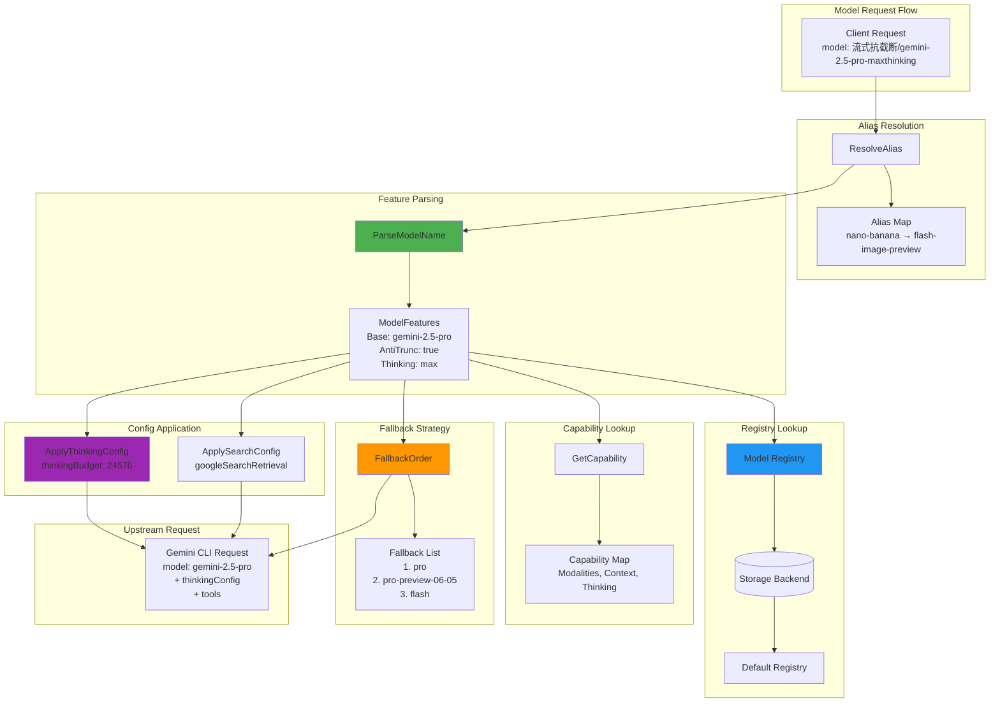

# Models 模块文档

## 模块定位与职责

Models 模块是 gcli2api-go 的**模型能力管理核心**，负责模型注册、变体生成、能力映射和回退策略：

- **模型注册表**：动态模型注册（存储后端）+ 默认模型列表
- **变体生成**：基于前缀/后缀规则生成模型变体（假流式、抗截断、Thinking、Search）
- **能力映射**：模型能力描述（多模态、上下文长度、Thinking 支持）
- **别名解析**：模型别名映射（如 `nano-banana` → `gemini-2.5-flash-image-preview`）
- **回退策略**：模型不可用时的回退顺序（Pro → Pro Preview → Flash）
- **特性解析**：从模型名称提取特性（Base、FakeStreaming、AntiTruncation、Search、ThinkingLevel）
- **配置应用**：将模型特性转换为 Gemini API 请求参数（thinkingConfig、tools）

## 目录结构与文件职责

```
internal/models/
├── registry.go                  # 模型注册表（动态注册、默认列表、分组）
├── capabilities.go              # 模型能力描述（多模态、上下文长度、Thinking）
├── variants.go                  # 变体生成器（前缀/后缀规则、特性解析）
├── aliases.go                   # 模型别名映射
├── base_metadata.go             # 基础模型元数据（能力、标签、推荐配置）
├── model_utils.go               # 模型工具函数（解析、验证、回退顺序）
└── *_test.go                    # 单元测试文件
```

## 核心设计与数据流

### 1. 模型命名规范

模型名称由 **前缀 + 基础模型 + 后缀** 组成：

```
[前缀/]<base_model>[-后缀]
```

**前缀**（可选）：
- `假流式/`：启用假流式（非流式模型模拟流式输出）
- `流式抗截断/`：启用抗截断续写

**基础模型**：
- `gemini-2.5-pro`
- `gemini-2.5-flash`
- `gemini-2.5-flash-image`
- 等

**后缀**（可选）：
- `-maxthinking`：最大 Thinking 预算（24576 tokens）
- `-nothinking`：禁用 Thinking
- `-autothinking`：自动 Thinking（默认）
- `-lowthinking`、`-medthinking`：低/中等 Thinking
- `-search`：启用 Google Search 联网搜索

**示例**：
- `gemini-2.5-pro`：基础模型
- `gemini-2.5-pro-maxthinking`：Pro + 最大 Thinking
- `流式抗截断/gemini-2.5-flash`：Flash + 抗截断
- `假流式/gemini-2.5-flash-image-search`：Flash Image + 假流式 + 搜索

### 2. 模型注册表架构

```
Storage Backend (Redis/MongoDB/PostgreSQL/File)
    ↓
model_registry_openai / model_registry_gemini (动态注册表)
    ↓
RegistryEntry[] (启用的模型列表)
    ↓
ExposedModelIDs() (暴露给 /v1/models)
```

**注册表优先级**：
1. 存储后端的 `model_registry_openai` / `model_registry_gemini`（按 channel 区分）
2. 存储后端的 `model_registry`（旧版通用键）
3. `DefaultRegistry()`（硬编码默认列表）

### 3. 变体生成策略

`AllVariants()` 生成所有可能的模型变体：

```
基础模型 × 后缀组合 × 前缀组合 = 变体列表
```

**后缀组合**：
- 无后缀
- Thinking 后缀（`-maxthinking`、`-nothinking`、`-autothinking`、`-lowthinking`、`-medthinking`）
- Search 后缀（`-search`）
- Thinking + Search 组合（`-maxthinking-search`）

**前缀组合**：
- 无前缀
- `假流式/`
- `流式抗截断/`

**估算**：每个基础模型约生成 30 个变体。

### 4. 能力映射

`Capability` 结构描述模型能力：

```go
type Capability struct {
    Modalities    []string // ["text"] 或 ["text", "image"]
    ContextLength int      // 上下文长度（默认 1000000）
    Images        bool     // 是否支持图片
    Thinking      string   // "none"/"auto"/"max"
    Source        string   // "manual"/"upstream"/"probe"
    UpdatedAt     int64    // 更新时间戳
}
```

**存储键**：`model_capabilities`（存储后端）

### 5. 回退策略

当模型不可用（404）时，按回退顺序尝试其他模型：

**Pro 系列回退**：
```
gemini-2.5-pro
  → gemini-2.5-pro-preview-06-05
  → gemini-2.5-pro-preview-05-06
  → gemini-2.5-flash
```

**Flash 系列回退**：
```
gemini-2.5-flash
  → gemini-2.5-flash-preview-09-2025
```

**Flash Image 系列回退**：
```
gemini-2.5-flash-image
  → gemini-2.5-flash-image-preview
```

**特性保留**：回退时保留原模型的前缀和后缀（如 `-maxthinking`、`-search`）。

## 关键类型与接口

### RegistryEntry 结构

```go
type RegistryEntry struct {
    ID            string `json:"id"`              // 暴露的模型 ID
    Base          string `json:"base"`            // 基础模型（如 gemini-2.5-pro）
    FakeStreaming bool   `json:"fake_streaming"`  // 是否启用假流式
    AntiTrunc     bool   `json:"anti_truncation"` // 是否启用抗截断
    Thinking      string `json:"thinking"`        // "auto"/"none"/"low"/"medium"/"high"/"max"
    Search        bool   `json:"search"`          // 是否启用搜索
    Image         bool   `json:"image"`           // 是否支持图片（UI 提示）
    Stream        bool   `json:"stream"`          // 是否优先流式
    Enabled       bool   `json:"enabled"`         // 是否启用
    Upstream      string `json:"upstream"`        // 上游类型（"code_assist"）
    Group         string `json:"group,omitempty"` // 分组 ID（可选）
    DisabledReason string `json:"disabled_reason,omitempty"` // 禁用原因（UI 显示）
}
```

### Capability 结构

```go
type Capability struct {
    Modalities    []string `json:"modalities,omitempty"`    // ["text"] 或 ["text", "image"]
    ContextLength int      `json:"context_length,omitempty"` // 上下文长度
    Images        bool     `json:"images,omitempty"`         // 是否支持图片
    Thinking      string   `json:"thinking,omitempty"`       // "none"/"auto"/"max"
    Source        string   `json:"source,omitempty"`         // "manual"/"upstream"/"probe"
    UpdatedAt     int64    `json:"updated_at,omitempty"`     // 更新时间戳
}
```

### ModelVariant 结构

```go
type ModelVariant struct {
    BaseName        string // 基础模型名称
    IsThinking      bool   // 是否启用 Thinking
    ThinkingMode    string // "max"/"no"/"auto"
    IsSearch        bool   // 是否启用搜索
    IsFakeStreaming bool   // 是否假流式
    IsAntiTrunc     bool   // 是否抗截断
}
```

### ModelFeatures 结构

```go
type ModelFeatures struct {
    Base           string `json:"base"`            // 基础模型
    FakeStreaming  bool   `json:"fake_streaming"`  // 假流式
    AntiTruncation bool   `json:"anti_truncation"` // 抗截断
    Search         bool   `json:"search"`          // 搜索
    ThinkingLevel  string `json:"thinking_level"`  // Thinking 级别
}
```

### BaseDescriptor 结构

```go
type BaseDescriptor struct {
    Base                   string   `json:"base"`
    DisplayName            string   `json:"display_name,omitempty"`
    Family                 string   `json:"family,omitempty"` // "pro"/"flash"
    SupportsImage          bool     `json:"supports_image"`
    SupportsStream         bool     `json:"supports_stream"`
    SupportsSearch         bool     `json:"supports_search"`
    SuggestedThinking      string   `json:"suggested_thinking,omitempty"`
    SuggestedFakeStreaming bool     `json:"suggested_fake_stream,omitempty"`
    SuggestedAntiTrunc     bool     `json:"suggested_anti_trunc,omitempty"`
    DefaultEnabled         bool     `json:"default_enabled"`
    Tags                   []string `json:"tags,omitempty"`
    Notes                  string   `json:"notes,omitempty"`
}
```

## 重要配置项

### 注册表配置

| 存储键 | 类型 | 说明 |
|--------|------|------|
| `model_registry_openai` | `[]RegistryEntry` | OpenAI 端点的模型注册表 |
| `model_registry_gemini` | `[]RegistryEntry` | Gemini 端点的模型注册表 |
| `model_registry` | `[]RegistryEntry` | 旧版通用注册表（兼容） |
| `model_groups` | `[]GroupEntry` | 模型分组配置（UI 使用） |
| `model_capabilities` | `map[string]Capability` | 模型能力映射 |

### 变体配置

| 配置项 | 类型 | 默认值 | 说明 |
|--------|------|--------|------|
| `FakeStreamingPrefix` | string | `"假流式/"` | 假流式前缀 |
| `AntiTruncationPrefix` | string | `"流式抗截断/"` | 抗截断前缀 |
| `ThinkingSuffixes` | map | 见下表 | Thinking 后缀映射 |
| `SearchSuffix` | string | `"-search"` | 搜索后缀 |

**ThinkingSuffixes 默认值**：
| 级别 | 后缀 |
|------|------|
| `max` | `-maxthinking` |
| `high` | `-maxthinking` |
| `none` | `-nothinking` |
| `low` | `-lowthinking` |
| `med` | `-medthinking` |
| `auto` | `-autothinking` |

### Thinking 配置映射

| ThinkingMode | thinkingBudget | includeThoughts |
|--------------|----------------|-----------------|
| `max` | 24576 | true |
| `no` | 0 | false |
| `auto` | -1 | true |

## 与其他模块的依赖关系

### 依赖的模块

- **config**：读取 `DisabledModels` 配置
- **storage**：读写模型注册表、能力映射

### 被依赖的模块

- **handlers**：使用 `ExposedModelIDs()` 返回 `/v1/models` 列表
- **translator**：使用 `ParseModelName()` 解析模型特性，应用 Thinking/Search 配置
- **upstream**：使用 `FallbackOrder()` 实现模型回退
- **server**：使用 `ActiveEntriesByChannel()` 构建路由

## 可执行示例

### 示例 1：解析模型名称

```go
package main

import (
    "fmt"
    "gcli2api-go/internal/models"
)

func main() {
    // 解析模型名称
    model := "流式抗截断/gemini-2.5-pro-maxthinking-search"

    variant := models.ParseModelName(model)
    fmt.Printf("Base: %s\n", variant.BaseName)
    fmt.Printf("FakeStreaming: %v\n", variant.IsFakeStreaming)
    fmt.Printf("AntiTrunc: %v\n", variant.IsAntiTrunc)
    fmt.Printf("Thinking: %v (mode: %s)\n", variant.IsThinking, variant.ThinkingMode)
    fmt.Printf("Search: %v\n", variant.IsSearch)

    // 输出：
    // Base: gemini-2.5-pro
    // FakeStreaming: false
    // AntiTrunc: true
    // Thinking: true (mode: max)
    // Search: true
}
```

### 示例 2：提取基础模型

```go
package main

import (
    "fmt"
    "gcli2api-go/internal/models"
)

func main() {
    // 从变体名称提取基础模型
    variants := []string{
        "gemini-2.5-pro",
        "gemini-2.5-pro-maxthinking",
        "假流式/gemini-2.5-flash-search",
        "流式抗截断/gemini-2.5-flash-image-nothinking",
    }

    for _, v := range variants {
        base := models.BaseFromFeature(v)
        fmt.Printf("%s → %s\n", v, base)
    }

    // 输出：
    // gemini-2.5-pro → gemini-2.5-pro
    // gemini-2.5-pro-maxthinking → gemini-2.5-pro
    // 假流式/gemini-2.5-flash-search → gemini-2.5-flash
    // 流式抗截断/gemini-2.5-flash-image-nothinking → gemini-2.5-flash-image
}
```

### 示例 3：生成模型变体

```go
package main

import (
    "fmt"
    "gcli2api-go/internal/models"
)

func main() {
    // 为指定基础模型生成所有变体
    baseModels := []string{"gemini-2.5-pro", "gemini-2.5-flash"}
    variants := models.GenerateVariantsForModels(baseModels)

    fmt.Printf("Generated %d variants\n", len(variants))

    // 显示前 10 个变体
    for i, v := range variants {
        if i >= 10 {
            break
        }
        fmt.Printf("%d. %s\n", i+1, v)
    }

    // 输出示例：
    // Generated 60 variants
    // 1. gemini-2.5-pro
    // 2. gemini-2.5-pro-maxthinking
    // 3. gemini-2.5-pro-nothinking
    // 4. gemini-2.5-pro-search
    // 5. 假流式/gemini-2.5-pro
    // ...
}
```

### 示例 4：应用 Thinking 配置

```go
package main

import (
    "encoding/json"
    "fmt"
    "gcli2api-go/internal/models"
)

func main() {
    // 解析模型并应用 Thinking 配置
    model := "gemini-2.5-pro-maxthinking"
    variant := models.ParseModelName(model)

    genConfig := make(map[string]interface{})
    genConfig = variant.ApplyThinkingConfig(genConfig)

    jsonData, _ := json.MarshalIndent(genConfig, "", "  ")
    fmt.Println(string(jsonData))

    // 输出：
    // {
    //   "thinkingConfig": {
    //     "includeThoughts": true,
    //     "thinkingBudget": 24576
    //   }
    // }
}
```

### 示例 5：应用 Search 配置

```go
package main

import (
    "encoding/json"
    "fmt"
    "gcli2api-go/internal/models"
)

func main() {
    // 解析模型并应用 Search 配置
    model := "gemini-2.5-pro-search"
    variant := models.ParseModelName(model)

    request := make(map[string]interface{})
    request = variant.ApplySearchConfig(request)

    jsonData, _ := json.MarshalIndent(request, "", "  ")
    fmt.Println(string(jsonData))

    // 输出：
    // {
    //   "tools": [
    //     {
    //       "googleSearchRetrieval": {
    //         "dynamicRetrievalConfig": {
    //           "mode": "MODE_DYNAMIC"
    //         }
    //       }
    //     }
    //   ]
    // }
}
```

### 示例 6：模型回退顺序

```go
package main

import (
    "fmt"
    "gcli2api-go/internal/models"
)

func main() {
    // 获取模型回退顺序
    model := "流式抗截断/gemini-2.5-pro-maxthinking"
    fallbacks := models.FallbackOrder(model)

    fmt.Printf("Fallback order for %s:\n", model)
    for i, fb := range fallbacks {
        fmt.Printf("%d. %s\n", i+1, fb)
    }

    // 输出：
    // Fallback order for 流式抗截断/gemini-2.5-pro-maxthinking:
    // 1. 流式抗截断/gemini-2.5-pro-maxthinking
    // 2. 流式抗截断/gemini-2.5-pro-preview-06-05-maxthinking
    // 3. 流式抗截断/gemini-2.5-pro-preview-05-06-maxthinking
    // 4. 流式抗截断/gemini-2.5-flash-maxthinking
}
```

### 示例 7：获取暴露的模型列表

```go
package main

import (
    "context"
    "fmt"
    "gcli2api-go/internal/config"
    "gcli2api-go/internal/models"
    "gcli2api-go/internal/storage"
)

func main() {
    // 加载配置
    cfg := config.Load()

    // 创建存储后端
    backend := storage.NewFileBackend("/tmp/gcli2api")
    backend.Initialize(context.Background())
    defer backend.Close()

    // 获取 OpenAI 端点的模型列表
    modelIDs := models.ExposedModelIDsByChannel(cfg, backend, "openai")

    fmt.Printf("Exposed models (OpenAI): %d\n", len(modelIDs))
    for i, id := range modelIDs {
        if i >= 10 {
            fmt.Printf("... and %d more\n", len(modelIDs)-10)
            break
        }
        fmt.Printf("%d. %s\n", i+1, id)
    }
}
```

### 示例 8：动态注册模型

```go
package main

import (
    "context"
    "encoding/json"
    "gcli2api-go/internal/models"
    "gcli2api-go/internal/storage"
)

func main() {
    // 创建存储后端
    backend := storage.NewFileBackend("/tmp/gcli2api")
    backend.Initialize(context.Background())
    defer backend.Close()

    // 定义模型注册表
    registry := []models.RegistryEntry{
        {
            Base:      "gemini-2.5-pro",
            Thinking:  "max",
            Stream:    true,
            Enabled:   true,
            Upstream:  "code_assist",
        },
        {
            Base:      "gemini-2.5-flash",
            AntiTrunc: true,
            Thinking:  "auto",
            Stream:    true,
            Enabled:   true,
            Upstream:  "code_assist",
        },
    }

    // 保存到存储后端
    ctx := context.Background()
    jsonData, _ := json.Marshal(registry)
    var data interface{}
    json.Unmarshal(jsonData, &data)
    backend.SetConfig(ctx, "model_registry_openai", data)

    fmt.Println("Model registry saved")
}
```

### 示例 9：查询模型能力

```go
package main

import (
    "context"
    "fmt"
    "gcli2api-go/internal/models"
    "gcli2api-go/internal/storage"
)

func main() {
    // 创建存储后端
    backend := storage.NewFileBackend("/tmp/gcli2api")
    backend.Initialize(context.Background())
    defer backend.Close()

    // 查询模型能力
    cap, ok := models.GetCapability(backend, "gemini-2.5-pro")
    if ok {
        fmt.Printf("Model: gemini-2.5-pro\n")
        fmt.Printf("Modalities: %v\n", cap.Modalities)
        fmt.Printf("Context Length: %d\n", cap.ContextLength)
        fmt.Printf("Images: %v\n", cap.Images)
        fmt.Printf("Thinking: %s\n", cap.Thinking)
    } else {
        fmt.Println("Capability not found")
    }
}
```

### 示例 10：别名解析

```go
package main

import (
    "fmt"
    "gcli2api-go/internal/models"
)

func main() {
    // 解析模型别名
    aliases := []string{
        "nano-banana",
        "nanobanana",
        "gemini-2.5-pro",
    }

    for _, alias := range aliases {
        resolved, ok := models.ResolveAlias(alias)
        if ok {
            fmt.Printf("%s → %s (alias)\n", alias, resolved)
        } else {
            fmt.Printf("%s → %s (no alias)\n", alias, resolved)
        }
    }

    // 输出：
    // nano-banana → gemini-2.5-flash-image-preview (alias)
    // nanobanana → gemini-2.5-flash-image-preview (alias)
    // gemini-2.5-pro → gemini-2.5-pro (no alias)
}
```

## 架构示意图



## 已知限制

1. **变体数量爆炸**
   - 每个基础模型生成约 30 个变体，7 个基础模型 = 210+ 变体
   - 解决方案：使用动态注册表，仅暴露常用变体

2. **前缀/后缀硬编码**
   - 前缀（`假流式/`、`流式抗截断/`）和后缀（`-maxthinking`）硬编码在代码中
   - 解决方案：使用 `VariantConfig` 支持自定义前缀/后缀

3. **别名映射固定**
   - 别名映射（`nano-banana` → `gemini-2.5-flash-image-preview`）硬编码
   - 解决方案：扩展为存储后端配置（`model_aliases`）

4. **回退顺序固定**
   - 回退顺序硬编码在 `FallbackBases()` 函数中
   - 解决方案：支持配置文件定义回退顺序

5. **能力映射不完整**
   - 默认能力映射仅包含基础信息，缺少详细的 Token 限制、速率限制
   - 解决方案：通过管理 API 手动补充能力信息

6. **注册表无版本控制**
   - 注册表变更无历史记录，无法回滚
   - 解决方案：使用 Git Backend 或审计日志

7. **分组功能未完全实现**
   - `GroupEntry` 定义存在，但未在路由层使用
   - 解决方案：扩展管理 API 支持按分组过滤模型

8. **Thinking 级别映射不精确**
   - `low`、`med` 级别的 `thinkingBudget` 未定义
   - 解决方案：补充中间级别的预算值（如 low=4096, med=12288）

## 最佳实践

1. **使用动态注册表**：生产环境通过管理 API 配置模型注册表，避免暴露所有变体
2. **按 Channel 区分**：OpenAI 和 Gemini 端点使用不同的注册表（`model_registry_openai` / `model_registry_gemini`）
3. **启用回退策略**：配置 `FallbackBases()` 确保模型不可用时自动切换
4. **补充能力映射**：通过 `UpsertCapabilities()` 手动补充模型能力信息
5. **使用别名简化**：为常用模型配置别名（如 `gpt-4` → `gemini-2.5-pro`）
6. **监控变体使用**：记录各变体的使用频率，优化注册表
7. **定期更新基础模型列表**：新模型发布后及时更新 `DefaultBaseModels()`
8. **测试回退逻辑**：确保回退顺序符合预期，避免降级到不兼容的模型
9. **文档化特性**：在 `BaseDescriptor` 中补充 `Notes` 字段，说明模型特性
10. **版本化注册表**：使用存储后端的 `updated_at` 字段追踪变更时间

## 模型命名速查表

| 特性 | 前缀/后缀 | 示例 |
|------|-----------|------|
| 基础模型 | - | `gemini-2.5-pro` |
| 最大 Thinking | `-maxthinking` | `gemini-2.5-pro-maxthinking` |
| 禁用 Thinking | `-nothinking` | `gemini-2.5-pro-nothinking` |
| 自动 Thinking | `-autothinking` | `gemini-2.5-pro-autothinking` |
| 联网搜索 | `-search` | `gemini-2.5-pro-search` |
| 假流式 | `假流式/` | `假流式/gemini-2.5-flash` |
| 抗截断 | `流式抗截断/` | `流式抗截断/gemini-2.5-flash` |
| 组合特性 | 前缀 + 基础 + 后缀 | `流式抗截断/gemini-2.5-pro-maxthinking-search` |

## 基础模型对比

| 模型 | 家族 | 图片 | 流式 | 搜索 | 推荐 Thinking | 推荐抗截断 | 默认启用 |
|------|------|------|------|------|---------------|------------|----------|
| gemini-2.5-pro | Pro | ❌ | ✅ | ✅ | max | ❌ | ✅ |
| gemini-2.5-pro-preview-06-05 | Pro | ❌ | ✅ | ✅ | max | ❌ | ❌ |
| gemini-2.5-flash | Flash | ❌ | ✅ | ❌ | auto | ✅ | ✅ |
| gemini-2.5-flash-preview-09-2025 | Flash | ❌ | ✅ | ❌ | auto | ✅ | ❌ |
| gemini-2.5-flash-image | Flash | ✅ | ✅ | ❌ | auto | ✅ | ✅ |
| gemini-2.5-flash-image-preview | Flash | ✅ | ✅ | ❌ | auto | ✅ | ❌ |
```


