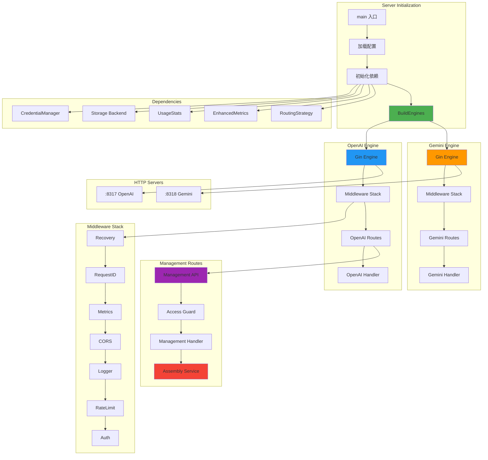

# Server 模块文档

## 模块定位与职责

Server 模块是 gcli2api-go 的**服务器构建与路由装配核心**，负责 HTTP 服务器的初始化、路由注册和中间件应用：

- **双引擎构建**：构建 OpenAI 和 Gemini 两个独立的 Gin 引擎
- **路由装配**：注册 OpenAI、Gemini、管理端三类路由
- **中间件应用**：按顺序应用 Recovery、RequestID、Metrics、CORS、Logger、RateLimit
- **管理端资源**：挂载管理控制台静态资源（HTML/JS/CSS）
- **健康检查**：提供 `/healthz` 和 `/metrics` 端点
- **访问控制**：管理端本地/远程访问控制、IP 白名单、TTL 限制
- **路由装配台**（Assembly）：动态路由计划管理、模型分组、粘性路由
- **优雅关闭**：支持优雅关闭和资源清理

## 目录结构与文件职责

```
internal/server/
├── builder.go                          # 服务器构建入口（BuildEngines、依赖注入）
├── engine_helpers.go                   # 引擎通用设置（中间件、标签、元数据端点）
├── guard.go                            # 访问控制守卫（本地/远程、IP 白名单、只读模式）
├── routes_openai.go                    # OpenAI 路由注册（/v1/chat/completions、/v1/models）
├── routes_gemini.go                    # Gemini 路由注册（/v1/models/:model/:action）
├── routes_management.go                # 管理端路由注册（凭证、模型、日志、装配台）
├── routes_utils.go                     # 路由工具函数（路径拼接、JSON 构建）
├── admin_assets.go                     # 管理端静态资源挂载（HTML/JS/CSS）
├── webembed.go                         # 嵌入式 Web 资源（embed.FS）
├── storage_helpers.go                  # 存储辅助函数（凭证持久化）
├── assembly_service.go                 # 装配台服务（路由计划管理）
├── assembly_routes.go                  # 装配台路由（计划 CRUD、应用、快照）
├── assembly_plans_api.go               # 装配台计划 API（创建、更新、删除）
├── assembly_plans_apply.go             # 装配台计划应用（事务、回滚）
├── assembly_plans_helpers.go           # 装配台辅助函数（验证、转换）
├── assembly_routing.go                 # 装配台路由逻辑（粘性路由、冷却）
├── assembly_snapshot.go                # 装配台快照（当前状态导出）
├── assembly_diff.go                    # 装配台差异对比（计划 vs 当前）
├── assembly_routes_dashboard.go        # 装配台仪表板 API
├── assembly_routes_dryrun.go           # 装配台 Dry-Run（预览变更）
├── assembly_routes_helpers.go          # 装配台路由辅助函数
├── assembly_routes_plans.go            # 装配台计划路由
├── assembly_routes_routing.go          # 装配台路由配置 API
└── assembly_routes_types.go            # 装配台类型定义

internal/server/*_test.go               # 单元测试文件
```

## 核心设计与数据流

### 1. 服务器构建流程

```
main() 入口
    ↓
加载配置（config.Load）
    ↓
初始化依赖（CredentialManager、Storage、UsageStats、EnhancedMetrics）
    ↓
BuildEngines(cfg, deps)
    ↓
构建 OpenAI 引擎 + 构建 Gemini 引擎
    ↓
应用标准设置（applyStandardEngineSettings）
    ↓
注册路由（RegisterOpenAIRoutes、RegisterGeminiRoutes、registerManagementRoutes）
    ↓
创建共享路由策略（route.Strategy）
    ↓
启动自动探活（AutoProbe）
    ↓
启动 HTTP 服务器（http.ListenAndServe）
```

### 2. 中间件执行顺序

```
HTTP Request
    ↓
1. gin.Recovery()           # Panic 恢复
    ↓
2. mw.RequestID()           # 生成/传递 X-Request-ID
    ↓
3. mw.Metrics()             # Prometheus 指标收集
    ↓
4. mw.CORS()                # 跨域支持（管理端除外）
    ↓
5. mw.RequestLogger()       # 请求日志（可选）
    ↓
6. mw.RateLimiterAutoKey()  # 限流（可选）
    ↓
7. server_label 标签        # 标记 openai/gemini
    ↓
8. 路由级鉴权（UnifiedAuth/MultiKeyAuth）
    ↓
Handler 处理
    ↓
Response
```

### 3. 路由结构

**OpenAI 引擎路由**：
```
/                           → 重定向到 /admin
/routes                     → 重定向到 /admin
/login                      → 重定向到 /admin
/admin                      → 管理控制台（需鉴权）
/admin/assets/*             → 静态资源（JS/CSS）
/healthz                    → 健康检查
/metrics                    → Prometheus 指标
/meta/routes                → 路由元数据
/meta/base-path             → 基础路径配置

/v1/models                  → 列出模型
/v1/models/:id              → 获取模型详情
/v1/chat/completions        → OpenAI 聊天补全
/v1/completions             → OpenAI 文本补全
/v1/responses               → Gemini 原生响应格式
/v1/images/generations      → 图片生成

/routes/api/management/*    → 管理 API（凭证、模型、装配台）
/api/management/*           → 管理 API 别名（307 重定向）
```

**Gemini 引擎路由**：
```
/healthz                    → 健康检查
/metrics                    → Prometheus 指标

/v1/models                  → 列出模型
/v1/models/:id              → 获取模型详情
/v1/models/:model/:action   → Gemini 原生 API
  - :generateContent        → 生成内容
  - :streamGenerateContent  → 流式生成
  - :countTokens            → Token 计数

/v1beta/models              → Beta 版本模型列表
/v1beta/models/:id          → Beta 版本模型详情
```

### 4. 管理端访问控制

**本地访问**（默认）：
- 仅允许 `127.0.0.1`、`::1`、`localhost` 访问
- 无需额外配置

**远程访问**（可选）：
- 配置 `management_allow_remote: true`
- 可选 IP 白名单（`management_remote_allow_ips`）
- 可选 TTL 限制（`management_remote_ttl_hours`）
- 强制禁用 `header_pass_through`（安全考虑）

**只读模式**（可选）：
- 配置 `management_read_only: true`
- 仅允许 GET/HEAD/OPTIONS 请求
- 阻止所有写操作（POST/PUT/DELETE/PATCH）

### 5. 装配台（Assembly）架构

```
装配台计划（Plan）
    ↓
验证计划（ValidatePlan）
    ↓
Dry-Run（预览变更）
    ↓
应用计划（ApplyPlan）
    ↓
事务开始（BeginTransaction）
    ↓
更新路由配置（UpdateRoutingConfig）
    ↓
更新模型注册表（UpdateModelRegistry）
    ↓
更新分组配置（UpdateModelGroups）
    ↓
事务提交（CommitTransaction）
    ↓
刷新路由策略（RefreshStrategy）
    ↓
记录审计日志（RecordOperation）
```

## 关键类型与接口

### Dependencies 结构

```go
type Dependencies struct {
    CredentialManager *credential.Manager      // 凭证管理器
    UsageStats        *usagestats.UsageStats   // 用量统计
    Storage           store.Backend            // 存储后端
    EnhancedMetrics   *monitoring.EnhancedMetrics // 增强指标
    RoutingStrategy   *route.Strategy          // 路由策略
}
```

### AssemblyService 结构

```go
type AssemblyService struct {
    cfg          *config.Config              // 配置
    st           store.Backend               // 存储后端
    metrics      *monitoring.EnhancedMetrics // 指标
    backendLabel string                      // 后端标签
    strategy     *route.Strategy             // 路由策略
}
```

### AssemblyAudit 结构

```go
type AssemblyAudit struct {
    ActorLabel string // 操作者标签（user/system/api）
    ActorID    string // 操作者 ID
    Reason     string // 操作原因
}
```

## 重要配置项

### 服务器配置

| 配置项 | 类型 | 默认值 | 说明 |
|--------|------|--------|------|
| `openai_port` | int | `8317` | OpenAI 端点监听端口 |
| `gemini_port` | int | `8318` | Gemini 端点监听端口 |
| `base_path` | string | `""` | 基础路径前缀 |
| `web_admin_enabled` | bool | `true` | 是否启用 Web 管理控制台 |

### 安全配置

| 配置项 | 类型 | 默认值 | 说明 |
|--------|------|--------|------|
| `management_key` | string | - | 管理端密钥（必填） |
| `management_allow_remote` | bool | `false` | 是否允许远程访问管理端 |
| `management_remote_allow_ips` | []string | `[]` | 远程访问 IP 白名单 |
| `management_remote_ttl_hours` | int | `0` | 远程访问 TTL（小时，0=无限制） |
| `management_read_only` | bool | `false` | 管理端只读模式 |
| `header_pass_through` | bool | `false` | 是否透传请求头到上游 |
| `debug` | bool | `false` | 调试模式 |

### 限流配置

| 配置项 | 类型 | 默认值 | 说明 |
|--------|------|--------|------|
| `rate_limit_enabled` | bool | `false` | 是否启用限流 |
| `rate_limit_rps` | int | `10` | 每秒请求数 |
| `rate_limit_burst` | int | `20` | 突发容量 |

## 与其他模块的依赖关系

### 依赖的模块

- **config**：读取配置、热更新
- **credential**：凭证管理器
- **storage**：存储后端
- **monitoring**：指标收集
- **middleware**：中间件（鉴权、日志、限流、CORS）
- **handlers/openai**：OpenAI 处理器
- **handlers/gemini**：Gemini 处理器
- **handlers/management**：管理端处理器
- **upstream/strategy**：路由策略

### 被依赖的模块

- **cmd/server**：主程序入口调用 `BuildEngines()`

## 可执行示例

### 示例 1：构建服务器

```go
package main

import (
    "context"
    "gcli2api-go/internal/config"
    "gcli2api-go/internal/credential"
    "gcli2api-go/internal/monitoring"
    "gcli2api-go/internal/server"
    "gcli2api-go/internal/stats"
    "gcli2api-go/internal/storage"
    "net/http"
)

func main() {
    // 加载配置
    cfg := config.Load()
    
    // 初始化存储后端
    backend := storage.NewFileBackend("/tmp/gcli2api")
    backend.Initialize(context.Background())
    defer backend.Close()
    
    // 初始化凭证管理器
    credMgr := credential.NewManager(cfg, backend)
    credMgr.LoadCredentials()
    
    // 初始化用量统计
    usageStats := stats.NewUsageStats(cfg, backend)
    
    // 初始化增强指标
    metrics := monitoring.NewEnhancedMetrics()
    
    // 构建依赖
    deps := server.Dependencies{
        CredentialManager: credMgr,
        UsageStats:        usageStats,
        Storage:           backend,
        EnhancedMetrics:   metrics,
    }
    
    // 构建引擎
    openaiEngine, geminiEngine, strategy := server.BuildEngines(cfg, deps)
    
    // 启动服务器
    go http.ListenAndServe(":8317", openaiEngine)
    http.ListenAndServe(":8318", geminiEngine)
}
```

### 示例 2：注册自定义路由

```go
package main

import (
    "gcli2api-go/internal/config"
    "gcli2api-go/internal/server"
    "github.com/gin-gonic/gin"
    "net/http"
)

func main() {
    cfg := config.Load()
    deps := server.Dependencies{} // 省略初始化
    
    openaiEngine, _, _ := server.BuildEngines(cfg, deps)
    
    // 注册自定义路由
    openaiEngine.GET("/custom/health", func(c *gin.Context) {
        c.JSON(http.StatusOK, gin.H{
            "status": "healthy",
            "version": "1.0.0",
        })
    })
    
    http.ListenAndServe(":8317", openaiEngine)
}
```

### 示例 3：应用自定义中间件

```go
package main

import (
    "gcli2api-go/internal/config"
    "gcli2api-go/internal/server"
    "github.com/gin-gonic/gin"
    "log"
)

func customMiddleware() gin.HandlerFunc {
    return func(c *gin.Context) {
        log.Printf("Custom middleware: %s %s", c.Request.Method, c.Request.URL.Path)
        c.Next()
    }
}

func main() {
    cfg := config.Load()
    deps := server.Dependencies{} // 省略初始化
    
    openaiEngine, _, _ := server.BuildEngines(cfg, deps)
    
    // 应用自定义中间件
    openaiEngine.Use(customMiddleware())
    
    http.ListenAndServe(":8317", openaiEngine)
}
```

### 示例 4：配置管理端访问控制

```yaml
# config.yaml
security:
  management_key: "your-secret-key"
  management_allow_remote: true
  management_remote_allow_ips:
    - "192.168.1.0/24"
    - "10.0.0.100"
  management_remote_ttl_hours: 24
  management_read_only: false
```

### 示例 5：访问管理端 API

```bash
# 登录获取 Session Token
curl -X POST http://localhost:8317/routes/api/management/login \
  -H "Content-Type: application/json" \
  -d '{"key": "your-management-key"}'

# 使用 Session Token 访问管理 API
curl http://localhost:8317/routes/api/management/credentials \
  -H "Cookie: mgmt_session=<token>"

# 或使用 Management Key 直接访问
curl http://localhost:8317/routes/api/management/credentials \
  -H "Authorization: Bearer your-management-key"
```

### 示例 6：上传凭证文件

```bash
# 上传单个 JSON 文件
curl -X POST http://localhost:8317/routes/api/management/credentials/upload \
  -H "Authorization: Bearer your-management-key" \
  -F "file=@credential.json"

# 上传 ZIP 批量文件
curl -X POST http://localhost:8317/routes/api/management/credentials/upload \
  -H "Authorization: Bearer your-management-key" \
  -F "file=@credentials.zip"

# 验证 ZIP 文件（不上传）
curl -X POST "http://localhost:8317/routes/api/management/credentials/validate-zip?validate_tokens=true" \
  -H "Authorization: Bearer your-management-key" \
  -F "file=@credentials.zip"
```

### 示例 7：管理模型变体配置

```bash
# 获取当前变体配置
curl http://localhost:8317/routes/api/management/models/variant-config \
  -H "Authorization: Bearer your-management-key"

# 更新变体配置
curl -X PUT http://localhost:8317/routes/api/management/models/variant-config \
  -H "Authorization: Bearer your-management-key" \
  -H "Content-Type: application/json" \
  -d '{
    "fake_streaming_prefix": "假流式/",
    "anti_truncation_prefix": "流式抗截断/",
    "search_suffix": "-search",
    "thinking_suffixes": {
      "max": "-maxthinking",
      "none": "-nothinking",
      "auto": "-autothinking"
    }
  }'

# 生成所有变体
curl http://localhost:8317/routes/api/management/models/generate-variants \
  -H "Authorization: Bearer your-management-key"
```

### 示例 8：解析模型特性

```bash
curl -X POST http://localhost:8317/routes/api/management/models/parse-features \
  -H "Authorization: Bearer your-management-key" \
  -H "Content-Type: application/json" \
  -d '{
    "models": [
      "gemini-2.5-pro",
      "流式抗截断/gemini-2.5-flash-maxthinking",
      "假流式/gemini-2.5-flash-image-search"
    ]
  }'

# 响应示例：
# {
#   "results": {
#     "gemini-2.5-pro": {
#       "base": "gemini-2.5-pro",
#       "fake_streaming": false,
#       "anti_truncation": false,
#       "search": false,
#       "thinking_level": ""
#     },
#     "流式抗截断/gemini-2.5-flash-maxthinking": {
#       "base": "gemini-2.5-flash",
#       "fake_streaming": false,
#       "anti_truncation": true,
#       "search": false,
#       "thinking_level": "max"
#     }
#   }
# }
```

### 示例 9：WebSocket 日志流

```javascript
// 前端 JavaScript 代码
const ws = new WebSocket('ws://localhost:8317/routes/api/management/logs/stream');

ws.onopen = () => {
  console.log('Connected to log stream');
};

ws.onmessage = (event) => {
  const log = JSON.parse(event.data);
  console.log(`[${log.level}] ${log.message}`, log);
};

ws.onerror = (error) => {
  console.error('WebSocket error:', error);
};

ws.onclose = () => {
  console.log('Disconnected from log stream');
};
```

### 示例 10：装配台计划管理

```bash
# 创建装配台计划
curl -X POST http://localhost:8317/routes/api/management/assembly/plans \
  -H "Authorization: Bearer your-management-key" \
  -H "Content-Type: application/json" \
  -d '{
    "name": "production-routing",
    "description": "Production routing configuration",
    "routing_config": {
      "sticky_enabled": true,
      "sticky_ttl_minutes": 60,
      "cooldown_enabled": true,
      "cooldown_duration_seconds": 300
    },
    "model_registry": [
      {
        "base": "gemini-2.5-pro",
        "thinking": "max",
        "enabled": true
      }
    ]
  }'

# 应用计划
curl -X POST http://localhost:8317/routes/api/management/assembly/plans/{plan_id}/apply \
  -H "Authorization: Bearer your-management-key" \
  -H "Content-Type: application/json" \
  -d '{
    "actor_label": "admin",
    "actor_id": "user@example.com",
    "reason": "Update production routing"
  }'

# Dry-Run（预览变更）
curl -X POST http://localhost:8317/routes/api/management/assembly/plans/{plan_id}/dry-run \
  -H "Authorization: Bearer your-management-key"
```

## 架构示意图



## 已知限制

1. **双引擎独立**
   - OpenAI 和 Gemini 引擎完全独立，无法共享端口
   - 解决方案：使用反向代理（Nginx/Caddy）统一入口

2. **管理端单密钥**
   - 管理端仅支持单一 `management_key`，无多用户支持
   - 解决方案：使用 Session Token 机制，支持多用户登录

3. **静态资源嵌入**
   - 管理端静态资源嵌入到二进制，更新需重新编译
   - 解决方案：开发模式支持从文件系统加载

4. **路由装配台复杂**
   - 装配台功能复杂，学习曲线陡峭
   - 解决方案：提供预设模板和向导

5. **IP 白名单静态**
   - IP 白名单配置静态，无法动态更新
   - 解决方案：支持从存储后端读取白名单

6. **TTL 限制粗粒度**
   - 远程访问 TTL 以小时为单位，粒度较粗
   - 解决方案：支持分钟级 TTL

7. **无 HTTPS 支持**
   - 服务器不直接支持 HTTPS，需反向代理
   - 解决方案：使用 Caddy/Nginx 提供 TLS 终止

8. **优雅关闭未完全实现**
   - 缺少完整的优雅关闭逻辑（等待请求完成）
   - 解决方案：实现 `http.Server.Shutdown()` 集成

## 最佳实践

1. **使用反向代理**：生产环境使用 Nginx/Caddy 提供 HTTPS 和统一入口
2. **限制远程访问**：仅在必要时启用 `management_allow_remote`，并配置 IP 白名单
3. **启用只读模式**：生产环境可启用 `management_read_only` 防止误操作
4. **配置 TTL**：远程访问配置合理的 TTL（如 24 小时），定期重启服务
5. **监控管理端访问**：通过 `management_access_total` 指标监控管理端访问
6. **使用 Session Token**：避免在 URL 中传递 `management_key`
7. **定期备份装配台计划**：导出装配台快照，防止配置丢失
8. **测试 Dry-Run**：应用装配台计划前先执行 Dry-Run 预览变更
9. **分离端口**：OpenAI 和 Gemini 端口分别绑定到不同网卡（内网/外网）
10. **日志流限流**：WebSocket 日志流限制并发连接数，避免资源耗尽

## 管理端 API 速查表

| 端点 | 方法 | 说明 |
|------|------|------|
| `/routes/api/management/login` | POST | 登录获取 Session Token |
| `/routes/api/management/logout` | POST | 登出销毁 Session Token |
| `/routes/api/management/credentials` | GET | 列出凭证 |
| `/routes/api/management/credentials` | POST | 创建凭证 |
| `/routes/api/management/credentials/upload` | POST | 上传凭证文件（JSON/ZIP） |
| `/routes/api/management/credentials/validate` | POST | 验证凭证格式 |
| `/routes/api/management/credentials/validate-zip` | POST | 验证 ZIP 文件 |
| `/routes/api/management/models/variant-config` | GET | 获取变体配置 |
| `/routes/api/management/models/variant-config` | PUT | 更新变体配置 |
| `/routes/api/management/models/generate-variants` | GET | 生成所有变体 |
| `/routes/api/management/models/parse-features` | POST | 解析模型特性 |
| `/routes/api/management/logs/stream` | GET | WebSocket 日志流 |
| `/routes/api/management/assembly/plans` | GET | 列出装配台计划 |
| `/routes/api/management/assembly/plans` | POST | 创建装配台计划 |
| `/routes/api/management/assembly/plans/:id` | GET | 获取计划详情 |
| `/routes/api/management/assembly/plans/:id` | PUT | 更新计划 |
| `/routes/api/management/assembly/plans/:id` | DELETE | 删除计划 |
| `/routes/api/management/assembly/plans/:id/apply` | POST | 应用计划 |
| `/routes/api/management/assembly/plans/:id/dry-run` | POST | Dry-Run 预览 |
| `/routes/api/management/assembly/snapshot` | GET | 导出当前快照 |

## 中间件执行顺序速查表

| 顺序 | 中间件 | 功能 | 配置项 |
|------|--------|------|--------|
| 1 | `gin.Recovery()` | Panic 恢复 | - |
| 2 | `mw.RequestID()` | 生成/传递 X-Request-ID | - |
| 3 | `mw.Metrics()` | Prometheus 指标收集 | - |
| 4 | `mw.CORS()` | 跨域支持（管理端除外） | - |
| 5 | `mw.RequestLogger()` | 请求日志 | `request_log_enabled` |
| 6 | `mw.RateLimiterAutoKey()` | 限流 | `rate_limit_enabled` |
| 7 | `server_label` | 标记 openai/gemini | - |
| 8 | `mw.UnifiedAuth()` | 路由级鉴权 | `openai_key`/`gemini_key` |

