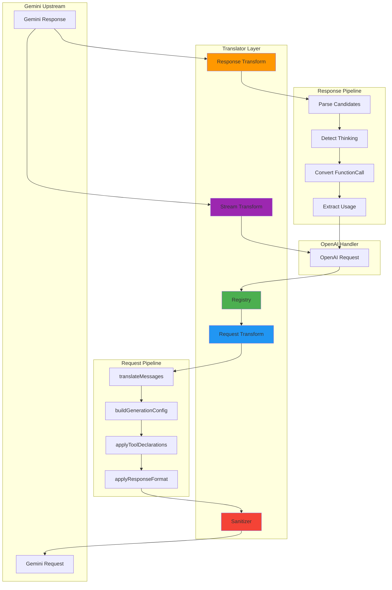

# Translator 模块文档

## 模块定位与职责

Translator 模块是 gcli2api-go 的**格式转换核心**，负责在不同 API 格式之间进行双向转换，包括：

- **请求转换**：OpenAI → Gemini（消息、工具、生成配置、响应格式）
- **响应转换**：Gemini → OpenAI（非流式响应、流式 SSE、Thinking 内容提取）
- **注册机制**：可扩展的 Registry 支持自定义格式转换器
- **内容清洗**：Sanitizer 支持正则过滤敏感内容（如年龄信息）
- **消息合并**：相邻同角色消息自动合并（可配置）
- **多模态支持**：图片、音频、视频、Base64 内联数据
- **工具调用映射**：OpenAI tool_calls ↔ Gemini functionCall/functionResponse
- **Thinking 检测**：自动识别推理内容并映射到 `reasoning_content` 字段

## 目录结构与文件职责

```
internal/translator/
├── types.go                              # 核心类型定义（Format、Transform 函数签名）
├── registry.go                           # 转换器注册表与查找逻辑
├── openai_to_gemini.go                   # OpenAI → Gemini 请求转换入口
├── openai_to_gemini_messages.go          # 消息转换（user/assistant/tool/system）
├── openai_to_gemini_generation.go        # 生成配置转换（temperature、top_p、thinkingConfig）
├── openai_to_gemini_postprocess.go       # 后处理（工具声明、响应格式）
├── gemini_to_openai.go                   # Gemini → OpenAI 响应转换（非流式 + 流式）
├── openai_responses_to_gemini.go         # OpenAI 响应 → Gemini 格式（反向转换，用于测试）
├── sanitizer.go                          # 内容清洗器（正则过滤、DONE 指令注入）
├── sanitizer_test.go                     # Sanitizer 单元测试
└── translator_test.go                    # 集成测试
```

## 核心设计与数据流

### 1. 请求转换流程（OpenAI → Gemini）

```
OpenAI Request (JSON)
    ↓
translateMessages()  ← 消息转换（user/assistant/tool/system）
    ↓
buildGenerationConfig()  ← 生成配置（temperature、top_p、thinkingConfig）
    ↓
applyToolDeclarations()  ← 工具声明转换
    ↓
applyResponseFormat()  ← 响应格式（JSON Schema）
    ↓
sanitizeMessages()  ← 内容清洗（正则过滤）
    ↓
ensureDoneInstruction()  ← 注入 DONE 指令
    ↓
Gemini Request (JSON)
```

### 2. 响应转换流程（Gemini → OpenAI）

**非流式响应**：
```
Gemini Response (JSON)
    ↓
GeminiToOpenAIResponse()
    ↓
提取 candidates → choices
    ↓
检测 Thinking 内容（thought、executableCode、文本模式）
    ↓
分离 reasoning_content 和 content
    ↓
转换 functionCall → tool_calls
    ↓
映射 finishReason（STOP/MAX_TOKENS/SAFETY）
    ↓
构建 usage 统计
    ↓
OpenAI Response (JSON)
```

**流式响应**：
```
Gemini SSE Stream
    ↓
GeminiToOpenAIStream()
    ↓
逐行解析 SSE（data: {...}）
    ↓
提取 delta（content/reasoning_content/tool_calls）
    ↓
构建 OpenAI chunk（chat.completion.chunk）
    ↓
发送 SSE（data: {...}\n\n）
    ↓
发送 [DONE] 标记
    ↓
OpenAI SSE Stream
```

### 3. Registry 机制

Translator 使用全局 Registry 管理转换器：

- **注册**：`Register(from, to Format, cfg TranslatorConfig)` 在 `init()` 中自动注册
- **查找**：`TranslateRequest/Response/Stream()` 根据 `from` 和 `to` 查找对应转换器
- **回退**：如果未找到转换器，返回原始数据（透传）

### 4. Sanitizer 机制

Sanitizer 支持运行时配置的正则过滤：

- **默认模式**：过滤中文年龄表达（如"18岁"、"十八岁"）
- **环境变量**：`SANITIZER_ENABLED=true`、`SANITIZER_PATTERNS="pattern1|pattern2"`
- **运行时配置**：`ConfigureSanitizer(enabled, patterns)`
- **DONE 指令**：自动在 systemInstruction 末尾注入 `[DONE]` 标记（可配置）

## 关键类型与接口

### Format 枚举

```go
type Format string

const (
    FormatOpenAI  Format = "openai"
    FormatGemini  Format = "gemini"
    FormatGeneric Format = "generic"
)
```

### Transform 函数签名

```go
// 请求转换：model + rawJSON + stream → 转换后的 JSON
type RequestTransform func(model string, rawJSON []byte, stream bool) []byte

// 响应转换：ctx + model + responseBody → 转换后的 JSON
type ResponseTransform func(ctx context.Context, model string, responseBody []byte) ([]byte, error)

// 流式转换：ctx + model + reader → 转换后的 reader
type StreamTransform func(ctx context.Context, model string, reader io.Reader) (io.Reader, error)
```

### TranslatorConfig

```go
type TranslatorConfig struct {
    RequestTransform  RequestTransform
    ResponseTransform ResponseTransform
    StreamTransform   StreamTransform
}
```

### Registry

```go
type Registry struct {
    mu        sync.RWMutex
    requests  map[Format]map[Format]RequestTransform
    responses map[Format]map[Format]ResponseTransform
    streams   map[Format]map[Format]StreamTransform
}
```

## 重要配置项

### 环境变量

| 变量名 | 类型 | 默认值 | 说明 |
|--------|------|--------|------|
| `SANITIZER_ENABLED` | bool | false | 是否启用内容清洗 |
| `SANITIZER_PATTERNS` | string | 年龄正则 | 清洗正则模式（`\|` 或 `,` 分隔） |
| `DONE_INSTRUCTION_ENABLED` | bool | true | 是否注入 DONE 指令 |

### 请求字段映射

| OpenAI 字段 | Gemini 字段 | 说明 |
|-------------|-------------|------|
| `messages` | `contents` + `systemInstruction` | 消息数组，system 消息提取为 systemInstruction |
| `temperature` | `generationConfig.temperature` | 温度参数 |
| `top_p` | `generationConfig.topP` | Top-P 采样 |
| `top_k` | `generationConfig.topK` | Top-K 采样（默认 40，最大 100） |
| `max_tokens` | `generationConfig.maxOutputTokens` | 最大输出 token 数 |
| `frequency_penalty` | `generationConfig.frequencyPenalty` | 频率惩罚 |
| `presence_penalty` | `generationConfig.presencePenalty` | 存在惩罚 |
| `n` | `generationConfig.candidateCount` | 候选数量 |
| `seed` | `generationConfig.seed` | 随机种子 |
| `reasoning_effort` | `generationConfig.thinkingConfig` | 推理强度（none/low/medium/high/auto） |
| `modalities` | `generationConfig.responseModalities` | 响应模态（text/image） |
| `stop` | `generationConfig.stopSequences` | 停止序列 |
| `tools` | `tools.functionDeclarations` | 工具声明 |
| `response_format` | `generationConfig.responseMimeType` + `responseSchema` | 响应格式（JSON Schema） |

### 响应字段映射

| Gemini 字段 | OpenAI 字段 | 说明 |
|-------------|-------------|------|
| `candidates[].content.parts[].text` | `choices[].message.content` | 文本内容 |
| `candidates[].content.parts[].thought` | `choices[].message.reasoning_content` | 推理内容 |
| `candidates[].content.parts[].functionCall` | `choices[].message.tool_calls` | 工具调用 |
| `candidates[].finishReason` | `choices[].finish_reason` | 结束原因（STOP→stop、MAX_TOKENS→length、SAFETY→content_filter） |
| `usageMetadata.promptTokenCount` | `usage.prompt_tokens` | 提示 token 数 |
| `usageMetadata.candidatesTokenCount` | `usage.completion_tokens` | 完成 token 数 |

## 与其他模块的依赖关系

### 依赖的模块

- **constants**：默认值（DefaultTopK、MaxTopK、MaxOutputTokens）
- **common**：DONE 指令常量（DoneMarker、DoneInstruction）

### 被依赖的模块

- **handlers/openai**：调用 `TranslateRequest()` 转换请求，调用 `TranslateResponse/Stream()` 转换响应
- **handlers/gemini**：可选地使用 Sanitizer 清洗输出
- **upstream**：透传转换后的请求体到 Gemini CLI

## 可执行示例

### 示例 1：OpenAI → Gemini 请求转换

```go
package main

import (
    "encoding/json"
    "fmt"
    "gcli2api-go/internal/translator"
)

func main() {
    // OpenAI 格式请求
    openaiReq := map[string]interface{}{
        "model": "gpt-4",
        "messages": []map[string]interface{}{
            {"role": "system", "content": "You are a helpful assistant."},
            {"role": "user", "content": "Hello!"},
        },
        "temperature": 0.7,
        "max_tokens":  100,
    }

    openaiJSON, _ := json.Marshal(openaiReq)

    // 转换为 Gemini 格式
    geminiJSON := translator.TranslateRequest(
        translator.FormatOpenAI,
        translator.FormatGemini,
        "gemini-2.5-pro",
        openaiJSON,
        false, // stream
    )

    fmt.Println(string(geminiJSON))
    // 输出：
    // {
    //   "contents": [{"role":"user","parts":[{"text":"Hello!"}]}],
    //   "systemInstruction": {"parts":[{"text":"You are a helpful assistant."},{"text":"[DONE]"}]},
    //   "generationConfig": {"temperature":0.7,"maxOutputTokens":100,"topK":40,"candidateCount":1}
    // }
}
```

### 示例 2：Gemini → OpenAI 响应转换

```go
package main

import (
    "context"
    "encoding/json"
    "fmt"
    "gcli2api-go/internal/translator"
)

func main() {
    // Gemini 格式响应
    geminiResp := `{
        "candidates": [{
            "content": {
                "parts": [{"text": "Hello! How can I help you?"}],
                "role": "model"
            },
            "finishReason": "STOP"
        }],
        "usageMetadata": {
            "promptTokenCount": 10,
            "candidatesTokenCount": 8
        }
    }`

    // 转换为 OpenAI 格式
    openaiJSON, err := translator.TranslateResponse(
        context.Background(),
        translator.FormatGemini,
        translator.FormatOpenAI,
        "gemini-2.5-pro",
        []byte(geminiResp),
    )
    if err != nil {
        panic(err)
    }

    var result map[string]interface{}
    json.Unmarshal(openaiJSON, &result)
    fmt.Printf("OpenAI Response: %+v\n", result)
    // 输出：
    // {
    //   "id": "chatcmpl-1234567890",
    //   "object": "chat.completion",
    //   "model": "gemini-2.5-pro",
    //   "choices": [{
    //     "index": 0,
    //     "message": {"role":"assistant","content":"Hello! How can I help you?"},
    //     "finish_reason": "stop"
    //   }],
    //   "usage": {"prompt_tokens":10,"completion_tokens":8,"total_tokens":18}
    // }
}
```

### 示例 3：Thinking 内容提取

```go
package main

import (
    "context"
    "encoding/json"
    "fmt"
    "gcli2api-go/internal/translator"
)

func main() {
    // Gemini 响应包含 thinking 内容
    geminiResp := `{
        "candidates": [{
            "content": {
                "parts": [
                    {"thought": "Let me analyze this step by step..."},
                    {"text": "The answer is 42."}
                ],
                "role": "model"
            },
            "finishReason": "STOP"
        }]
    }`

    openaiJSON, _ := translator.TranslateResponse(
        context.Background(),
        translator.FormatGemini,
        translator.FormatOpenAI,
        "gemini-2.5-pro",
        []byte(geminiResp),
    )

    var result map[string]interface{}
    json.Unmarshal(openaiJSON, &result)

    message := result["choices"].([]interface{})[0].(map[string]interface{})["message"].(map[string]interface{})
    fmt.Printf("Content: %s\n", message["content"])
    fmt.Printf("Reasoning: %s\n", message["reasoning_content"])
    // 输出：
    // Content: The answer is 42.
    // Reasoning: Let me analyze this step by step...
}
```

### 示例 4：工具调用转换

```go
package main

import (
    "encoding/json"
    "fmt"
    "gcli2api-go/internal/translator"
)

func main() {
    // OpenAI 格式工具调用
    openaiReq := map[string]interface{}{
        "model": "gpt-4",
        "messages": []map[string]interface{}{
            {"role": "user", "content": "What's the weather in Tokyo?"},
        },
        "tools": []map[string]interface{}{
            {
                "type": "function",
                "function": map[string]interface{}{
                    "name":        "get_weather",
                    "description": "Get current weather",
                    "parameters": map[string]interface{}{
                        "type": "object",
                        "properties": map[string]interface{}{
                            "location": map[string]interface{}{"type": "string"},
                        },
                        "required": []string{"location"},
                    },
                },
            },
        },
    }

    openaiJSON, _ := json.Marshal(openaiReq)
    geminiJSON := translator.TranslateRequest(
        translator.FormatOpenAI,
        translator.FormatGemini,
        "gemini-2.5-pro",
        openaiJSON,
        false,
    )

    var result map[string]interface{}
    json.Unmarshal(geminiJSON, &result)
    fmt.Printf("Gemini Tools: %+v\n", result["tools"])
    // 输出：
    // [{functionDeclarations:[{name:get_weather description:Get current weather parameters:{...}}]}]
}
```

### 示例 5：配置 Sanitizer

```go
package main

import (
    "gcli2api-go/internal/translator"
)

func main() {
    // 启用 Sanitizer 并配置自定义正则
    translator.ConfigureSanitizer(true, []string{
        `(?i)(?:[1-9]|1[0-8])岁(?:的)?`,  // 年龄过滤
        `\b\d{3}-\d{4}-\d{4}\b`,          // 电话号码过滤
        `\b[A-Z0-9._%+-]+@[A-Z0-9.-]+\.[A-Z]{2,}\b`, // 邮箱过滤
    })

    // 测试清洗
    input := "我今年18岁，电话是123-4567-8901，邮箱是test@example.com"
    output := translator.SanitizeOutputText(input)
    fmt.Println(output)
    // 输出：我今年，电话是，邮箱是
}
```

### 示例 6：流式响应转换

```go
package main

import (
    "bufio"
    "bytes"
    "context"
    "fmt"
    "gcli2api-go/internal/translator"
)

func main() {
    // 模拟 Gemini SSE 流
    geminiStream := `data: {"candidates":[{"content":{"parts":[{"text":"Hello"}],"role":"model"}}]}

data: {"candidates":[{"content":{"parts":[{"text":" world"}],"role":"model"}}]}

data: {"candidates":[{"content":{"parts":[],"role":"model"},"finishReason":"STOP"}]}

data: [DONE]

`

    reader := bytes.NewReader([]byte(geminiStream))

    // 转换为 OpenAI SSE 流
    openaiReader, err := translator.TranslateStream(
        context.Background(),
        translator.FormatGemini,
        translator.FormatOpenAI,
        "gemini-2.5-pro",
        reader,
    )
    if err != nil {
        panic(err)
    }

    // 读取转换后的流
    scanner := bufio.NewScanner(openaiReader)
    for scanner.Scan() {
        line := scanner.Text()
        fmt.Println(line)
    }
    // 输出：
    // data: {"id":"chatcmpl-...","object":"chat.completion.chunk","choices":[{"index":0,"delta":{"role":"assistant","content":"Hello"},"finish_reason":null}]}
    //
    // data: {"id":"chatcmpl-...","object":"chat.completion.chunk","choices":[{"index":0,"delta":{"content":" world"},"finish_reason":null}]}
    //
    // data: {"id":"chatcmpl-...","object":"chat.completion.chunk","choices":[{"index":0,"delta":{},"finish_reason":"stop"}]}
    //
    // data: [DONE]
}
```

## 架构示意图



## 已知限制

1. **System 消息处理**
   - 默认模式：仅前导 system 消息提取为 `systemInstruction`，后续 system 消息转为 user 消息
   - 兼容模式：所有 system 消息转为 user 消息（设置 `_compatibility_mode: true`）
   - 解决方案：根据模型能力选择合适的模式

2. **Thinking 检测准确性**
   - 基于启发式规则（`<think>`、`Let me think` 等）检测推理内容
   - 可能误判普通文本为推理内容
   - 解决方案：优化 `detectThinkingInText()` 规则或使用 Gemini 原生 `thought` 字段

3. **工具调用 ID 生成**
   - OpenAI 的 `tool_call_id` 由 Translator 生成（`call_{name}_{index}`）
   - 可能与 OpenAI 原生 ID 格式不一致
   - 解决方案：如果需要精确匹配，可扩展 ID 生成逻辑

4. **流式响应缓冲**
   - 流式转换使用 `io.Pipe`，可能引入额外延迟
   - 解决方案：已优化 Scanner 缓冲区（64KB 初始，4MB 最大）

5. **Sanitizer 性能**
   - 每次转换都会执行正则匹配，可能影响性能
   - 解决方案：仅在必要时启用 Sanitizer（默认禁用）

6. **消息合并副作用**
   - 默认启用相邻同角色消息合并，可能改变原始消息结构
   - 解决方案：设置 `compat_merge_adjacent: false` 禁用合并

7. **多模态支持限制**
   - 仅支持 text、image、audio、video 基本类型
   - 不支持复杂的多模态组合（如图片 + 音频）
   - 解决方案：扩展 `convertContentPart()` 支持更多类型

## 最佳实践

1. **选择合适的转换方向**：仅在必要时转换，避免不必要的性能开销
2. **配置 Sanitizer**：根据业务需求配置正则模式，避免过度过滤
3. **处理 Thinking 内容**：检查 `reasoning_content` 字段获取推理过程
4. **工具调用验证**：转换后验证 `tool_calls` 格式是否符合预期
5. **流式响应错误处理**：监听 SSE 流中的 `error` 事件
6. **消息合并控制**：对于需要保留原始消息结构的场景，禁用合并
7. **测试覆盖**：为自定义转换器编写单元测试，确保正确性
8. **性能监控**：监控转换耗时，识别性能瓶颈


