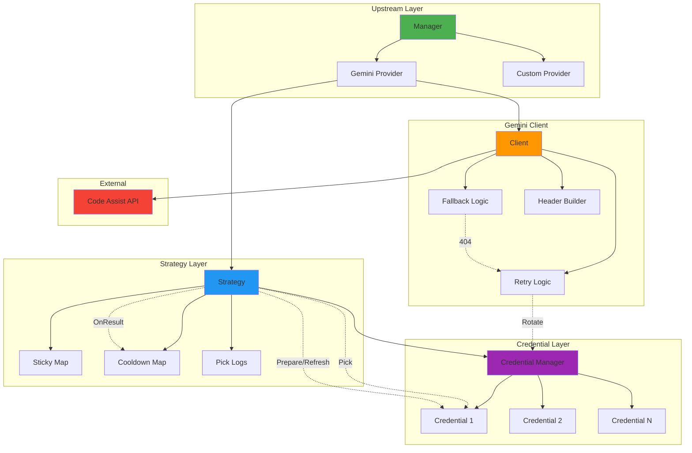

# Upstream 模块文档

## 模块定位与职责

Upstream 模块是 gcli2api-go 的**上游调用核心**，负责与 Gemini CLI (Code Assist) 的实际通信，包括：

- **Provider 抽象**：统一的上游调用接口，支持多 provider 扩展
- **Gemini CLI 集成**：完整的 Code Assist API 调用实现（生成/流式/计数/动作）
- **重试策略**：基于状态码的智能重试与凭证轮换
- **模型回退**：404 时自动尝试备用模型（如 gemini-2.0-flash-exp → gemini-2.0-flash-thinking-exp）
- **路由策略（Strategy）**：凭证选择、粘性路由、冷却机制、提前刷新
- **请求优化**：User-Agent 伪装、Header 透传、Thinking Config 安全移除
- **并发控制**：每凭证并发限制与信号量管理
- **可观测性**：OpenTelemetry 追踪、Prometheus 指标

## 目录结构与文件职责

```
internal/upstream/
├── manager.go                    # Provider 管理器
├── request.go                    # RequestContext 与 ProviderResponse 定义
├── context.go                    # Context 辅助函数（Header 透传）
├── retry.go                      # TryWithRotation 重试与轮换逻辑
├── gemini/
│   ├── provider.go               # Gemini Provider 实现
│   ├── client.go                 # Gemini CLI HTTP 客户端
│   ├── client_retry.go           # 重试逻辑（指数退避、Retry-After）
│   ├── client_headers.go         # User-Agent 生成与 Header 处理
│   ├── client_payload.go         # 请求体预处理（Image Hints、Thinking Config）
│   ├── client_models.go          # 模型回退顺序生成
│   ├── client_fallback.go        # 404 模型回退实现
│   ├── executor.go               # Executor 封装（简化调用）
│   └── ...                       # 测试文件
└── strategy/
    ├── strategy_types.go         # Strategy 结构定义
    ├── strategy_constructor.go   # Strategy 构造函数
    ├── strategy_pick.go          # 凭证选择逻辑（P2C 加权选择）
    ├── strategy_sticky.go        # 粘性路由实现
    ├── strategy_cooldown.go      # 冷却机制实现
    ├── strategy_refresh.go       # 提前刷新与 401 补偿
    ├── strategy_logs.go          # 选路日志记录
    ├── helpers.go                # 辅助函数
    └── global.go                 # 全局 Strategy 实例
```

## 核心设计与数据流

### 1. 请求处理流程

```
Handler → Translator → Upstream Manager → Provider → Strategy
                                              ↓
                                         Pick Credential
                                              ↓
                                         Prepare (Refresh?)
                                              ↓
                                         Gemini Client
                                              ↓
                                         HTTP Request
                                              ↓
                                    Retry/Rotation (if needed)
                                              ↓
                                         Response
                                              ↓
                                    OnResult (Cooldown/Sticky)
```

### 2. 凭证选择策略（P2C）

Strategy 使用 **Power of Two Choices (P2C)** 算法选择凭证：

1. **粘性命中**：检查请求头中的粘性键（如 `X-Session-ID`），如果存在且未过期，直接返回对应凭证
2. **过滤候选**：排除冷却中的凭证和无并发容量的凭证
3. **随机采样**：从候选中随机选择 2 个凭证
4. **评分比较**：计算两个凭证的健康评分，选择分数更高的
5. **回写粘性**：如果请求头包含粘性键，将选中的凭证 ID 写入粘性映射（TTL 默认 5 分钟）

### 3. 冷却机制

当凭证遇到特定错误时，进入冷却期，暂时不参与选择：

| 错误码 | 冷却策略 | 说明 |
|--------|---------|------|
| 429    | 指数退避 | 速率限制，strikes 递增，冷却时间翻倍 |
| 403    | 指数退避 | 权限不足，strikes 递增 |
| 5xx    | 指数退避 | 服务器错误，strikes 递增 |
| 2xx/3xx | strikes-- | 成功请求减少 strikes，strikes=0 时移除冷却 |

冷却时间计算：`duration = base << (strikes - 1)`，最大不超过 `max`（默认 60 秒）

### 4. 重试与轮换策略

`TryWithRotation` 函数实现智能重试：

1. **初次尝试**：使用初始凭证发起请求
2. **成功路径**：状态码 < 400，直接返回
3. **401 补偿**：尝试刷新当前凭证，重试一次
4. **轮换条件**：429/401/403/5xx（可选）触发轮换
5. **获取备用凭证**：调用 `GetAlternateCredential(excludeID)`
6. **轮换限制**：最多轮换 `MaxRotations` 次（默认 2-8 次，取决于凭证数量）
7. **标记失败**：每次轮换前标记当前凭证失败，触发 `OnResult`

### 5. 模型回退机制

当遇到 404 错误时，自动尝试备用模型：

```
gemini-2.5-pro → gemini-2.0-flash-exp → gemini-2.0-flash-thinking-exp → gemini-1.5-pro
```

回退顺序由 `models.FallbackOrder(model)` 生成，保留模型后缀（如 `-maxthinking`、`-search`）

## 关键类型与接口

### Provider 接口

```go
type Provider interface {
    Name() string
    SupportsModel(baseModel string) bool
    Stream(RequestContext) ProviderResponse
    Generate(RequestContext) ProviderResponse
    ListModels(RequestContext) ProviderListResponse
    Invalidate(credID string)
}
```

### RequestContext

```go
type RequestContext struct {
    Ctx             context.Context
    Credential      *credential.Credential
    BaseModel       string
    ProjectID       string
    Body            []byte
    HeaderOverrides http.Header
}
```

### ProviderResponse

```go
type ProviderResponse struct {
    Resp       *http.Response
    UsedModel  string
    Err        error
    Credential *credential.Credential
}
```

### Strategy 结构

```go
type Strategy struct {
    cfg       *config.Config
    credMgr   *credential.Manager
    onRefresh func(string) // 刷新回调，用于使客户端缓存失效
    
    mu       sync.RWMutex
    sticky   map[string]stickyEntry   // 粘性路由映射
    cooldown map[string]cooldownEntry // 冷却状态映射
    
    pickLogs   []PickLog // 选路日志（最近 200 条）
    pickLogCap int
}
```

### Gemini Client

```go
type Client struct {
    cfg         *config.Config
    cli         *http.Client
    caller      string             // "openai"/"gemini"
    credentials *oauth.Credentials
    token       string             // 缓存的 access token
}
```

## 重要配置项

### 重试配置

| 字段 | 类型 | 默认值 | 说明 |
|------|------|--------|------|
| `RetryOnNetworkError` | bool | true | 网络错误时是否重试 |
| `RetryOn5xx` | bool | true | 5xx 错误时是否重试 |
| `MaxRetries` | int | 3 | 最大重试次数 |
| `RetryBaseDelayMS` | int | 1000 | 基础重试延迟（毫秒） |
| `RetryMaxDelayMS` | int | 30000 | 最大重试延迟（毫秒） |

### 路由配置

| 字段 | 类型 | 默认值 | 说明 |
|------|------|--------|------|
| `StickyTTLSeconds` | int | 300 | 粘性路由 TTL（秒） |
| `RouterCooldownBaseMS` | int | 2000 | 冷却基础时间（毫秒） |
| `RouterCooldownMaxMS` | int | 60000 | 冷却最大时间（毫秒） |
| `RefreshAheadSeconds` | int | 180 | 提前刷新秒数 |

### 超时配置

| 字段 | 类型 | 默认值 | 说明 |
|------|------|--------|------|
| `DialTimeoutSec` | int | 10 | 连接超时（秒） |
| `TLSHandshakeTimeoutSec` | int | 10 | TLS 握手超时（秒） |
| `ResponseHeaderTimeoutSec` | int | 30 | 响应头超时（秒） |
| `ExpectContinueTimeoutSec` | int | 1 | Expect-Continue 超时（秒） |

### 轮换配置

| 字段 | 类型 | 默认值 | 说明 |
|------|------|--------|------|
| `MaxRotations` | int | 自动计算 | 单次请求最大轮换次数 |
| `RotateOn5xx` | bool | false | 5xx 错误时是否轮换 |

## 与其他模块的依赖关系

### 依赖的模块

- **config**：读取重试、路由、超时等配置
- **credential**：获取凭证、标记成功/失败、刷新 token
- **oauth**：OAuth token 刷新与验证
- **models**：模型回退顺序生成、能力检查
- **monitoring**：Prometheus 指标记录（重试、回退、粘性命中、冷却）
- **tracing**：OpenTelemetry 追踪（请求跨度、事件记录）

### 被依赖的模块

- **handlers**：调用 `Provider.Stream()`/`Provider.Generate()` 发起上游请求
- **translator**：将 OpenAI 格式转换为 Gemini 格式后传递给 upstream
- **server**：初始化 `Manager` 并注册 `Provider`

## 可执行示例

### 示例 1：初始化 Provider 和 Manager

```go
package main

import (
    "gcli2api-go/internal/config"
    "gcli2api-go/internal/credential"
    "gcli2api-go/internal/upstream"
    "gcli2api-go/internal/upstream/gemini"
    "gcli2api-go/internal/upstream/strategy"
)

func main() {
    // 加载配置
    cfg, _ := config.Load()

    // 创建凭证管理器
    credMgr := credential.NewManager(credential.Options{
        AuthDir: "/path/to/credentials",
    })
    credMgr.LoadCredentials()

    // 创建路由策略
    router := strategy.NewStrategy(cfg, credMgr, func(credID string) {
        // 刷新回调：使客户端缓存失效
        log.Printf("Credential %s refreshed, invalidating cache", credID)
    })

    // 创建 Gemini Provider
    geminiProvider := gemini.NewProvider(cfg)

    // 创建 Upstream Manager
    upstreamMgr := upstream.NewManager(geminiProvider)

    // 使用 Provider
    provider := upstreamMgr.ProviderFor("gemini-2.5-pro")
    log.Printf("Selected provider: %s", provider.Name())
}
```

### 示例 2：发起流式请求

```go
// 准备请求上下文
reqCtx := upstream.RequestContext{
    Ctx:        context.Background(),
    Credential: cred,
    BaseModel:  "gemini-2.5-pro",
    ProjectID:  "my-project-123",
    Body:       requestBody,
    HeaderOverrides: http.Header{
        "X-Session-ID": []string{"user-session-abc"},
    },
}

// 发起流式请求
resp := provider.Stream(reqCtx)
if resp.Err != nil {
    log.Fatalf("Stream failed: %v", resp.Err)
}
defer resp.Resp.Body.Close()

// 读取 SSE 流
scanner := bufio.NewScanner(resp.Resp.Body)
for scanner.Scan() {
    line := scanner.Text()
    if strings.HasPrefix(line, "data: ") {
        data := strings.TrimPrefix(line, "data: ")
        log.Printf("Received: %s", data)
    }
}
```

### 示例 3：使用 Strategy 选择凭证

```go
// 从请求头中选择凭证（支持粘性路由）
cred := router.Pick(ctx, req.Header)
if cred == nil {
    return errors.New("no credential available")
}

// 使用凭证发起请求
reqCtx := upstream.RequestContext{
    Ctx:        ctx,
    Credential: cred,
    BaseModel:  "gemini-2.5-pro",
    Body:       payload,
}

resp := provider.Generate(reqCtx)
if resp.Err != nil {
    // 标记失败并触发冷却
    router.OnResult(cred.ID, 429)
    return resp.Err
}

// 标记成功（减少冷却 strikes）
router.OnResult(cred.ID, resp.Resp.StatusCode)
```

### 示例 4：重试与轮换

```go
// 配置轮换选项
opts := upstream.RotationOptions{
    MaxRotations: 4,
    RotateOn5xx:  true,
}

// 定义请求函数
doRequest := func(c *credential.Credential) (*http.Response, error) {
    reqCtx := upstream.RequestContext{
        Ctx:        ctx,
        Credential: c,
        BaseModel:  "gemini-2.5-pro",
        Body:       payload,
    }
    resp := provider.Generate(reqCtx)
    return resp.Resp, resp.Err
}

// 执行带轮换的请求
resp, usedCred, err := upstream.TryWithRotation(
    ctx,
    credMgr,
    router,
    initialCred,
    opts,
    doRequest,
)
if err != nil {
    log.Fatalf("Request failed after rotations: %v", err)
}
defer resp.Body.Close()

log.Printf("Request succeeded with credential: %s", usedCred.ID)
```

### 示例 5：查看路由状态

```go
// 获取粘性路由和冷却状态快照
stickyCount, cooldowns := router.Snapshot()
log.Printf("Sticky routes: %d", stickyCount)

for _, cd := range cooldowns {
    log.Printf("Credential %s: strikes=%d, remaining=%ds",
        cd.CredID, cd.Strikes, cd.RemainingSec)
}

// 获取最近的选路日志
picks := router.Picks(10)
for _, pick := range picks {
    log.Printf("[%s] Selected %s (reason: %s, score: %.2f)",
        pick.Time.Format("15:04:05"),
        pick.CredID,
        pick.Reason,
        pick.ScoreA)
}

// 清除特定凭证的冷却状态
if router.ClearCooldown("cred-123") {
    log.Printf("Cleared cooldown for cred-123")
}
```

### 示例 6：自定义 Provider

```go
// 实现自定义 Provider
type CustomProvider struct {
    name string
}

func (p *CustomProvider) Name() string {
    return p.name
}

func (p *CustomProvider) SupportsModel(baseModel string) bool {
    return strings.HasPrefix(baseModel, "custom-")
}

func (p *CustomProvider) Stream(ctx upstream.RequestContext) upstream.ProviderResponse {
    // 实现流式请求逻辑
    resp, err := http.Post("https://custom-api.com/stream", "application/json", bytes.NewReader(ctx.Body))
    return upstream.ProviderResponse{
        Resp:       resp,
        UsedModel:  ctx.BaseModel,
        Err:        err,
        Credential: ctx.Credential,
    }
}

func (p *CustomProvider) Generate(ctx upstream.RequestContext) upstream.ProviderResponse {
    // 实现非流式请求逻辑
    resp, err := http.Post("https://custom-api.com/generate", "application/json", bytes.NewReader(ctx.Body))
    return upstream.ProviderResponse{
        Resp:       resp,
        UsedModel:  ctx.BaseModel,
        Err:        err,
        Credential: ctx.Credential,
    }
}

func (p *CustomProvider) ListModels(ctx upstream.RequestContext) upstream.ProviderListResponse {
    return upstream.ProviderListResponse{
        Models: []string{"custom-model-1", "custom-model-2"},
        Err:    nil,
    }
}

func (p *CustomProvider) Invalidate(credID string) {
    // 清理缓存
}

// 注册自定义 Provider
customProvider := &CustomProvider{name: "custom"}
upstreamMgr.Register(customProvider)
```

## 架构示意图



## 已知限制

1. **Provider 扩展性**
   - 当前仅实现 Gemini Provider，其他 provider 需要自行实现
   - 解决方案：参考 `gemini.Provider` 实现自定义 provider

2. **模型回退顺序**
   - 回退顺序硬编码在 `models.FallbackOrder()` 中
   - 解决方案：未来可支持配置文件定义回退顺序

3. **粘性路由键提取**
   - 当前仅支持 `X-Session-ID`、`X-User-ID`、`X-Client-ID` 等固定 Header
   - 解决方案：可扩展 `stickyKeyAndSourceFromHeaders()` 支持更多 Header

4. **冷却状态持久化**
   - 冷却状态仅存储在内存中，重启后丢失
   - 解决方案：可扩展 Strategy 支持持久化到 Redis/文件

5. **并发轮换限制**
   - `TryWithRotation` 的 `MaxRotations` 默认值基于凭证数量，可能不适合所有场景
   - 解决方案：显式配置 `RotationOptions.MaxRotations`

6. **重试延迟上限**
   - 最大重试延迟为 30 秒，可能不适合某些慢速 API
   - 解决方案：调整 `RetryMaxDelayMS` 配置

7. **Thinking Config 移除**
   - 对于不支持 thinking 的模型，会自动移除 `thinkingConfig`
   - 影响：可能导致请求体与预期不一致，需要注意日志中的 `thinking_removed` 指标

## 最佳实践

1. **使用 Strategy 选择凭证**：避免直接调用 `credMgr.GetCredential()`，使用 `router.Pick()` 获得更好的负载均衡和容错
2. **启用粘性路由**：对于有状态的会话（如多轮对话），在请求头中传递 `X-Session-ID` 确保使用同一凭证
3. **监控冷却状态**：定期调用 `router.Snapshot()` 检查冷却凭证数量，及时发现问题
4. **配置合理的轮换次数**：根据凭证数量和 API 稳定性调整 `MaxRotations`
5. **处理 401 补偿**：`TryWithRotation` 会自动处理 401 并刷新 token，无需手动处理
6. **关闭响应体**：所有 `Provider` 方法返回的 `http.Response` 必须由调用方关闭
7. **使用 Context 超时**：为 `RequestContext.Ctx` 设置合理的超时，避免长时间阻塞
8. **记录选路日志**：使用 `router.Picks()` 获取选路历史，便于调试和分析


