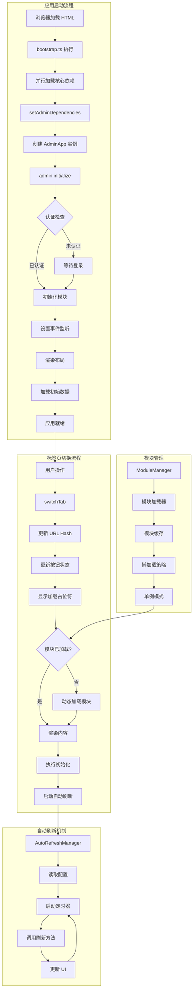

# Admin 模块文档

## 模块定位与职责

Admin 模块是 GCLI2API-Go 前端管理控制台的**核心应用层**，负责整个管理界面的初始化、路由管理、标签页切换、模块协调和生命周期管理。

### 核心职责

1. **应用初始化**：管理控制台的启动流程、依赖注入、模块加载
2. **路由管理**：基于 URL Hash 的路由系统、标签页切换、深链接支持
3. **布局管理**：侧边栏、头部状态栏、主内容区的渲染和控制
4. **模块协调**：动态加载和管理各业务模块（凭证、日志、统计等）
5. **快捷键系统**：全局键盘快捷键绑定和处理
6. **自动刷新**：仪表盘和统计数据的自动刷新机制
7. **错误处理**：资源加载失败、版本不匹配等错误的处理和展示
8. **无障碍支持**：ARIA 属性、焦点管理、屏幕阅读器支持

---

## 目录结构与文件职责

```
web/src/admin/
├── app.ts              # AdminApp 主应用类（1510 行）- 应用核心逻辑
├── bootstrap.ts        # 应用启动流程（83 行）- 依赖加载和初始化
├── router.ts           # 路由管理器（130 行）- Hash 路由和标签页切换
├── layout.ts           # 布局辅助函数（247 行）- 侧边栏、头部渲染
├── module-loader.ts    # 模块加载器（57 行）- 管理模块的动态加载
├── shortcuts.ts        # 快捷键绑定（138 行）- 全局键盘快捷键
├── refresh.ts          # 自动刷新管理器（136 行）- 数据自动刷新逻辑
├── error-handler.ts    # 错误处理器（132 行）- 资源加载错误处理
├── resource-loader.ts  # 资源加载器（166 行）- 脚本/样式表加载和重试
└── ui-utils.ts         # UI 工具函数（127 行）- 模态框、Emoji 移除等
```

### 文件职责说明

| 文件 | 核心职责 | 关键类型/函数 |
|------|---------|--------------|
| **app.ts** | AdminApp 主应用类，管理整个应用生命周期 | `AdminApp`、`setAdminDependencies` |
| **bootstrap.ts** | 应用启动流程，加载核心依赖并初始化 | `bootstrapAdmin`、`AdminBootstrapContext` |
| **router.ts** | Hash 路由管理，标签页切换逻辑 | `Router`、`createRouter` |
| **layout.ts** | 布局渲染辅助函数，侧边栏和头部生成 | `renderLayout`、`createSidebarController` |
| **module-loader.ts** | 管理模块的动态加载和错误处理 | `loadAdminModule`、`initializeModuleLoading` |
| **shortcuts.ts** | 全局键盘快捷键绑定和处理 | `bindAdminShortcuts` |
| **refresh.ts** | 自动刷新管理器，控制数据刷新间隔 | `createAutoRefreshManager`、`AutoRefreshManager` |
| **error-handler.ts** | 资源加载错误处理和展示 | `renderAdminLoadError` |
| **resource-loader.ts** | 脚本和样式表加载，支持重试和超时 | `loadResourceWithRetry` |
| **ui-utils.ts** | UI 工具函数（模态框、Emoji 移除） | `openModal`、`closeModal` |

---

## 核心设计与数据流

### 1. 应用启动流程

```
浏览器加载 HTML
    ↓
bootstrap.ts 执行
    ↓
并行加载核心依赖（auth、api、ui、oauth、config、dashboard、layout、a11y）
    ↓
setAdminDependencies() 注入依赖
    ↓
创建 AdminApp 实例
    ↓
admin.initialize()
    ↓
认证检查 → 模块初始化 → 事件监听 → 渲染布局 → 加载初始数据
    ↓
应用就绪
```

### 2. 标签页切换流程

```
用户点击标签按钮 / URL Hash 变化
    ↓
switchTab(tabName)
    ↓
更新 URL Hash
    ↓
更新标签按钮状态（active、aria-selected）
    ↓
显示加载占位符（skeleton）
    ↓
停止之前标签页的自动刷新
    ↓
动态加载标签页所需模块（如未加载）
    ↓
渲染标签页内容
    ↓
执行标签页特定初始化（initializeTabContent）
    ↓
启动自动刷新（如启用）
    ↓
无障碍通知（announce）
    ↓
移动端收起侧边栏
```

### 3. 模块动态加载机制

```typescript
// AdminApp 内部的模块加载器
private createModuleLoaders(): Record<string, () => Promise<any>> {
    return {
        metrics: async () => {
            if (!metricsManager) {
                const mod = await import(modulePath('metrics', '/js/metrics.js'));
                metricsManager = mod.metricsManager;
            }
            return metricsManager;
        },
        credentials: async () => {
            if (!credsManager) {
                const credsMod = await import(modulePath('creds', '/js/creds.js'));
                credsManager = credsMod.credsManager;
            }
            await credsManager.refreshCredentials();
            credsManager.bindDomRefresh();
            return credsManager;
        },
        // ... 其他模块
    };
}
```

**特点**：
- **懒加载**：仅在切换到对应标签页时加载模块
- **单例模式**：模块加载后缓存，避免重复加载
- **初始化钩子**：加载后自动执行模块特定的初始化逻辑

### 4. 自动刷新机制

```
用户启用自动刷新
    ↓
createAutoRefreshManager 创建管理器
    ↓
读取 localStorage 配置（启用状态、刷新间隔）
    ↓
根据当前标签页启动对应的刷新定时器
    ↓
定时器触发 → 调用模块的刷新方法
    ↓
用户切换标签页 → 停止旧定时器 → 启动新定时器
```

**支持的刷新间隔**：15s、30s（默认）、60s

### 5. 快捷键系统

| 快捷键 | 功能 | 条件 |
|--------|------|------|
| `Ctrl/Cmd + K` | 快速切换标签 | 全局 |
| `Ctrl/Cmd + R` | 刷新当前标签页数据 | 全局 |
| `Ctrl/Cmd + S` | 保存配置 | 仅配置页 |
| `Ctrl/Cmd + E` | 导出当前数据 | 全局 |
| `Ctrl/Cmd + I` | 导入配置 | 仅配置页 |
| `Ctrl/Cmd + B` | 切换批量模式 | 仅凭证页 |
| `Ctrl/Cmd + H` | 显示/隐藏侧边栏 | 全局 |
| `Shift + ?` | 快捷键帮助 | 全局 |
| `Ctrl/Cmd + [` | 上一个标签页 | 全局 |
| `Ctrl/Cmd + ]` | 下一个标签页 | 全局 |
| `F5` | 强制刷新页面（带确认） | 全局 |

---

## 关键类型与接口

### 1. AdminApp 类

```typescript
export class AdminApp {
    private currentTab: string;                    // 当前标签页
    private tabs: string[];                        // 所有标签页列表
    private initialized: boolean;                  // 初始化状态
    private moduleManager: ModuleManager;          // 模块管理器
    private modules: Record<string, any>;          // 已加载模块缓存
    private autoRefresh: AutoRefreshManager;       // 自动刷新管理器
    private detachShortcuts?: () => void;          // 快捷键解绑函数

    constructor();                                 // 构造函数
    async initialize(): Promise<void>;             // 初始化应用
    async switchTab(tabName: string): Promise<void>; // 切换标签页
    async loadModule(moduleName: string): Promise<any>; // 加载模块
    refreshCurrentTab(): Promise<void>;            // 刷新当前标签页
    exportCurrentTabData(): void;                  // 导出当前数据
    showQuickSwitcher(): void;                     // 显示快速切换器
    showHelpModal(): void;                         // 显示快捷键帮助
}
```

### 2. AdminBootstrapContext 接口

```typescript
export interface AdminBootstrapContext {
  basePath: string;                                // 基础路径
  assetVersion: string;                            // 资源版本号
  metaPayload: any;                                // 元信息载荷
  metaError: string;                               // 元信息错误
  assetMismatch: { expected: string; server: string } | null; // 版本不匹配
}
```

### 3. Router 类

```typescript
export class Router {
    private tabs: string[];                        // 标签页列表
    private currentTab: string;                    // 当前标签页
    private onTabChange?: (tab: string) => void;   // 标签页切换回调

    getTabFromHash(): string | null;               // 从 URL Hash 获取标签页
    setHashForTab(tab: string): void;              // 设置 URL Hash
    switchTo(tab: string): void;                   // 切换到指定标签页
    navigate(direction: 1 | -1): void;             // 导航到下一个/上一个标签页
}
```

### 4. AutoRefreshManager 接口

```typescript
export type AutoRefreshManager = {
    startDashboardRefresh: () => void;             // 启动仪表盘刷新
    stopDashboardRefresh: () => void;              // 停止仪表盘刷新
    isEnabled: () => boolean;                      // 是否启用自动刷新
    getInterval: () => number;                     // 获取刷新间隔
    initControls: () => void;                      // 初始化控件
};
```

### 5. SidebarController 接口

```typescript
export interface SidebarController {
    toggle: () => void;                            // 切换侧边栏
    open: () => void;                              // 打开侧边栏
    close: () => void;                             // 关闭侧边栏
    isOpen: () => boolean;                         // 是否打开
    isMobile: () => boolean;                       // 是否移动端
}
```

---

## 重要配置项

| 配置项 | 类型 | 默认值 | 说明 |
|--------|------|--------|------|
| `tabs` | `string[]` | `['dashboard','assembly','credentials','oauth','stats','streaming','logs','models','config']` | 标签页列表 |
| `defaultTab` | `string` | `'dashboard'` | 默认标签页 |
| `autoRefreshInterval` | `number` | `30000` (30s) | 自动刷新间隔（毫秒） |
| `autoRefreshEnabled` | `boolean` | `true` | 是否启用自动刷新 |
| `basePath` | `string` | `''` | 应用基础路径 |
| `assetVersion` | `string` | `'20251026'` | 资源版本号 |
| `resourceRetries` | `number` | `3` | 资源加载重试次数 |
| `resourceTimeout` | `number` | `10000` (10s) | 资源加载超时时间（毫秒） |

---

## 与其他模块的依赖关系

### 依赖的模块

| 模块 | 用途 | 导入方式 |
|------|------|---------|
| **auth** | 认证管理 | `import(modulePath('auth', '/dist/auth.js'))` |
| **api** | API 客户端 | `import(modulePath('api', '/dist/api.js'))` |
| **ui** | UI 组件库 | `import(modulePath('ui', '/dist/ui.js'))` |
| **oauth** | OAuth 管理 | `import(modulePath('oauth', '/dist/oauth.js'))` |
| **config** | 配置管理 | `import(modulePath('config', '/dist/config.js'))` |
| **dashboard** | 仪表盘 | `import(modulePath('dashboard', '/dist/dashboard.js'))` |
| **layout** | 布局工具 | `import(modulePath('layout', '/dist/layout.js'))` |
| **a11y** | 无障碍工具 | `import(modulePath('a11y', '/dist/utils/a11y.js'))` |
| **creds** | 凭证管理 | `import(modulePath('creds', '/js/creds.js'))` |
| **metrics** | 指标统计 | `import(modulePath('metrics', '/js/metrics.js'))` |
| **tabs/assembly** | 装配台标签页 | `import('../tabs/assembly')` |
| **tabs/streaming** | 流式标签页 | `import('../tabs/streaming')` |
| **tabs/logs** | 日志标签页 | `import('../tabs/logs')` |
| **tabs/registry** | 模型注册表标签页 | `import('../tabs/registry')` |
| **core/module_manager** | 模块管理器 | `import('../core/module_manager')` |
| **core/module_paths** | 模块路径工具 | `import('../core/module_paths')` |

### 被依赖的模块

Admin 模块作为应用核心，被以下模块依赖：

- **所有标签页模块**：通过 `window.admin` 访问应用实例
- **快捷键系统**：通过 `bindAdminShortcuts` 绑定到应用实例
- **自动刷新系统**：通过 `createAutoRefreshManager` 访问应用状态

---

## 可执行示例

### 示例 1：创建 AdminApp 实例

```typescript
import { AdminApp, setAdminDependencies } from './admin/app';

// 设置依赖
setAdminDependencies({
    auth: authModule,
    api: apiModule,
    ui: uiModule,
    oauthManager: oauthModule,
    configManager: configModule,
    dashboard: dashboardModule,
    renderQuickSwitcher: quickSwitcherModule.renderQuickSwitcher,
    upstream: upstreamModule,
    layoutInitHashRouter: layoutModule.initHashRouter,
    layoutSetHashForTab: layoutModule.setHashForTab,
    layoutBindSidebar: layoutModule.bindSidebar,
    layoutToggleSidebar: layoutModule.toggleSidebar,
    layoutIsMobile: layoutModule.isMobile,
    isFormInput: keyboardModule.isFormInput,
    addSkipLinks: a11yModule.addSkipLinks,
    announce: a11yModule.announce,
    manageFocus: a11yModule.manageFocus,
    enhanceButton: a11yModule.enhanceButton,
});

// 创建应用实例
const admin = new AdminApp();
window.admin = admin;

// 初始化应用
admin.initialize().catch((err) => {
    console.error('Admin initialize failed:', err);
});
```

### 示例 2：切换标签页

```typescript
// 切换到凭证管理页
await admin.switchTab('credentials');

// 切换到配置页
await admin.switchTab('config');

// 切换到仪表盘
await admin.switchTab('dashboard');
```

### 示例 3：使用路由管理器

```typescript
import { createRouter } from './admin/router';

const router = createRouter({
    tabs: ['dashboard', 'credentials', 'oauth', 'stats', 'logs', 'models', 'config'],
    defaultTab: 'dashboard',
    onTabChange: (tab) => {
        console.log(`切换到标签页: ${tab}`);
    }
});

// 从 URL Hash 获取标签页
const currentTab = router.getTabFromHash(); // 返回 'credentials' (如果 URL 是 #credentials)

// 切换到指定标签页
router.switchTo('stats');

// 导航到下一个标签页
router.next();

// 导航到上一个标签页
router.prev();
```

### 示例 4：创建自动刷新管理器

```typescript
import { createAutoRefreshManager } from './admin/refresh';

const autoRefresh = createAutoRefreshManager({
    getCurrentTab: () => admin.currentTab,
    updateDashboard: () => admin.updateDashboard(),
    getModules: () => admin.modules,
    getMetricsManager: () => metricsManager
});

// 启动仪表盘刷新
autoRefresh.startDashboardRefresh();

// 检查是否启用
if (autoRefresh.isEnabled()) {
    console.log(`自动刷新已启用，间隔: ${autoRefresh.getInterval()}ms`);
}

// 初始化控件（绑定到 DOM）
autoRefresh.initControls();

// 停止刷新
autoRefresh.stopDashboardRefresh();
```

### 示例 5：绑定快捷键

```typescript
import { bindAdminShortcuts } from './admin/shortcuts';
import { isFormInput } from './utils/keyboard';

// 绑定快捷键到应用实例
const detachShortcuts = bindAdminShortcuts(admin, isFormInput);

// 解绑快捷键（清理时调用）
window.addEventListener('beforeunload', () => {
    if (detachShortcuts) {
        detachShortcuts();
    }
});
```

### 示例 6：加载资源（带重试）

```typescript
import { loadResourceWithRetry } from './admin/resource-loader';

// 加载脚本
loadResourceWithRetry('/js/metrics.js', 'script', 3)
    .then((element) => {
        console.log('脚本加载成功:', element);
    })
    .catch((err) => {
        console.error('脚本加载失败:', err);
    });

// 加载样式表
loadResourceWithRetry('/css/theme.css', 'stylesheet', 2)
    .then((element) => {
        console.log('样式表加载成功:', element);
    })
    .catch((err) => {
        console.error('样式表加载失败:', err);
    });
```

### 示例 7：渲染布局

```typescript
import { renderLayout, DEFAULT_TABS } from './admin/layout';

const layoutHTML = renderLayout(
    {
        tabs: DEFAULT_TABS,
        basePath: '/admin',
        version: 'v2.0.0'
    },
    'dashboard',  // 当前标签页
    '<div>仪表盘内容</div>',  // 标签页内容
    (key) => translations[key]  // 翻译函数
);

document.getElementById('app-container').innerHTML = layoutHTML;
```

### 示例 8：创建侧边栏控制器

```typescript
import { createSidebarController, bindSidebarControls } from './admin/layout';

const sidebarController = createSidebarController();

// 绑定控件事件
bindSidebarControls(sidebarController, (isOpen) => {
    console.log(`侧边栏状态: ${isOpen ? '打开' : '关闭'}`);
});

// 切换侧边栏
sidebarController.toggle();

// 检查是否移动端
if (sidebarController.isMobile()) {
    console.log('当前是移动端');
}
```

### 示例 9：处理资源加载错误

```typescript
import { renderAdminLoadError } from './admin/error-handler';

const context = {
    basePath: '/admin',
    assetVersion: '20251026',
    metaPayload: { asset_version: '20251027' },
    metaError: '',
    assetMismatch: { expected: '20251026', server: '20251027' }
};

// 渲染错误页面
renderAdminLoadError(new Error('加载失败'), context);
```

### 示例 10：使用 UI 工具函数

```typescript
import { openModal, closeModal, initializeEmojiStripping } from './admin/ui-utils';

// 打开模态框
openModal('提示', '<p>这是一个模态框</p>', true);

// 关闭模态框
setTimeout(() => {
    closeModal();
}, 3000);

// 初始化 Emoji 移除（移除界面中的前导 Emoji）
initializeEmojiStripping();
```

---

## 架构示意图



---

## 已知限制

### 1. 单页应用限制
**限制**：所有功能在单个页面中，无法独立访问某个标签页
**影响**：无法直接分享特定功能的 URL（虽然支持 Hash 路由）
**解决方案**：使用 Hash 路由实现深链接，如 `#credentials` 可直接打开凭证页

### 2. 模块加载顺序依赖
**限制**：核心依赖必须在 AdminApp 初始化前加载完成
**影响**：如果某个核心模块加载失败，整个应用无法启动
**解决方案**：使用 `Promise.all` 并行加载，失败时显示详细错误信息

### 3. 浏览器兼容性
**限制**：依赖 ES6 模块、动态 import、Promise 等现代特性
**影响**：不支持 IE11 及更早版本的浏览器
**解决方案**：在不支持的浏览器中显示升级提示

### 4. 资源版本不匹配
**限制**：HTML 中的资源版本号与服务器返回的版本号可能不一致
**影响**：可能加载到旧版本的静态资源，导致功能异常
**解决方案**：检测版本不匹配并提示用户强制刷新

### 5. 自动刷新性能影响
**限制**：多个标签页同时启用自动刷新会增加服务器负载
**影响**：频繁的 API 请求可能影响性能
**解决方案**：仅在当前标签页启用刷新，切换标签页时停止旧定时器

### 6. 快捷键冲突
**限制**：某些快捷键可能与浏览器或操作系统快捷键冲突
**影响**：快捷键可能无法正常工作
**解决方案**：在表单输入时禁用快捷键，使用 `preventDefault` 阻止默认行为

### 7. 移动端体验
**限制**：侧边栏在移动端需要手动切换，占用屏幕空间
**影响**：小屏幕设备上的操作体验不佳
**解决方案**：移动端自动收起侧边栏，点击外部区域关闭

### 8. 模块懒加载延迟
**限制**：首次切换到某个标签页时需要加载模块，有延迟
**影响**：用户体验不够流畅
**解决方案**：显示加载占位符（skeleton），预加载常用模块

---

## 最佳实践

### 1. 依赖注入模式
**建议**：使用 `setAdminDependencies` 统一注入依赖，避免硬编码
**原因**：便于测试和模块替换
**示例**：
```typescript
setAdminDependencies({
    auth: mockAuth,  // 测试时可替换为 mock 对象
    api: mockApi,
    // ...
});
```

### 2. 模块懒加载
**建议**：仅在需要时加载模块，减少初始加载时间
**原因**：提升首屏加载速度
**示例**：
```typescript
// 仅在切换到凭证页时加载凭证模块
const module = await this.loadModule('credentials');
```

### 3. 错误边界处理
**建议**：在关键操作中使用 try-catch，避免单个模块错误导致整个应用崩溃
**原因**：提升应用稳定性
**示例**：
```typescript
try {
    await this.switchTab(tabName);
} catch (error) {
    console.error('切换标签页失败:', error);
    ui.showNotification('error', '加载失败');
}
```

### 4. 无障碍支持
**建议**：为所有交互元素添加 ARIA 属性，支持键盘导航
**原因**：提升可访问性
**示例**：
```typescript
button.setAttribute('aria-selected', 'true');
button.setAttribute('role', 'tab');
announce('已切换到凭证页面');
```

### 5. 自动刷新节流
**建议**：使用合理的刷新间隔（30s），避免频繁请求
**原因**：减少服务器负载
**示例**：
```typescript
const DEFAULT_INTERVAL = 30000; // 30秒
```

### 6. 资源加载重试
**建议**：资源加载失败时自动重试，使用指数退避策略
**原因**：提升加载成功率
**示例**：
```typescript
loadResourceWithRetry(src, 'script', 3); // 最多重试 3 次
```

### 7. URL Hash 路由
**建议**：使用 Hash 路由实现深链接，支持浏览器前进/后退
**原因**：提升用户体验
**示例**：
```typescript
window.location.hash = '#credentials'; // 可分享的 URL
```

### 8. 移动端适配
**建议**：检测屏幕宽度，移动端自动收起侧边栏
**原因**：优化小屏幕体验
**示例**：
```typescript
if (this.isMobile()) {
    this.toggleSidebar(false);
}
```

### 9. 版本检测
**建议**：检测资源版本不匹配，提示用户刷新
**原因**：避免加载旧版本资源
**示例**：
```typescript
if (assetVersionHtml !== assetVersionServer) {
    ui.showNotification('warning', '检测到新版本，请刷新页面');
}
```

### 10. 快捷键文档化
**建议**：提供快捷键帮助模态框（Shift + ?），列出所有快捷键
**原因**：帮助用户快速上手
**示例**：
```typescript
app.showHelpModal(); // 显示快捷键列表
```

---

## 快捷键速查表

| 快捷键 | 功能 | 适用范围 |
|--------|------|---------|
| `Ctrl/Cmd + K` | 快速切换标签 | 全局 |
| `Ctrl/Cmd + R` | 刷新当前标签页数据 | 全局 |
| `Ctrl/Cmd + S` | 保存配置 | 配置页 |
| `Ctrl/Cmd + E` | 导出当前数据 | 全局 |
| `Ctrl/Cmd + I` | 导入配置 | 配置页 |
| `Ctrl/Cmd + B` | 切换批量模式 | 凭证页 |
| `Ctrl/Cmd + H` | 显示/隐藏侧边栏 | 全局 |
| `Ctrl/Cmd + [` | 上一个标签页 | 全局 |
| `Ctrl/Cmd + ]` | 下一个标签页 | 全局 |
| `Shift + ?` | 快捷键帮助 | 全局 |
| `F5` | 强制刷新页面（带确认） | 全局 |
| `Esc` | 关闭模态框 | 模态框打开时 |

---

## 常见问题

### Q1: 如何添加新的标签页？
**A**: 在 `AdminApp` 构造函数中的 `this.tabs` 数组添加标签页 ID，在 `renderTabContent` 方法中添加渲染逻辑，在 `initializeTabContent` 方法中添加初始化逻辑。

### Q2: 如何禁用自动刷新？
**A**: 取消勾选头部状态栏中的"自动刷新"复选框，或在 localStorage 中设置 `ui:autoRefresh` 为 `'0'`。

### Q3: 如何自定义刷新间隔？
**A**: 在头部状态栏的下拉菜单中选择 15s、30s 或 60s，或在 localStorage 中设置 `ui:autoRefreshInterval`。

### Q4: 如何处理资源加载失败？
**A**: `resource-loader.ts` 会自动重试 3 次，失败后调用 `renderAdminLoadError` 显示错误页面，提供刷新和诊断信息。

### Q5: 如何在测试中 mock 依赖？
**A**: 使用 `setAdminDependencies` 注入 mock 对象：
```typescript
setAdminDependencies({
    auth: { ensureAuthenticated: () => Promise.resolve(true) },
    api: { get: () => Promise.resolve({}) },
    // ...
});
```

---

## 性能优化建议

1. **预加载常用模块**：在空闲时预加载 credentials、stats 等常用模块
2. **虚拟滚动**：凭证列表使用虚拟滚动，减少 DOM 节点数量
3. **防抖/节流**：搜索、过滤等操作使用防抖，减少计算频率
4. **缓存 API 响应**：使用 `refreshManager` 缓存数据，避免重复请求
5. **懒加载图表**：仅在切换到统计页时加载图表库

---

## 相关文档

- [API 模块文档](./api.md) - 后端通信层
- [Creds 模块文档](./creds.md) - 凭证管理 UI
- [Tabs 模块文档](./tabs.md) - 标签页管理
- [Core 模块文档](./core.md) - 核心基础设施


