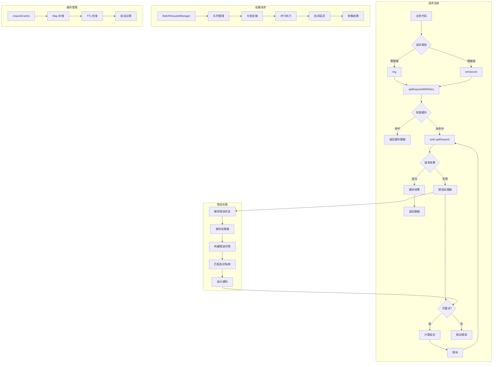

# API 模块文档

## 模块定位与职责

API 模块是 GCLI2API-Go 前端的**后端通信层**，负责封装所有与后端 API 的交互逻辑，提供统一的请求接口、错误处理、重试机制、缓存管理和批量操作支持。

### 核心职责

1. **统一请求封装**：基于 `auth.apiRequest` 提供 `mg`（管理端）和 `enhanced`（增强端）两个请求函数
2. **智能错误处理**：分类处理 HTTP 错误（401/403/429/500/502/503/504/网络错误），提供友好提示和操作建议
3. **自动重试机制**：支持指数退避重试、429 退避、网络错误重试
4. **请求缓存**：GET 请求自动缓存 30 秒，减少重复请求
5. **批量请求管理**：支持批量操作（分块、并发控制、重试）
6. **网络状态监控**：监听在线/离线事件，自动显示横幅提示
7. **业务 API 封装**：提供凭证、装配台、模型注册、统计、OAuth、配置等业务 API

---

## 目录结构与文件职责

```
web/src/api/
├── base.ts         # 基础请求层（456 行）- 统一错误处理、重试、缓存
├── credentials.ts  # 凭证 API（92 行）- 凭证管理、批量操作、探活
├── assembly.ts     # 装配台 API（64 行）- 路由计划、应用、回滚、干运行
├── registry.ts     # 模型注册 API（66 行）- 模型注册、分组、导入导出
├── stats.ts        # 统计 API（10 行）- 统计数据、增强指标、流式指标
├── oauth.ts        # OAuth API（20 行）- OAuth 流程、项目列表、用户信息
├── config.ts       # 配置 API（12 行）- 配置读取、更新、重载
├── batch.ts        # 批量操作（84 行）- 分块处理、重试、并发控制
└── cache.ts        # 缓存管理（15 行）- 缓存清理、模式匹配
```

### 文件职责说明

| 文件 | 核心职责 | 关键函数 |
|------|---------|---------|
| **base.ts** | 统一请求封装、错误处理、重试、缓存 | `mg`、`enhanced`、`apiRequestWithRetry`、`BatchRequestManager` |
| **credentials.ts** | 凭证管理 API | `listCredentials`、`enableCredential`、`batchEnableCredentials`、`probeFlash` |
| **assembly.ts** | 装配台 API | `listAssemblyPlans`、`applyAssemblyPlan`、`rollbackAssemblyPlan`、`dryRunAssemblyPlan` |
| **registry.ts** | 模型注册 API | `getRegistry`、`putRegistry`、`importRegistryJSON`、`exportRegistry` |
| **stats.ts** | 统计 API | `getStats`、`getEnhancedMetrics`、`getStreamingMetrics` |
| **oauth.ts** | OAuth API | `startOAuth`、`completeOAuth`、`listOAuthProjects` |
| **config.ts** | 配置 API | `getConfig`、`updateConfig`、`reloadConfig` |
| **batch.ts** | 批量操作 | `bulkCredentialAction`、`bulkModelAction`、`bulkHealthCheck` |
| **cache.ts** | 缓存管理 | `clear`、`clearPattern`、`size` |

---

## 核心设计与数据流

### 1. 请求流程

```
业务代码调用 API 函数
    ↓
mg() / enhanced() 包装请求
    ↓
apiRequestWithRetry() 重试包装
    ↓
检查缓存（GET 请求）
    ↓
auth.apiRequest() / auth.apiRequestEnhanced() 执行请求
    ↓
成功 → 缓存结果 → 返回数据
    ↓
失败 → 错误处理器分类处理
    ↓
可重试 → 计算延迟 → 重试
    ↓
不可重试 / 超过最大重试次数 → 抛出错误
```

### 2. 错误处理流程

```
请求失败
    ↓
解析错误状态（401/403/429/500/502/503/504/network）
    ↓
查找对应的错误处理器
    ↓
构建错误详情（status、code、detail、headers）
    ↓
匹配友好错误指南（remote_management_disabled、invalid_api_key、admin_required）
    ↓
显示通知（标题、消息、操作按钮）
    ↓
返回处理结果（handled、retry、retryAfter、exponentialBackoff）
```

### 3. 重试策略

| 错误类型 | 重试策略 | 延迟计算 |
|---------|---------|---------|
| **429 (Too Many Requests)** | 不重试 | 显示 Retry-After 提示 |
| **500/502/503/504** | 重试（最多 3 次） | 指数退避（1s → 2s → 4s，最大 30s） |
| **408 (Timeout)** | 重试（最多 3 次） | 指数退避 |
| **网络错误** | 重试（最多 3 次） | 固定 5s |
| **401/403** | 不重试 | 由 auth.js 处理 |

### 4. 缓存机制

```typescript
// 缓存键格式
const cacheKey = `mg:${path}`;  // 管理端请求
const cacheKey = `enh:${path}`; // 增强端请求

// 缓存策略
- 仅缓存 GET 请求
- TTL: 30 秒
- POST/PUT/DELETE 请求不缓存
- 可通过 options.cache = false 禁用缓存
```

### 5. 批量请求管理

```
批量请求队列
    ↓
BatchRequestManager.add()
    ↓
分批处理（每批 10 个）
    ↓
并行执行批内请求
    ↓
批间延迟 100ms
    ↓
收集结果（Promise.allSettled）
```

---

## 关键类型与接口

### 1. 请求函数签名

```typescript
// 管理端请求（需要管理密钥）
export const mg = async (path: string, options: any = {}): Promise<any>

// 增强端请求（需要认证）
export const enhanced = async (path: string, options: any = {}): Promise<any>

// 请求选项
interface RequestOptions {
  method?: 'GET' | 'POST' | 'PUT' | 'DELETE';
  body?: string | FormData;
  headers?: Record<string, string>;
  cache?: boolean;           // 是否缓存（默认 true）
  batch?: boolean;           // 是否批量请求（默认 false）
  maxRetries?: number;       // 最大重试次数（默认 3）
}
```

### 2. 错误处理器返回值

```typescript
interface ErrorHandlerResult {
  handled: boolean;          // 是否已处理（true 则不抛出错误）
  retry: boolean;            // 是否重试
  retryAfter?: number;       // 重试延迟（毫秒）
  exponentialBackoff?: boolean; // 是否使用指数退避
}
```

### 3. 友好错误指南

```typescript
interface FriendlyErrorGuide {
  id: string;                // 错误 ID
  title: string;             // 错误标题
  message: string;           // 错误消息
  actions?: string[];        // 操作建议
  match: (details: any) => boolean; // 匹配函数
}
```

### 4. 批量请求管理器

```typescript
class BatchRequestManager {
  queue: any[];              // 请求队列
  processing: boolean;       // 是否正在处理
  batchSize: number;         // 批量大小（默认 10）
  batchDelay: number;        // 批间延迟（默认 100ms）

  async add(requestFn: () => Promise<any>, context: any = {}): Promise<any>;
  async process(): Promise<void>;
}
```

### 5. 凭证批量操作

```typescript
interface BatchCredentialRequest {
  ids: string[];             // 凭证 ID 列表
  concurrency?: number;      // 并发数（可选）
}

interface BatchOperationResponse {
  task_id: string;           // 任务 ID
  status: string;            // 任务状态
  total: number;             // 总数
  completed: number;         // 已完成数
  failed: number;            // 失败数
}

interface BatchTaskDetail {
  task_id: string;
  operation: string;         // 操作类型（enable/disable/delete/recover）
  status: string;            // 状态（pending/running/completed/failed）
  total: number;
  completed: number;
  failed: number;
  results: Array<{
    id: string;
    success: boolean;
    error?: string;
  }>;
}
```

---

## 重要配置项

| 配置项 | 类型 | 默认值 | 说明 |
|--------|------|--------|------|
| `CACHE_TTL` | `number` | `30000` (30s) | 请求缓存 TTL（毫秒） |
| `maxRetries` | `number` | `3` | 最大重试次数 |
| `batchSize` | `number` | `10` | 批量请求每批大小 |
| `batchDelay` | `number` | `100` (100ms) | 批量请求批间延迟（毫秒） |
| `DEFAULT_CHUNK_SIZE` | `number` | `5` | 批量操作分块大小 |
| `DEFAULT_RETRY` | `number` | `2` | 批量操作重试次数 |
| `CHUNK_DELAY_MS` | `number` | `300` (300ms) | 批量操作块间延迟（毫秒） |

---

## 与其他模块的依赖关系

### 依赖的模块

| 模块 | 用途 | 导入方式 |
|------|------|---------|
| **auth** | 认证和 API 请求 | `import { auth } from '../auth.js'` |
| **ui** | UI 通知和横幅 | `import { ui } from '../ui.js'` |

### 被依赖的模块

API 模块被以下模块依赖：

- **Admin 模块**：通过 `api` 对象访问所有 API
- **Creds 模块**：调用 `credentialsApi` 管理凭证
- **Tabs 模块**：调用各业务 API 获取数据
- **Dashboard 模块**：调用 `statsApi` 获取统计数据
- **Config 模块**：调用 `configApi` 管理配置
- **OAuth 模块**：调用 `oauthApi` 处理 OAuth 流程
- **Registry 模块**：调用 `registryApi` 管理模型注册

---

## 可执行示例

### 示例 1：基础请求（管理端）

```typescript
import { mg } from './api/base';

// GET 请求（自动缓存）
const credentials = await mg('credentials');

// POST 请求（不缓存）
const result = await mg('credentials/reload', { method: 'POST' });

// DELETE 请求
await mg('credentials/test-cred-id', { method: 'DELETE' });

// 禁用缓存
const freshData = await mg('stats', { cache: false });
```

### 示例 2：增强端请求

```typescript
import { enhanced } from './api/base';

// 获取增强指标
const metrics = await enhanced('metrics');

// 更新配置
const config = await enhanced('config', {
  method: 'PUT',
  body: JSON.stringify({ openai_port: 8080 })
});

// 带查询参数
import { withQuery } from './api/base';
const data = await enhanced(withQuery('models/openai/registry', { group: 'flash' }));
```

### 示例 3：凭证管理 API

```typescript
import { credentialsApi } from './api/credentials';

// 列出所有凭证
const creds = await credentialsApi.listCredentials();

// 启用凭证
await credentialsApi.enableCredential('cred-id');

// 批量禁用凭证
const result = await credentialsApi.batchDisableCredentials(
  ['cred-1', 'cred-2', 'cred-3'],
  5  // 并发数
);

// 探活（Flash 模型）
const probeResult = await credentialsApi.probeFlash('gemini-2.5-flash', 10);

// 上传凭证文件
const formData = new FormData();
formData.append('file', file);
await credentialsApi.uploadCredentialFiles(formData);

// 查询批量任务状态
const tasks = await credentialsApi.listBatchTasks();
const taskDetail = await credentialsApi.getBatchTask('task-id');
```

### 示例 4：装配台 API

```typescript
import { assemblyApi } from './api/assembly';

// 列出所有路由计划
const plans = await assemblyApi.listAssemblyPlans();

// 获取指定计划
const plan = await assemblyApi.getAssemblyPlan('production');

// 保存新计划
await assemblyApi.saveAssemblyPlan('backup', {
  models: true,
  variants: true,
  routing: true
});

// 应用计划（带原因）
await assemblyApi.applyAssemblyPlan('production', {
  reason: '切换到生产环境配置'
});

// 回滚计划
await assemblyApi.rollbackAssemblyPlan('production', {
  reason: '回滚到上一个稳定版本'
});

// 干运行（测试计划）
const dryRunResult = await assemblyApi.dryRunAssemblyPlan({
  models: [...],
  routing: {...}
});

// 清理路由冷却
await assemblyApi.clearRoutingCooldowns({}, {
  reason: '手动清理冷却时间'
});
```

### 示例 5：模型注册 API

```typescript
import { registryApi } from './api/registry';

// 获取模型注册表
const registry = await registryApi.getRegistry('openai');

// 更新整个注册表
await registryApi.putRegistry('openai', [
  { id: 'gpt-4', base: 'gemini-2.0-pro', enabled: true },
  { id: 'gpt-3.5-turbo', base: 'gemini-2.5-flash', enabled: true }
]);

// 添加单个模型
await registryApi.postRegistry('openai', {
  id: 'custom-model',
  base: 'gemini-2.0-pro',
  enabled: true
});

// 删除模型
await registryApi.deleteRegistryModel('openai', 'custom-model');

// 导入 JSON
await registryApi.importRegistryJSON('openai', models, 'replace');

// 导出注册表
const exported = await registryApi.exportRegistry('openai');

// 刷新上游模型建议
await registryApi.refreshUpstreamModels(true, 30);

// 批量启用/禁用
await registryApi.bulkEnable('openai', 'flash');
await registryApi.bulkDisable('openai', 'pro');
```

### 示例 6：统计 API

```typescript
import { statsApi } from './api/stats';

// 获取基础统计
const stats = await statsApi.getStats();

// 获取增强指标
const metrics = await statsApi.getEnhancedMetrics();

// 获取流式指标
const streamingMetrics = await statsApi.getStreamingMetrics();

// 重置统计
await statsApi.resetStats();
```

### 示例 7：OAuth API

```typescript
import { oauthApi } from './api/oauth';

// 启动 OAuth 流程
const authUrl = await oauthApi.startOAuth('my-project-id');
window.location.href = authUrl.auth_url;

// 完成 OAuth（回调处理）
const result = await oauthApi.completeOAuth(code, state);

// 列出项目
const projects = await oauthApi.listOAuthProjects(accessToken);

// 获取用户信息
const userInfo = await oauthApi.getOAuthUserInfo(accessToken);
```

### 示例 8：批量操作

```typescript
import { batchOperations } from './api/batch';

// 批量凭证操作
const results = await batchOperations.bulkCredentialAction([
  { id: 'cred-1', action: 'enable' },
  { id: 'cred-2', action: 'disable' },
  { id: 'cred-3', action: 'delete' }
]);

// 批量模型操作
const modelResults = await batchOperations.bulkModelAction(
  'openai',
  [model1, model2, model3],
  'enable'
);

// 批量健康检查
const healthResults = await batchOperations.bulkHealthCheck([
  'cred-1', 'cred-2', 'cred-3'
]);

// 处理结果
results.forEach((result, index) => {
  if (result.status === 'fulfilled') {
    console.log(`操作 ${index} 成功:`, result.value);
  } else {
    console.error(`操作 ${index} 失败:`, result.reason);
  }
});
```

### 示例 9：缓存管理

```typescript
import { cacheApi } from './api/cache';

// 清空所有缓存
cacheApi.clear();

// 清空匹配模式的缓存
cacheApi.clearPattern('^mg:credentials');  // 清空所有凭证相关缓存
cacheApi.clearPattern('stats$');           // 清空所有统计相关缓存

// 查看缓存大小
const size = cacheApi.size();
console.log(`当前缓存条目数: ${size}`);
```

### 示例 10：错误处理

```typescript
import { mg } from './api/base';

try {
  const result = await mg('credentials/invalid-id', { method: 'DELETE' });
} catch (error) {
  // 错误已被自动处理（显示通知）
  // 可以在这里添加额外的错误处理逻辑
  console.error('操作失败:', error);
}

// 自定义重试次数
try {
  const result = await mg('stats', { maxRetries: 5 });
} catch (error) {
  console.error('重试 5 次后仍然失败:', error);
}
```

---

## 架构示意图



## 已知限制

### 1. 缓存粒度
**限制**：缓存仅基于路径，不考虑查询参数
**影响**：相同路径不同参数的请求可能返回错误的缓存数据
**解决方案**：使用 `cache: false` 禁用缓存，或在路径中包含参数

### 2. 批量请求并发控制
**限制**：批量请求的并发数固定为批量大小（10）
**影响**：无法动态调整并发数
**解决方案**：使用凭证批量操作 API 的 `concurrency` 参数

### 3. 错误通知频率
**限制**：重试期间不显示通知，仅在最后一次失败时显示
**影响**：用户可能不知道请求正在重试
**解决方案**：在控制台查看重试日志

### 4. 缓存过期策略
**限制**：缓存过期采用被动检查，不会主动清理
**影响**：过期缓存仍占用内存
**解决方案**：定期调用 `cacheApi.clear()` 清理缓存

### 5. 网络状态检测延迟
**限制**：依赖浏览器的 `online`/`offline` 事件，可能有延迟
**影响**：网络恢复后可能仍显示离线横幅
**解决方案**：手动刷新页面

### 6. 重试延迟上限
**限制**：指数退避最大延迟为 30 秒
**影响**：长时间服务不可用时可能过早放弃
**解决方案**：增加 `maxRetries` 参数

### 7. 批量操作错误处理
**限制**：批量操作中单个失败不会中断整个批次
**影响**：部分成功部分失败的情况需要手动处理
**解决方案**：检查 `PromiseSettledResult` 的 `status` 字段

### 8. 友好错误指南匹配
**限制**：错误指南匹配基于字符串包含，可能误匹配
**影响**：显示不相关的错误提示
**解决方案**：优化匹配规则，使用更精确的条件

---

## 最佳实践

### 1. 使用类型安全的 API 函数
**建议**：优先使用 `credentialsApi`、`assemblyApi` 等封装好的 API 对象
**原因**：提供类型提示和参数校验
**示例**：
```typescript
// 推荐
await credentialsApi.enableCredential('cred-id');

// 不推荐
await mg('credentials/cred-id/enable', { method: 'POST' });
```

### 2. 合理使用缓存
**建议**：对频繁访问且变化不大的数据启用缓存
**原因**：减少服务器负载，提升响应速度
**示例**：
```typescript
// 启用缓存（默认）
const stats = await mg('stats');

// 禁用缓存（实时数据）
const liveStats = await mg('stats', { cache: false });
```

### 3. 批量操作使用分块
**建议**：大量操作使用 `batchOperations` 而非循环调用
**原因**：避免并发过高导致服务器压力
**示例**：
```typescript
// 推荐
const results = await batchOperations.bulkCredentialAction(actions);

// 不推荐
for (const action of actions) {
  await credentialsApi.enableCredential(action.id);
}
```

### 4. 错误处理使用 try-catch
**建议**：关键操作使用 try-catch 捕获错误
**原因**：虽然错误会自动显示通知，但可能需要额外处理
**示例**：
```typescript
try {
  await credentialsApi.deleteCredential('cred-id');
  ui.showNotification('success', '删除成功');
} catch (error) {
  // 错误已显示通知，这里可以添加额外逻辑
  console.error('删除失败:', error);
}
```

### 5. 使用 withQuery 构建查询参数
**建议**：使用 `withQuery` 函数构建带查询参数的 URL
**原因**：自动处理 URL 编码和空值过滤
**示例**：
```typescript
import { withQuery } from './api/base';

const url = withQuery('models/openai/registry', {
  group: 'flash',
  enabled: true,
  empty: null  // 自动过滤
});
// 结果: models/openai/registry?group=flash&enabled=true
```

### 6. 批量任务使用流式监控
**建议**：批量任务使用 SSE 流式监控进度
**原因**：实时获取任务状态，提升用户体验
**示例**：
```typescript
const taskId = result.task_id;
const streamUrl = credentialsApi.getBatchTaskStreamURL(taskId);
const eventSource = new EventSource(streamUrl);

eventSource.onmessage = (event) => {
  const progress = JSON.parse(event.data);
  console.log(`进度: ${progress.completed}/${progress.total}`);
};
```

### 7. 定期清理缓存
**建议**：在适当时机清理缓存（如用户登出、切换环境）
**原因**：避免缓存数据过期或不一致
**示例**：
```typescript
// 用户登出时清理缓存
window.addEventListener('auth:logout', () => {
  cacheApi.clear();
});

// 切换环境时清理特定缓存
cacheApi.clearPattern('^mg:credentials');
```

### 8. 使用 encodeSegment 编码路径参数
**建议**：路径参数使用 `encodeSegment` 编码
**原因**：避免特殊字符导致 URL 解析错误
**示例**：
```typescript
import { encodeSegment } from './api/base';

const credId = 'cred/with/slash';
await mg(`credentials/${encodeSegment(credId)}`);
// 结果: credentials/cred%2Fwith%2Fslash
```

### 9. 重试次数根据场景调整
**建议**：根据操作重要性调整重试次数
**原因**：关键操作需要更多重试机会
**示例**：
```typescript
// 关键操作：增加重试次数
await mg('credentials/reload', { method: 'POST', maxRetries: 5 });

// 非关键操作：减少重试次数
await mg('stats', { maxRetries: 1 });
```

### 10. 监听网络状态变化
**建议**：监听网络状态事件，自动重试失败请求
**原因**：网络恢复后自动恢复功能
**示例**：
```typescript
window.addEventListener('online', async () => {
  // 网络恢复后重新加载数据
  await credentialsApi.listCredentials();
  ui.showNotification('success', '网络已恢复，数据已刷新');
});
```

## API 速查表

### 凭证 API

| 函数 | 方法 | 路径 | 说明 |
|------|------|------|------|
| `listCredentials` | GET | `credentials` | 列出所有凭证 |
| `enableCredential` | POST | `credentials/:id/enable` | 启用凭证 |
| `disableCredential` | POST | `credentials/:id/disable` | 禁用凭证 |
| `deleteCredential` | DELETE | `credentials/:id` | 删除凭证 |
| `recoverCredential` | POST | `credentials/:id/recover` | 恢复凭证 |
| `batchEnableCredentials` | POST | `credentials/batch-enable` | 批量启用 |
| `probeFlash` | POST | `credentials/probe` | 探活测试 |

### 装配台 API

| 函数 | 方法 | 路径 | 说明 |
|------|------|------|------|
| `listAssemblyPlans` | GET | `assembly/plans` | 列出所有计划 |
| `getAssemblyPlan` | GET | `assembly/plans/:name` | 获取指定计划 |
| `saveAssemblyPlan` | POST | `assembly/plans` | 保存新计划 |
| `applyAssemblyPlan` | PUT | `assembly/plans/:name/apply` | 应用计划 |
| `rollbackAssemblyPlan` | PUT | `assembly/plans/:name/rollback` | 回滚计划 |
| `dryRunAssemblyPlan` | POST | `assembly/dry-run` | 干运行测试 |

### 模型注册 API

| 函数 | 方法 | 路径 | 说明 |
|------|------|------|------|
| `getRegistry` | GET | `models/:channel/registry` | 获取注册表 |
| `putRegistry` | PUT | `models/:channel/registry` | 更新注册表 |
| `postRegistry` | POST | `models/:channel/registry` | 添加模型 |
| `deleteRegistryModel` | DELETE | `models/:channel/registry/:id` | 删除模型 |
| `importRegistryJSON` | POST | `models/:channel/registry/import` | 导入 JSON |
| `exportRegistry` | GET | `models/:channel/registry/export` | 导出注册表 |

### 统计 API

| 函数 | 方法 | 路径 | 说明 |
|------|------|------|------|
| `getStats` | GET | `stats` | 获取基础统计 |
| `resetStats` | POST | `stats/reset` | 重置统计 |
| `getEnhancedMetrics` | GET | `metrics` | 获取增强指标 |
| `getStreamingMetrics` | GET | `metrics/streaming` | 获取流式指标 |

### OAuth API

| 函数 | 方法 | 路径 | 说明 |
|------|------|------|------|
| `startOAuth` | POST | `oauth/start` | 启动 OAuth 流程 |
| `completeOAuth` | POST | `oauth/callback` | 完成 OAuth 回调 |
| `listOAuthProjects` | GET | `oauth/projects` | 列出项目列表 |
| `getOAuthUserInfo` | GET | `oauth/userinfo` | 获取用户信息 |

### 配置 API

| 函数 | 方法 | 路径 | 说明 |
|------|------|------|------|
| `getConfig` | GET | `config` | 获取配置 |
| `updateConfig` | PUT | `config` | 更新配置 |
| `reloadConfig` | POST | `config/reload` | 重载配置 |

---

## 常见问题

### Q1: 如何禁用某个请求的缓存？
**A**: 在请求选项中设置 `cache: false`：
```typescript
const data = await mg('stats', { cache: false });
```

### Q2: 如何自定义重试次数？
**A**: 在请求选项中设置 `maxRetries`：
```typescript
const data = await mg('credentials', { maxRetries: 5 });
```

### Q3: 批量操作如何控制并发数？
**A**: 使用凭证批量操作 API 的 `concurrency` 参数：
```typescript
await credentialsApi.batchEnableCredentials(['id1', 'id2'], 3);
```

### Q4: 如何查看错误详情？
**A**: 错误通知中点击"查看详情"按钮，或在控制台查看错误对象。

### Q5: 如何清理特定模式的缓存？
**A**: 使用 `cacheApi.clearPattern`：
```typescript
cacheApi.clearPattern('^mg:credentials');  // 清理所有凭证缓存
```

---

## 性能优化建议

1. **启用请求缓存**：对不常变化的数据启用缓存（默认启用）
2. **使用批量操作**：大量操作使用批量 API，避免循环调用
3. **合理设置重试次数**：非关键操作减少重试次数
4. **定期清理缓存**：避免缓存占用过多内存
5. **使用流式监控**：批量任务使用 SSE 流式监控，减少轮询

---

## 相关文档

- [Admin 模块文档](./admin.md) - 应用核心
- [Creds 模块文档](./creds.md) - 凭证管理 UI
- [Auth 模块文档](./auth.md) - 认证管理
- [UI 模块文档](./ui.md) - UI 组件库

