# Core 模块文档

## 模块定位与职责

Core 模块是 GCLI2API-Go 前端的**核心基础设施**，提供模块管理、动态加载、版本控制等核心功能。

### 核心职责

1. **模块管理**：模块注册、加载、缓存、依赖管理
2. **动态加载**：异步模块加载、懒加载、并发控制
3. **版本控制**：模块版本管理、缓存破坏、版本覆盖
4. **单例模式**：确保模块只加载一次、避免重复加载
5. **并发控制**：防止同一模块并发加载、请求合并
6. **缓存管理**：模块实例缓存、加载状态管理

---

## 目录结构与文件职责

```
web/src/core/
├── module_manager.ts  # 模块管理器（57 行）- 模块注册、加载、缓存
└── module_paths.ts    # 模块路径管理（37 行）- 版本控制、路径生成
```

### 文件职责说明

| 文件 | 核心职责 | 关键类/函数 | 主要功能 |
|------|---------|------------|---------|
| **module_manager.ts** | 模块管理 | `ModuleManager` | 模块注册、动态加载、缓存管理、并发控制 |
| **module_paths.ts** | 路径管理 | `modulePath`、`moduleVersion` | 版本控制、路径生成、缓存破坏 |

---

## 核心设计与数据流

### 1. 模块加载流程

```
调用 load(name)
    ↓
检查缓存（modules[name]）
    ↓
存在 → 返回缓存的模块实例
    ↓
不存在 → 检查是否有注册的 loader
    ↓
无 loader → 抛出错误
    ↓
有 loader → 检查是否正在加载（inflight）
    ↓
正在加载 → 返回现有的 Promise（请求合并）
    ↓
未加载 → 创建新的 Promise → 调用 loader()
    ↓
加载成功 → 缓存模块实例 → 删除 inflight 记录
    ↓
返回模块实例
```

### 2. 并发控制机制

```
用户 A 调用 load('creds')
    ↓
创建 Promise → 存入 inflight Map
    ↓
用户 B 调用 load('creds')（同时）
    ↓
检查 inflight Map → 发现正在加载
    ↓
返回相同的 Promise（请求合并）
    ↓
loader() 完成 → 两个用户都收到相同的模块实例
    ↓
删除 inflight 记录
```

### 3. 版本控制流程

```
调用 modulePath(key, path)
    ↓
查找版本覆盖（VERSION_OVERRIDES[key]）
    ↓
存在 → 使用覆盖版本
    ↓
不存在 → 使用全局版本（window.__ASSET_VERSION__）
    ↓
拼接版本参数（path?v=version）
    ↓
返回带版本的路径
```

### 4. 模块注册流程

```
调用 register(name, loader)
    ↓
存储 loader 到 loaders 对象
    ↓
等待 load(name) 调用
    ↓
执行 loader() → 返回模块实例
    ↓
缓存到 modules 对象
```

---

## 关键类型与接口

### 1. ModuleFactory 类型

```typescript
export type ModuleFactory = () => Promise<any>;
```

**说明**：模块工厂函数，返回 Promise，用于异步加载模块。

### 2. ModuleManager 类

```typescript
export class ModuleManager {
  private modules: Record<string, any>;           // 已加载的模块缓存
  private loaders: Record<string, ModuleFactory>; // 模块加载器
  private inflight: Map<string, Promise<any>>;    // 正在加载的模块

  constructor(
    initialModules: Record<string, any> = {},
    loaders: Record<string, ModuleFactory> = {}
  );

  cache(): Record<string, any>;                   // 获取所有缓存的模块
  register(name: string, loader: ModuleFactory): void;  // 注册模块加载器
  set(name: string, instance: any): void;         // 手动设置模块实例
  has(name: string): boolean;                     // 检查模块是否已加载
  load(name: string): Promise<any>;               // 加载模块
}
```

### 3. 版本控制函数

```typescript
// 获取模块版本
export const moduleVersion = (key: string): string;

// 生成带版本的模块路径
export const modulePath = (key: string, path: string): string;

// 设置模块版本覆盖
export const setModuleVersionOverride = (key: string, version: string): void;

// 获取所有版本覆盖
export const moduleVersionOverrides: Record<string, string>;
```

---

## 重要配置项

### VERSION_OVERRIDES 配置

| 模块名 | 版本 | 说明 |
|--------|------|------|
| `auth` | `20251026` | 认证模块 |
| `api` | `20251026` | API 模块 |
| `ui` | `20251026c` | UI 模块 |
| `oauth` | `20251026c` | OAuth 模块 |
| `creds` | `20251026c` | 凭证模块 |
| `dashboard` | `20251026c` | 仪表板模块 |
| `logs` | `20251026` | 日志模块 |
| `registry` | `20251026` | 注册表模块 |
| `config` | `20251026c` | 配置模块 |
| `streaming` | `20251026c` | 流式模块 |

---

## 与其他模块的依赖关系

### 依赖的模块

无直接依赖（核心基础设施）

### 被依赖的模块

Core 模块被以下模块依赖：

- **Admin 模块**：使用 `ModuleManager` 管理标签页模块
- **所有业务模块**：使用 `modulePath` 生成带版本的资源路径

---

## 可执行示例

### 示例 1：创建模块管理器

```typescript
import { ModuleManager } from './core/module_manager';

// 创建模块管理器
const moduleManager = new ModuleManager();

// 注册模块加载器
moduleManager.register('creds', async () => {
  const module = await import('./tabs/creds');
  return module.default;
});

moduleManager.register('logs', async () => {
  const module = await import('./tabs/logs');
  return module.default;
});
```

### 示例 2：加载模块

```typescript
import { ModuleManager } from './core/module_manager';

const moduleManager = new ModuleManager();

// 注册模块
moduleManager.register('creds', async () => {
  const module = await import('./tabs/creds');
  return module.default;
});

// 加载模块
const credsModule = await moduleManager.load('creds');
console.log('凭证模块已加载:', credsModule);

// 再次加载（从缓存返回）
const credsModule2 = await moduleManager.load('creds');
console.log('从缓存加载:', credsModule === credsModule2); // true
```

### 示例 3：并发加载（请求合并）

```typescript
import { ModuleManager } from './core/module_manager';

const moduleManager = new ModuleManager();

moduleManager.register('creds', async () => {
  console.log('开始加载凭证模块');
  await new Promise(resolve => setTimeout(resolve, 1000));
  return { name: 'creds' };
});

// 同时发起多个加载请求
const [module1, module2, module3] = await Promise.all([
  moduleManager.load('creds'),
  moduleManager.load('creds'),
  moduleManager.load('creds')
]);

// 只会加载一次，三个请求共享同一个 Promise
console.log('开始加载凭证模块'); // 只输出一次
console.log(module1 === module2 && module2 === module3); // true
```

### 示例 4：手动设置模块

```typescript
import { ModuleManager } from './core/module_manager';

const moduleManager = new ModuleManager();

// 手动设置模块实例（跳过加载）
const apiModule = {
  get: (url: string) => fetch(url),
  post: (url: string, data: any) => fetch(url, { method: 'POST', body: JSON.stringify(data) })
};

moduleManager.set('api', apiModule);

// 检查模块是否已加载
console.log(moduleManager.has('api')); // true

// 加载模块（直接返回缓存）
const api = await moduleManager.load('api');
console.log(api === apiModule); // true
```

### 示例 5：使用初始模块

```typescript
import { ModuleManager } from './core/module_manager';

// 创建时提供初始模块
const moduleManager = new ModuleManager({
  config: { apiUrl: '/api', basePath: '/gcli2api' },
  utils: { escapeHTML: (str: string) => str.replace(/</g, '&lt;') }
});

// 直接使用初始模块
const config = await moduleManager.load('config');
console.log(config.apiUrl); // '/api'
```

### 示例 6：生成带版本的路径

```typescript
import { modulePath, moduleVersion } from './core/module_paths';

// 生成带版本的路径
const credsPath = modulePath('creds', '/static/creds.js');
console.log(credsPath); // '/static/creds.js?v=20251026c'

const logsPath = modulePath('logs', '/static/logs.js');
console.log(logsPath); // '/static/logs.js?v=20251026'

// 获取模块版本
const version = moduleVersion('creds');
console.log(version); // '20251026c'
```

### 示例 7：设置版本覆盖

```typescript
import { setModuleVersionOverride, modulePath } from './core/module_paths';

// 设置版本覆盖
setModuleVersionOverride('creds', '20251027');

// 生成路径（使用新版本）
const path = modulePath('creds', '/static/creds.js');
console.log(path); // '/static/creds.js?v=20251027'
```

### 示例 8：获取所有缓存的模块

```typescript
import { ModuleManager } from './core/module_manager';

const moduleManager = new ModuleManager();

moduleManager.set('api', { get: () => {} });
moduleManager.set('ui', { render: () => {} });

// 获取所有缓存的模块
const cache = moduleManager.cache();
console.log(Object.keys(cache)); // ['api', 'ui']
```

### 示例 9：错误处理

```typescript
import { ModuleManager } from './core/module_manager';

const moduleManager = new ModuleManager();

try {
  // 尝试加载未注册的模块
  await moduleManager.load('unknown');
} catch (error) {
  console.error(error.message); // 'No loader registered for module "unknown"'
}
```

### 示例 10：完整的模块管理示例

```typescript
import { ModuleManager } from './core/module_manager';
import { modulePath } from './core/module_paths';

// 创建模块管理器
const moduleManager = new ModuleManager();

// 注册所有标签页模块
const tabs = ['creds', 'logs', 'registry', 'assembly'];
tabs.forEach(tab => {
  moduleManager.register(tab, async () => {
    const path = modulePath(tab, `/static/${tab}.js`);
    const script = document.createElement('script');
    script.src = path;
    document.head.appendChild(script);
    
    return new Promise((resolve) => {
      script.onload = () => {
        resolve((window as any)[`${tab}Module`]);
      };
    });
  });
});

// 切换标签页时加载模块
async function switchTab(tabName: string) {
  const module = await moduleManager.load(tabName);
  module.init();
}

// 使用
await switchTab('creds');
```

---

## 架构示意图

```mermaid
graph TB
    subgraph "模块加载流程"
        A[调用 load] --> B{缓存存在?}
        B -->|是| C[返回缓存]
        B -->|否| D{loader 存在?}
        D -->|否| E[抛出错误]
        D -->|是| F{正在加载?}
        F -->|是| G[返回现有 Promise]
        F -->|否| H[创建新 Promise]
        H --> I[调用 loader]
        I --> J[加载成功]
        J --> K[缓存模块]
        K --> L[删除 inflight]
        L --> M[返回模块]
    end

    subgraph "并发控制机制"
        N[用户 A load] --> O[创建 Promise]
        O --> P[存入 inflight]
        Q[用户 B load] --> R{inflight 存在?}
        R -->|是| S[返回相同 Promise]
        R -->|否| T[创建新 Promise]
        P --> U[loader 完成]
        S --> U
        U --> V[删除 inflight]
    end

    subgraph "版本控制流程"
        W[调用 modulePath] --> X{VERSION_OVERRIDES?}
        X -->|存在| Y[使用覆盖版本]
        X -->|不存在| Z[使用全局版本]
        Y --> AA[拼接版本参数]
        Z --> AA
        AA --> AB[返回带版本路径]
    end

    subgraph "模块注册流程"
        AC[调用 register] --> AD[存储 loader]
        AD --> AE[等待 load 调用]
        AE --> AF[执行 loader]
        AF --> AG[缓存模块]
    end
```



---

## 已知限制

### 1. 模块加载失败无重试
**限制**：模块加载失败后不会自动重试
**影响**：网络不稳定时可能加载失败
**解决方案**：实现重试机制

### 2. 无模块卸载功能
**限制**：无法卸载已加载的模块
**影响**：无法释放内存
**解决方案**：实现 `unload()` 方法

### 3. 无模块依赖管理
**限制**：无法声明模块间的依赖关系
**影响**：需要手动管理加载顺序
**解决方案**：实现依赖图和拓扑排序

### 4. 版本控制依赖全局变量
**限制**：依赖 `window.__ASSET_VERSION__`
**影响**：服务端渲染时可能不可用
**解决方案**：支持配置注入

### 5. 无模块加载超时
**限制**：模块加载无超时限制
**影响**：加载卡住时无法恢复
**解决方案**：实现超时机制

### 6. 无模块加载进度
**限制**：无法获取模块加载进度
**影响**：用户体验不佳
**解决方案**：实现进度回调

### 7. 无模块热更新
**限制**：无法热更新已加载的模块
**影响**：需要刷新页面才能更新
**解决方案**：实现模块热替换（HMR）

### 8. 版本覆盖硬编码
**限制**：版本覆盖在代码中硬编码
**影响**：更新版本需要修改代码
**解决方案**：从配置文件或 API 加载版本

---

## 最佳实践

### 1. 使用异步加载优化性能
**建议**：使用动态 import 懒加载模块
**原因**：减少初始加载时间
**示例**：
```typescript
// 推荐
moduleManager.register('creds', async () => {
  const module = await import('./tabs/creds');
  return module.default;
});

// 不推荐
import credsModule from './tabs/creds';
moduleManager.set('creds', credsModule); // 同步加载
```

### 2. 利用并发控制避免重复加载
**建议**：信任 ModuleManager 的并发控制
**原因**：自动合并并发请求
**示例**：
```typescript
// 推荐
const [creds, logs] = await Promise.all([
  moduleManager.load('creds'),
  moduleManager.load('logs')
]);

// 不推荐
const creds = await moduleManager.load('creds');
const logs = await moduleManager.load('logs'); // 串行加载
```

### 3. 使用初始模块提升性能
**建议**：将常用模块作为初始模块
**原因**：避免异步加载延迟
**示例**：
```typescript
// 推荐
const moduleManager = new ModuleManager({
  config: appConfig,
  utils: utilsModule
});

// 不推荐
moduleManager.register('config', async () => appConfig);
```

### 4. 使用版本控制破坏缓存
**建议**：所有静态资源使用 modulePath
**原因**：确保用户获取最新版本
**示例**：
```typescript
// 推荐
const path = modulePath('creds', '/static/creds.js');
script.src = path; // '/static/creds.js?v=20251026c'

// 不推荐
script.src = '/static/creds.js'; // 可能被浏览器缓存
```

### 5. 错误处理要完善
**建议**：捕获模块加载错误
**原因**：避免应用崩溃
**示例**：
```typescript
// 推荐
try {
  const module = await moduleManager.load('creds');
  module.init();
} catch (error) {
  console.error('模块加载失败:', error);
  showNotification('模块加载失败，请刷新页面', 'error');
}

// 不推荐
const module = await moduleManager.load('creds'); // 可能抛出错误
```

### 6. 使用 has() 检查模块状态
**建议**：加载前检查模块是否已加载
**原因**：避免不必要的加载
**示例**：
```typescript
// 推荐
if (!moduleManager.has('creds')) {
  await moduleManager.load('creds');
}

// 不推荐
await moduleManager.load('creds'); // 总是尝试加载
```

### 7. 模块工厂函数要幂等
**建议**：loader 函数应该是幂等的
**原因**：确保多次调用结果一致
**示例**：
```typescript
// 推荐
moduleManager.register('creds', async () => {
  const module = await import('./tabs/creds');
  return module.default; // 总是返回相同的模块
});

// 不推荐
let counter = 0;
moduleManager.register('creds', async () => {
  return { id: counter++ }; // 每次返回不同的对象
});
```

### 8. 使用 cache() 调试
**建议**：使用 cache() 查看已加载的模块
**原因**：方便调试
**示例**：
```typescript
// 推荐
console.log('已加载的模块:', moduleManager.cache());

// 调试时检查模块状态
if (process.env.NODE_ENV === 'development') {
  (window as any).moduleManager = moduleManager;
}
```

### 9. 版本覆盖要谨慎
**建议**：只在必要时使用版本覆盖
**原因**：避免版本混乱
**示例**：
```typescript
// 推荐
// 只在开发环境覆盖版本
if (process.env.NODE_ENV === 'development') {
  setModuleVersionOverride('creds', 'dev');
}

// 不推荐
setModuleVersionOverride('creds', Math.random().toString()); // 随机版本
```

### 10. 模块命名要规范
**建议**：使用一致的模块命名规范
**原因**：提高代码可维护性
**示例**：
```typescript
// 推荐
moduleManager.register('creds', loader);
moduleManager.register('logs', loader);
moduleManager.register('registry', loader);

// 不推荐
moduleManager.register('Creds', loader);
moduleManager.register('LOGS', loader);
moduleManager.register('registry_module', loader);
```

## 常见问题

### Q1: 如何实现模块加载重试？
**A**: 扩展 ModuleManager 类：
```typescript
class RetryableModuleManager extends ModuleManager {
  async load(name: string, maxRetries = 3): Promise<any> {
    let lastError: Error | null = null;

    for (let i = 0; i < maxRetries; i++) {
      try {
        return await super.load(name);
      } catch (error) {
        lastError = error as Error;
        console.warn(`模块 ${name} 加载失败，重试 ${i + 1}/${maxRetries}`);
        await new Promise(resolve => setTimeout(resolve, 1000 * (i + 1)));
      }
    }

    throw lastError;
  }
}
```

### Q2: 如何实现模块卸载？
**A**: 扩展 ModuleManager 类：
```typescript
class UnloadableModuleManager extends ModuleManager {
  unload(name: string): void {
    const module = this.modules[name];

    // 调用模块的清理方法（如果存在）
    if (module && typeof module.destroy === 'function') {
      module.destroy();
    }

    // 从缓存中删除
    delete this.modules[name];

    // 删除正在加载的记录
    this.inflight.delete(name);
  }
}
```

### Q3: 如何实现模块依赖管理？
**A**: 扩展 ModuleManager 类：
```typescript
class DependencyModuleManager extends ModuleManager {
  private dependencies: Record<string, string[]> = {};

  registerWithDeps(name: string, deps: string[], loader: ModuleFactory): void {
    this.dependencies[name] = deps;
    this.register(name, loader);
  }

  async load(name: string): Promise<any> {
    // 先加载依赖
    const deps = this.dependencies[name] || [];
    await Promise.all(deps.map(dep => this.load(dep)));

    // 再加载模块本身
    return super.load(name);
  }
}

// 使用
const manager = new DependencyModuleManager();
manager.registerWithDeps('creds', ['api', 'ui'], async () => {
  const module = await import('./tabs/creds');
  return module.default;
});
```

### Q4: 如何实现模块加载超时？
**A**: 扩展 ModuleManager 类：
```typescript
class TimeoutModuleManager extends ModuleManager {
  async load(name: string, timeout = 10000): Promise<any> {
    const timeoutPromise = new Promise((_, reject) => {
      setTimeout(() => reject(new Error(`模块 ${name} 加载超时`)), timeout);
    });

    return Promise.race([
      super.load(name),
      timeoutPromise
    ]);
  }
}
```

### Q5: 如何从配置文件加载版本？
**A**: 使用异步初始化：
```typescript
async function initModuleVersions() {
  const response = await fetch('/api/module-versions');
  const versions = await response.json();

  Object.entries(versions).forEach(([key, version]) => {
    setModuleVersionOverride(key, version as string);
  });
}

// 应用启动时初始化
await initModuleVersions();
```

---

## 性能优化建议

1. **使用动态 import 懒加载**：减少初始加载时间
2. **利用并发加载**：使用 `Promise.all` 并行加载多个模块
3. **缓存模块实例**：避免重复加载
4. **使用版本控制**：确保浏览器缓存失效
5. **预加载关键模块**：在空闲时预加载可能需要的模块

---

## 相关文档

- [Admin 模块文档](./admin.md) - 应用核心
- [Services 模块文档](./services.md) - 服务层
- [Utils 模块文档](./utils.md) - 工具函数

