# Creds 模块文档

## 模块定位与职责

Creds 模块是 GCLI2API-Go 前端的**凭证管理 UI 层**，负责凭证的可视化展示、交互操作、健康评分计算、批量操作和数据过滤，为用户提供直观的凭证管理界面。

### 核心职责

1. **凭证列表渲染**：卡片视图、表格视图、分页器、空状态
2. **凭证详情展示**：基本信息、健康状态、配额信息、使用统计、时间信息、封禁信息
3. **健康评分系统**：基于错误历史、最后成功时间、状态计算健康评分（0-100）
4. **健康可视化**：饼图、柱状图、仪表盘
5. **数据过滤**：关键词搜索、状态筛选、健康度筛选、项目筛选
6. **批量操作**：批量启用/禁用/删除、批量测活、批量导出、进度跟踪
7. **分页管理**：客户端分页、页码导航
8. **类型定义**：TypeScript 类型安全

---

## 目录结构与文件职责

```
web/src/creds/
├── list.ts         # 列表渲染（293 行）- 凭证卡片、表格、分页器、筛选器
├── detail.ts       # 详情渲染（312 行）- 详情页面、基本信息、健康信息、配额信息
├── health.ts       # 健康评分（75 行）- 评分计算、等级判定、颜色映射
├── health_chart.ts # 健康可视化（354 行）- 饼图、柱状图、仪表盘
├── filter.ts       # 数据过滤（62 行）- 关键词、状态、健康度、项目筛选
├── batch.ts        # 批量操作（344 行）- 批量管理器、工具栏、进度跟踪
├── pagination.ts   # 分页管理（23 行）- 客户端分页逻辑
└── types.ts        # 类型定义（58 行）- TypeScript 接口和类型
```

### 文件职责说明

| 文件 | 核心职责 | 关键函数/类 |
|------|---------|------------|
| **list.ts** | 列表视图渲染 | `renderCredentialCard`、`renderCredentialsList`、`renderEmptyState`、`renderPager`、`renderFilters` |
| **detail.ts** | 详情视图渲染 | `renderCredentialDetail`、`renderBasicInfo`、`renderHealthInfo`、`renderQuotaInfo`、`renderBanInfo` |
| **health.ts** | 健康评分计算 | `calculateHealthScore`、`getHealthLevel`、`getHealthColor` |
| **health_chart.ts** | 健康可视化 | `renderHealthDistributionChart`、`renderHealthTrendChart`、`renderHealthGauge` |
| **filter.ts** | 数据过滤 | `filterCredentials`、`collectProjects` |
| **batch.ts** | 批量操作管理 | `BatchOperationManager`、`executeBatchOperation`、`renderBatchToolbar` |
| **pagination.ts** | 分页逻辑 | `paginate` |
| **types.ts** | 类型定义 | `Credential`、`CredentialFilters`、`PaginatedResult`、`HealthLevel` |

---

## 核心设计与数据流

### 1. 凭证列表渲染流程

```
获取凭证数据
    ↓
应用过滤器（关键词、状态、健康度、项目）
    ↓
计算健康评分（每个凭证）
    ↓
客户端分页
    ↓
渲染凭证卡片/表格
    ↓
渲染分页器
    ↓
绑定事件处理器
```

### 2. 健康评分计算逻辑

```typescript
初始评分 = 100

// 状态扣分
if (auto_banned) return 0;
if (disabled) return 25;

// 错误历史扣分
429 错误: -5 分/次（最多 -30 分）
403 错误: -10 分/次（最多 -40 分）
5xx 错误: -3 分/次（最多 -20 分）

// 最后成功时间扣分
if (距离最后成功 > 24 小时) {
  扣分 = (小时数 - 24) * 2（最多 -20 分）
}

最终评分 = max(0, 初始评分 - 总扣分)
```

### 3. 健康等级判定

| 评分范围 | 等级 | 颜色 | 说明 |
|---------|------|------|------|
| **≥90** | `excellent` | `#10b981` (绿色) | 优秀 |
| **70-89** | `good` | `#3b82f6` (蓝色) | 良好 |
| **50-69** | `poor` | `#f59e0b` (橙色) | 较差 |
| **<50** | `critical` | `#ef4444` (红色) | 危险 |

### 4. 批量操作流程

```
用户切换批量模式
    ↓
显示批量工具栏 + 复选框
    ↓
用户选择凭证（单选/全选）
    ↓
用户点击批量操作按钮（启用/禁用/删除/测活）
    ↓
显示确认对话框
    ↓
执行批量操作（串行/并发）
    ↓
显示进度条（实时更新）
    ↓
完成后显示结果（成功/失败数量）
    ↓
刷新列表
```

### 5. 数据过滤流程

```
用户输入筛选条件
    ↓
filterCredentials() 应用筛选
    ↓
关键词匹配（filename、email、project_id、display_name）
    ↓
状态匹配（active、disabled、banned）
    ↓
健康度匹配（excellent、good、poor、critical）
    ↓
项目匹配（project_id）
    ↓
返回过滤后的凭证列表
```

---

## 关键类型与接口

### 1. Credential 类型

```typescript
export interface Credential {
  filename?: string;              // 文件名
  email?: string;                 // 邮箱
  project_id?: string;            // 项目 ID
  display_name?: string;          // 显示名称
  id?: string;                    // 凭证 ID
  disabled?: boolean;             // 是否禁用
  auto_banned?: boolean;          // 是否自动封禁
  banned_reason?: string;         // 封禁原因
  last_success_time?: string;     // 最后成功时间（字符串）
  last_success_ts?: number;       // 最后成功时间戳
  last_success?: number | string; // 最后成功时间（兼容）
  last_failure_time?: string;     // 最后失败时间（字符串）
  last_failure_ts?: number;       // 最后失败时间戳
  last_failure?: number | string; // 最后失败时间（兼容）
  error_history?: Record<string, number>; // 错误历史（状态码 → 次数）
  total_calls?: number;           // 总调用次数
  total_requests?: number;        // 总请求次数
  success_rate?: number;          // 成功率
  failure_weight?: number;        // 失败权重
  health_score?: number;          // 健康评分
  error_codes?: string[];         // 错误代码列表
  quota_used?: number;            // 已用配额
  quota_limit?: number;           // 配额限制
  created_at?: string;            // 创建时间
  updated_at?: string;            // 更新时间
  last_used_at?: string;          // 最后使用时间
  avg_response_time?: number;     // 平均响应时间
  success_count?: number;         // 成功次数
  failure_count?: number;         // 失败次数
  banned_at?: string;             // 封禁时间
  ban_count?: number;             // 封禁次数
  [key: string]: unknown;         // 其他字段
}
```

### 2. CredentialFilters 类型

```typescript
export interface CredentialFilters {
  search: string;                 // 搜索关键词
  status: CredentialStatusFilter; // 状态筛选
  health: CredentialHealthFilter; // 健康度筛选
  project: string;                // 项目筛选
}

export type CredentialStatusFilter = 'all' | 'active' | 'disabled' | 'banned';
export type CredentialHealthFilter = 'all' | 'excellent' | 'good' | 'poor';
export type HealthLevel = 'excellent' | 'good' | 'poor' | 'critical';
```

### 3. BatchOperationManager 类

```typescript
export class BatchOperationManager {
  private selectedItems: Set<string>;  // 选中项集合
  private batchMode: boolean;          // 批量模式状态

  toggleBatchMode(): void;             // 切换批量模式
  showBatchUI(): void;                 // 显示批量 UI
  hideBatchUI(): void;                 // 隐藏批量 UI
  toggleSelection(itemId: string): void; // 切换选择状态
  selectAll(): void;                   // 全选
  clearSelection(): void;              // 清除选择
  getSelectedItems(): string[];        // 获取选中项
  getSelectionCount(): number;         // 获取选中数量
  showProgress(progress: BatchProgress): void; // 显示进度
  hideProgress(): void;                // 隐藏进度
  isBatchMode(): boolean;              // 是否批量模式
}
```

### 4. PaginatedResult 类型

```typescript
export interface PaginatedResult<T> {
  items: T[];       // 当前页数据
  total: number;    // 总数
  page: number;     // 当前页码
  pageSize: number; // 每页大小
  pages: number;    // 总页数
}
```

### 5. HealthThresholds 类型

```typescript
export interface HealthThresholds {
  excellent: number; // 优秀阈值（默认 90）
  good: number;      // 良好阈值（默认 70）
  poor: number;      // 较差阈值（默认 50）
}
```

---

## 重要配置项

| 配置项 | 类型 | 默认值 | 说明 |
|--------|------|--------|------|
| `DEFAULT_THRESHOLDS.excellent` | `number` | `90` | 优秀健康度阈值 |
| `DEFAULT_THRESHOLDS.good` | `number` | `70` | 良好健康度阈值 |
| `DEFAULT_THRESHOLDS.poor` | `number` | `50` | 较差健康度阈值 |
| `pageSize` | `number` | `20` | 每页显示数量 |
| `batchConcurrency` | `number` | `5` | 批量操作并发数 |

---

## 与其他模块的依赖关系

### 依赖的模块

| 模块 | 用途 | 导入方式 |
|------|------|---------|
| **API 模块** | 调用凭证 API | `import { credentialsApi } from '../api/credentials.js'` |
| **UI 模块** | 显示通知和对话框 | `import { ui } from '../ui.js'` |

### 被依赖的模块

Creds 模块被以下模块依赖：

- **Admin 模块**：通过 `credsManager` 访问凭证管理功能
- **Tabs 模块**：在凭证标签页中使用凭证列表和详情

---

## 可执行示例

### 示例 1：渲染凭证列表

```typescript
import { renderCredentialsList } from './creds/list';
import { paginate } from './creds/pagination';

// 获取凭证数据
const credentials = await credentialsApi.listCredentials();

// 分页
const paginatedResult = paginate(credentials, 1, 20);

// 渲染列表
const html = renderCredentialsList(paginatedResult.items, {
  page: paginatedResult.page,
  pages: paginatedResult.pages,
  pageSize: paginatedResult.pageSize,
  total: paginatedResult.total
});

// 插入到 DOM
document.getElementById('credentials-container').innerHTML = html;
```

### 示例 2：计算健康评分

```typescript
import { calculateHealthScore, getHealthLevel, getHealthColor } from './creds/health';

const credential = {
  auto_banned: false,
  disabled: false,
  error_history: {
    '429': 2,  // 2 次 429 错误
    '403': 1,  // 1 次 403 错误
    '500': 3   // 3 次 500 错误
  },
  last_success_ts: Date.now() - 12 * 60 * 60 * 1000  // 12 小时前
};

const score = calculateHealthScore(credential);
// 结果: 100 - (2*5) - (1*10) - (3*3) = 71

const level = getHealthLevel(score);
// 结果: 'good'

const color = getHealthColor(level);
// 结果: '#3b82f6'
```

### 示例 3：过滤凭证

```typescript
import { filterCredentials, collectProjects } from './creds/filter';

const credentials = [
  { email: 'user1@example.com', project_id: 'project-a', disabled: false, auto_banned: false },
  { email: 'user2@example.com', project_id: 'project-b', disabled: true, auto_banned: false },
  { email: 'user3@example.com', project_id: 'project-a', disabled: false, auto_banned: true },
];

// 筛选正常状态的凭证
const activeCredentials = filterCredentials(credentials, {
  search: '',
  status: 'active',
  health: 'all',
  project: 'all'
});
// 结果: [user1@example.com]

// 筛选项目 A 的凭证
const projectACredentials = filterCredentials(credentials, {
  search: '',
  status: 'all',
  health: 'all',
  project: 'project-a'
});
// 结果: [user1@example.com, user3@example.com]

// 收集所有项目
const projects = collectProjects(credentials);
// 结果: ['project-a', 'project-b']
```

### 示例 4：渲染凭证详情

```typescript
import { renderCredentialDetail } from './creds/detail';
import { calculateHealthScore, getHealthLevel, getHealthColor } from './creds/health';

const credential = {
  email: 'user@example.com',
  project_id: 'my-project',
  filename: 'cred-001.json',
  disabled: false,
  auto_banned: false,
  success_count: 100,
  failure_count: 5,
  quota_used: 1000,
  quota_limit: 10000,
  created_at: '2024-01-01T00:00:00Z',
  last_success_ts: Date.now() - 1000
};

const score = calculateHealthScore(credential);
const level = getHealthLevel(score);
const color = getHealthColor(level);

const html = renderCredentialDetail(credential, {
  healthScore: score,
  healthLevel: level,
  healthColor: color,
  showActions: true
});

document.getElementById('detail-container').innerHTML = html;
```

### 示例 5：批量操作管理

```typescript
import { BatchOperationManager, executeBatchOperation } from './creds/batch';

// 创建批量操作管理器
const batchManager = new BatchOperationManager();

// 切换批量模式
batchManager.toggleBatchMode();

// 选择凭证
batchManager.toggleSelection('cred-001');
batchManager.toggleSelection('cred-002');
batchManager.toggleSelection('cred-003');

// 获取选中项
const selectedItems = batchManager.getSelectedItems();
console.log(`已选择 ${selectedItems.length} 个凭证`);

// 执行批量启用
const result = await executeBatchOperation(
  'enable',
  selectedItems,
  async (action, credId) => {
    await credentialsApi.enableCredential(credId);
  },
  (progress) => {
    batchManager.showProgress(progress);
  }
);

console.log(`成功: ${result.success}, 失败: ${result.failed}`);
batchManager.hideProgress();
```

### 示例 6：渲染健康分布饼图

```typescript
import { renderHealthDistributionChart } from './creds/health_chart';

const credentials = [
  { health_score: 0.95 },  // excellent
  { health_score: 0.85 },  // good
  { health_score: 0.75 },  // good
  { health_score: 0.55 },  // poor
  { health_score: 0.30 },  // critical
];

const chartHtml = renderHealthDistributionChart(credentials, {
  width: 300,
  height: 300,
  showLegend: true
});

document.getElementById('chart-container').innerHTML = chartHtml;
```

### 示例 7：渲染健康仪表盘

```typescript
import { renderHealthGauge } from './creds/health_chart';

const score = 0.85;  // 85%

const gaugeHtml = renderHealthGauge(score, {
  width: 200,
  height: 150
});

document.getElementById('gauge-container').innerHTML = gaugeHtml;
```

### 示例 8：客户端分页

```typescript
import { paginate } from './creds/pagination';

const allCredentials = [...]; // 100 个凭证

// 第 1 页，每页 20 个
const page1 = paginate(allCredentials, 1, 20);
console.log(page1);
// {
//   items: [...20 个凭证],
//   total: 100,
//   page: 1,
//   pageSize: 20,
//   pages: 5
// }

// 第 3 页
const page3 = paginate(allCredentials, 3, 20);
console.log(page3.items.length); // 20
```

### 示例 9：渲染筛选器

```typescript
import { renderFilters } from './creds/list';
import { collectProjects } from './creds/filter';

const credentials = [...];
const projects = collectProjects(credentials);

const filtersHtml = renderFilters({
  projects,
  currentFilters: {
    search: '',
    status: 'all',
    health: 'all',
    project: 'all'
  }
});

document.getElementById('filters-container').innerHTML = filtersHtml;
```

### 示例 10：导出凭证数据

```typescript
import { exportCredentials } from './creds/batch';

const selectedCredentials = [
  { email: 'user1@example.com', project_id: 'project-a' },
  { email: 'user2@example.com', project_id: 'project-b' },
];

// 导出为 JSON 文件
exportCredentials(selectedCredentials);
// 下载文件: credentials-1234567890.json
```

---

## 架构示意图

```mermaid
graph TB
    subgraph "凭证列表渲染"
        A[获取凭证数据] --> B[应用过滤器]
        B --> C[计算健康评分]
        C --> D[客户端分页]
        D --> E[渲染凭证卡片]
        E --> F[渲染分页器]
        F --> G[绑定事件]
    end

    subgraph "健康评分计算"
        H[初始评分 100] --> I{状态检查}
        I -->|auto_banned| J[返回 0]
        I -->|disabled| K[返回 25]
        I -->|正常| L[错误历史扣分]
        L --> M[最后成功时间扣分]
        M --> N[返回最终评分]
    end

    subgraph "批量操作"
        O[切换批量模式] --> P[显示工具栏]
        P --> Q[用户选择凭证]
        Q --> R[点击批量操作]
        R --> S[显示确认对话框]
        S --> T[执行批量操作]
        T --> U[显示进度条]
        U --> V[完成并刷新]
    end

    subgraph "数据过滤"
        W[用户输入筛选条件] --> X[关键词匹配]
        X --> Y[状态匹配]
        Y --> Z[健康度匹配]
        Z --> AA[项目匹配]
        AA --> AB[返回过滤结果]
    end
```



---

## 已知限制

### 1. 客户端分页性能
**限制**：所有凭证数据一次性加载到客户端
**影响**：凭证数量超过 1000 时可能影响性能
**解决方案**：考虑实现服务端分页

### 2. 健康评分计算时机
**限制**：健康评分在每次渲染时重新计算
**影响**：大量凭证时可能有性能开销
**解决方案**：缓存计算结果，仅在数据变化时重新计算

### 3. 批量操作串行执行
**限制**：批量操作默认串行执行
**影响**：大量凭证操作耗时较长
**解决方案**：使用凭证批量操作 API 的并发参数

### 4. 筛选器不支持多选
**限制**：每个筛选维度只能选择一个值
**影响**：无法同时筛选多个项目
**解决方案**：扩展筛选器支持多选

### 5. 健康评分阈值固定
**限制**：健康等级阈值硬编码
**影响**：无法根据业务需求调整阈值
**解决方案**：将阈值配置化

### 6. 图表渲染依赖 SVG
**限制**：健康图表使用 SVG 渲染
**影响**：旧版浏览器可能不支持
**解决方案**：提供 Canvas 降级方案

### 7. 批量模式状态不持久化
**限制**：刷新页面后批量模式状态丢失
**影响**：用户需要重新选择凭证
**解决方案**：使用 localStorage 持久化状态

### 8. 详情页面无历史记录
**限制**：详情页面不支持浏览器前进/后退
**影响**：用户体验不佳
**解决方案**：使用 History API 管理路由

---

## 最佳实践

### 1. 使用类型安全的函数
**建议**：优先使用 TypeScript 类型定义
**原因**：提供编译时类型检查，减少运行时错误
**示例**：
```typescript
// 推荐
import type { Credential, CredentialFilters } from './creds/types';

const filters: CredentialFilters = {
  search: 'user',
  status: 'active',
  health: 'all',
  project: 'all'
};

// 不推荐
const filters = {
  search: 'user',
  status: 'active',  // 可能拼写错误
  health: 'all',
  project: 'all'
};
```

### 2. 缓存健康评分计算结果
**建议**：对健康评分计算结果进行缓存
**原因**：避免重复计算，提升性能
**示例**：
```typescript
const healthScoreCache = new Map<string, number>();

function getCachedHealthScore(credential: Credential): number {
  const key = credential.id || credential.filename;
  if (!healthScoreCache.has(key)) {
    const score = calculateHealthScore(credential);
    healthScoreCache.set(key, score);
  }
  return healthScoreCache.get(key)!;
}
```

### 3. 使用虚拟滚动优化大列表
**建议**：凭证数量超过 100 时使用虚拟滚动
**原因**：减少 DOM 节点数量，提升渲染性能
**示例**：
```typescript
// 使用虚拟滚动库（如 react-window）
import { FixedSizeList } from 'react-window';

<FixedSizeList
  height={600}
  itemCount={credentials.length}
  itemSize={120}
  width="100%"
>
  {({ index, style }) => (
    <div style={style}>
      {renderCredentialCard(credentials[index])}
    </div>
  )}
</FixedSizeList>
```

### 4. 批量操作使用确认对话框
**建议**：批量操作前显示确认对话框
**原因**：防止误操作，提升用户体验
**示例**：
```typescript
const confirmed = await ui.confirm({
  title: '批量删除',
  message: `确定要删除 ${count} 个凭证吗？此操作不可撤销。`,
  confirmText: '删除',
  cancelText: '取消'
});

if (confirmed) {
  await executeBatchOperation(...);
}
```

### 5. 健康评分使用颜色编码
**建议**：使用颜色直观展示健康状态
**原因**：提升可读性，快速识别问题凭证
**示例**：
```typescript
const color = getHealthColor(level);
// excellent: #10b981 (绿色)
// good: #3b82f6 (蓝色)
// poor: #f59e0b (橙色)
// critical: #ef4444 (红色)
```

### 6. 筛选器使用防抖
**建议**：搜索框输入使用防抖
**原因**：减少不必要的渲染，提升性能
**示例**：
```typescript
import { debounce } from 'lodash';

const debouncedFilter = debounce((search: string) => {
  const filtered = filterCredentials(credentials, { ...filters, search });
  renderList(filtered);
}, 300);

searchInput.addEventListener('input', (e) => {
  debouncedFilter(e.target.value);
});
```

### 7. 分页器显示总数
**建议**：分页器显示总数和当前范围
**原因**：让用户了解数据规模
**示例**：
```typescript
// 显示 1-20 / 共 100 项
const pagerInfo = `显示 ${start}-${end} / 共 ${total} 项`;
```

### 8. 批量操作显示进度
**建议**：批量操作显示实时进度
**原因**：让用户了解操作进度，避免焦虑
**示例**：
```typescript
batchManager.showProgress({
  total: 100,
  completed: 50,
  failed: 2,
  current: 'cred-050'
});
```

### 9. 详情页面支持键盘导航
**建议**：详情页面支持 ESC 键关闭
**原因**：提升键盘用户体验
**示例**：
```typescript
document.addEventListener('keydown', (e) => {
  if (e.key === 'Escape' && isDetailPageOpen) {
    closeDetailPage();
  }
});
```

### 10. 导出数据包含时间戳
**建议**：导出文件名包含时间戳
**原因**：避免文件名冲突，便于追溯
**示例**：
```typescript
const filename = `credentials-${Date.now()}.json`;
// 结果: credentials-1704067200000.json
```

## 常见问题

### Q1: 如何自定义健康评分阈值？
**A**: 修改 `DEFAULT_THRESHOLDS` 常量：
```typescript
import { DEFAULT_THRESHOLDS } from './creds/health';

// 自定义阈值
const customThresholds = {
  excellent: 95,  // 优秀阈值提高到 95
  good: 80,       // 良好阈值提高到 80
  poor: 60        // 较差阈值提高到 60
};

const level = getHealthLevel(score, customThresholds);
```

### Q2: 如何实现服务端分页？
**A**: 修改 API 调用，传递分页参数：
```typescript
const result = await credentialsApi.listCredentials({
  page: 1,
  pageSize: 20,
  filters: { status: 'active' }
});

// 服务端返回分页数据
// {
//   items: [...],
//   total: 100,
//   page: 1,
//   pages: 5
// }
```

### Q3: 如何优化大量凭证的渲染性能？
**A**: 使用虚拟滚动或懒加载：
```typescript
// 方案 1: 虚拟滚动
import { FixedSizeList } from 'react-window';

// 方案 2: 懒加载
const observer = new IntersectionObserver((entries) => {
  entries.forEach(entry => {
    if (entry.isIntersecting) {
      loadMoreCredentials();
    }
  });
});
```

### Q4: 如何批量操作时显示详细错误信息？
**A**: 在批量操作回调中收集错误：
```typescript
const errors: string[] = [];

const result = await executeBatchOperation(
  'delete',
  selectedItems,
  async (action, credId) => {
    try {
      await credentialsApi.deleteCredential(credId);
    } catch (error) {
      errors.push(`${credId}: ${error.message}`);
      throw error;
    }
  }
);

if (errors.length > 0) {
  ui.showNotification('error', `失败 ${errors.length} 个:\n${errors.join('\n')}`);
}
```

### Q5: 如何导出特定筛选条件的凭证？
**A**: 先过滤再导出：
```typescript
const filtered = filterCredentials(credentials, {
  search: '',
  status: 'active',
  health: 'excellent',
  project: 'my-project'
});

exportCredentials(filtered);
```

---

## 性能优化建议

1. **使用虚拟滚动**：凭证数量超过 100 时使用虚拟滚动
2. **缓存健康评分**：避免重复计算健康评分
3. **防抖搜索输入**：搜索框输入使用 300ms 防抖
4. **懒加载图表**：仅在可见时渲染健康图表
5. **批量操作并发**：使用凭证批量操作 API 的并发参数

---

## 相关文档

- [Admin 模块文档](./admin.md) - 应用核心
- [API 模块文档](./api.md) - 后端通信层
- [Tabs 模块文档](./tabs.md) - 标签页管理
- [UI 模块文档](./ui.md) - UI 组件库

