# Services 模块文档

## 模块定位与职责

Services 模块是 GCLI2API-Go 前端的**服务层**，提供缓存管理、事件总线、函数节流/防抖、快捷键管理、自动刷新等核心服务。

### 核心职责

1. **缓存管理**：提供 LRU 缓存、TTL 过期、命中率统计
2. **事件总线**：提供发布/订阅模式、事件解耦
3. **函数节流**：限制函数调用频率，优化性能
4. **函数防抖**：延迟函数执行，减少不必要的调用
5. **快捷键管理**：注册/注销快捷键、组合键支持
6. **自动刷新**：定时刷新数据、生命周期管理
7. **统计分析**：缓存命中率、事件监听器数量

---

## 目录结构与文件职责

```
web/src/services/
├── cache.ts      # 缓存管理服务（260 行）- CacheManager、RefreshManager
└── shortcut.ts   # 快捷键和工具服务（228 行）- EventBus、throttle、debounce、ShortcutManager
```

### 文件职责说明

| 文件 | 核心职责 | 关键类 | 主要方法 |
|------|---------|--------|---------|
| **cache.ts** | 缓存和刷新管理 | `CacheManager`、`RefreshManager` | `get`、`set`、`getOrSet`、`register`、`unregister` |
| **shortcut.ts** | 事件和快捷键管理 | `EventBus`、`ShortcutManager` | `on`、`emit`、`throttle`、`debounce`、`register` |

---

## 核心设计与数据流

### 1. 缓存管理架构

```
用户调用 get(key)
    ↓
readEntry(key) - 读取缓存条目
    ↓
检查是否存在
    ↓
检查是否过期（Date.now() - timestamp > ttl）
    ↓
过期 → 删除条目 → 返回 undefined（misses++）
    ↓
未过期 → touch(key) 更新访问顺序 → 返回数据（hits++）
```

### 2. LRU 缓存淘汰策略

```
用户调用 set(key, data)
    ↓
检查缓存大小（size >= maxSize）
    ↓
超过限制 → 删除最旧的条目（Map 第一个 key）
    ↓
添加新条目到 Map（自动排在最后）
    ↓
touch() 更新访问顺序（删除后重新添加）
```

### 3. 事件总线流程

```
订阅者调用 on(event, handler)
    ↓
创建事件处理器集合（Set）
    ↓
添加 handler 到集合
    ↓
返回取消订阅函数
    ↓
发布者调用 emit(event, ...args)
    ↓
获取事件处理器集合
    ↓
遍历执行所有 handler（try-catch 捕获错误）
```

### 4. 函数节流机制

```
用户调用节流函数
    ↓
计算距离上次调用的时间（timeSinceLastCall）
    ↓
timeSinceLastCall >= delay
    ↓
是 → 立即执行函数 → 更新 lastCall
    ↓
否 → 清除旧定时器 → 设置新定时器（delay - timeSinceLastCall）
```

### 5. 函数防抖机制

```
用户调用防抖函数
    ↓
清除旧定时器（clearTimeout）
    ↓
设置新定时器（setTimeout）
    ↓
等待 delay 毫秒
    ↓
执行函数
```

### 6. 快捷键匹配流程

```
用户按下键盘
    ↓
触发 keydown 事件
    ↓
检查快捷键管理器是否启用
    ↓
遍历所有注册的快捷键
    ↓
匹配 key、ctrl、shift、alt
    ↓
全部匹配 → preventDefault → 执行 handler
```

---

## 关键类型与接口

### 1. CacheManager 类

```typescript
export class CacheManager<T = any> {
  private cache: Map<string, CacheEntry<T>> = new Map();
  private options: CacheOptions;
  private hits = 0;
  private misses = 0;

  constructor(options: CacheOptions = {});
  
  get(key: string): T | undefined;                           // 获取缓存
  set(key: string, data: T, ttl?: number): void;             // 设置缓存
  has(key: string): boolean;                                 // 检查是否存在
  delete(key: string): void;                                 // 删除缓存
  clear(): void;                                             // 清空缓存
  size(): number;                                            // 获取缓存大小
  keys(): string[];                                          // 获取所有 key
  getOrSet(key, factory, ttl?): T | Promise<T>;              // 获取或设置
  getStats(): CacheStats;                                    // 获取统计信息
}
```

### 2. CacheOptions 接口

```typescript
export interface CacheOptions {
  ttl?: number;        // 过期时间（毫秒），默认 5 分钟
  maxSize?: number;    // 最大条目数，默认 100
}
```

### 3. CacheEntry 接口

```typescript
export interface CacheEntry<T> {
  data: T;             // 缓存数据
  timestamp: number;   // 创建时间戳
  ttl: number;         // 过期时间（毫秒）
}
```

### 4. CacheStats 接口

```typescript
export interface CacheStats {
  hits: number;        // 命中次数
  misses: number;      // 未命中次数
  hitRate: number;     // 命中率（0-1）
}
```

### 5. RefreshManager 类

```typescript
export class RefreshManager {
  private intervals: Map<string, number> = new Map();

  constructor(options: RefreshManagerOptions = {});
  
  register(key, handler, interval): void;                    // 注册刷新处理器
  unregister(key: string): void;                             // 注销刷新处理器
  unregisterAll(): void;                                     // 注销所有处理器
  isRegistered(key: string): boolean;                        // 检查是否注册
  count(): number;                                           // 获取注册数量
}
```

### 6. EventBus 类

```typescript
export class EventBus {
  private events: Map<string, Set<Function>> = new Map();

  on(event: string, handler: Function): () => void;          // 订阅事件
  off(event: string, handler: Function): void;               // 取消订阅
  emit(event: string, ...args: any[]): void;                 // 发布事件
  once(event: string, handler: Function): () => void;        // 订阅一次
  clear(): void;                                             // 清空所有事件
  listenerCount(event: string): number;                      // 获取监听器数量
  eventNames(): string[];                                    // 获取所有事件名
}
```

### 7. ShortcutManager 类

```typescript
export class ShortcutManager {
  private shortcuts: Map<string, ShortcutOptions> = new Map();
  private enabled: boolean = true;

  constructor();
  
  register(id: string, options: ShortcutOptions): void;      // 注册快捷键
  unregister(id: string): void;                              // 注销快捷键
  enable(): void;                                            // 启用快捷键
  disable(): void;                                           // 禁用快捷键
  destroy(): void;                                           // 销毁管理器
}
```

### 8. ShortcutOptions 接口

```typescript
export interface ShortcutOptions {
  key: string;                  // 按键（如 'r', 'Escape'）
  ctrl?: boolean;               // 是否需要 Ctrl/Cmd
  shift?: boolean;              // 是否需要 Shift
  alt?: boolean;                // 是否需要 Alt
  meta?: boolean;               // 是否需要 Meta
  handler: (event: KeyboardEvent) => void;  // 处理函数
  preventDefault?: boolean;     // 是否阻止默认行为（默认 true）
}
```

---

## 重要配置项

### CacheManager 配置

| 配置项 | 类型 | 默认值 | 说明 |
|--------|------|--------|------|
| `ttl` | `number` | `300000` | 缓存过期时间（毫秒），默认 5 分钟 |
| `maxSize` | `number` | `100` | 最大缓存条目数 |

### ShortcutOptions 配置

| 配置项 | 类型 | 默认值 | 说明 |
|--------|------|--------|------|
| `key` | `string` | - | 按键名称 |
| `ctrl` | `boolean` | `false` | 是否需要 Ctrl/Cmd |
| `shift` | `boolean` | `false` | 是否需要 Shift |
| `alt` | `boolean` | `false` | 是否需要 Alt |
| `preventDefault` | `boolean` | `true` | 是否阻止默认行为 |

---

## 与其他模块的依赖关系

### 依赖的模块

无直接依赖（纯服务层）

### 被依赖的模块

Services 模块被以下模块依赖：

- **UI 模块**：使用 EventBus、throttle、debounce
- **Admin 模块**：使用 ShortcutManager 注册快捷键
- **API 模块**：使用 CacheManager 缓存 API 响应
- **Creds 模块**：使用 debounce 优化搜索输入

---

## 可执行示例

### 示例 1：使用缓存管理器

```typescript
import { CacheManager } from './services/cache';

// 创建缓存管理器
const cache = new CacheManager<string>({
  ttl: 5 * 60 * 1000,  // 5 分钟
  maxSize: 100
});

// 设置缓存
cache.set('user:123', 'John Doe');

// 获取缓存
const user = cache.get('user:123');
console.log(user); // 'John Doe'

// 检查是否存在
if (cache.has('user:123')) {
  console.log('缓存存在');
}

// 获取统计信息
const stats = cache.getStats();
console.log(`命中率: ${(stats.hitRate * 100).toFixed(2)}%`);
```

---

### 示例 2：使用 getOrSet 方法

```typescript
import { CacheManager } from './services/cache';

const cache = new CacheManager();

// 同步工厂函数
const user = cache.getOrSet('user:123', () => {
  console.log('从数据库加载用户');
  return { id: 123, name: 'John Doe' };
});

// 异步工厂函数
const userData = await cache.getOrSet('user:456', async () => {
  console.log('从 API 加载用户');
  const response = await fetch('/api/users/456');
  return response.json();
});
```

### 示例 3：使用事件总线

```typescript
import { EventBus } from './services/shortcut';

const eventBus = new EventBus();

// 订阅事件
const unsubscribe = eventBus.on('user:login', (user) => {
  console.log('用户登录:', user);
});

// 发布事件
eventBus.emit('user:login', { id: 123, name: 'John Doe' });

// 取消订阅
unsubscribe();

// 或者
eventBus.off('user:login', handler);
```

### 示例 4：使用 once 订阅

```typescript
import { EventBus } from './services/shortcut';

const eventBus = new EventBus();

// 只订阅一次
eventBus.once('app:ready', () => {
  console.log('应用已就绪');
});

// 第一次触发
eventBus.emit('app:ready'); // 输出: 应用已就绪

// 第二次触发（不会执行）
eventBus.emit('app:ready'); // 无输出
```

### 示例 5：使用函数节流

```typescript
import { throttle } from './services/shortcut';

// 节流滚动事件处理器
const handleScroll = throttle(() => {
  console.log('滚动位置:', window.scrollY);
}, 200); // 200ms 内最多执行一次

window.addEventListener('scroll', handleScroll);
```

### 示例 6：使用函数防抖

```typescript
import { debounce } from './services/shortcut';

// 防抖搜索输入
const handleSearch = debounce((query: string) => {
  console.log('搜索:', query);
  // 执行搜索 API 调用
}, 300); // 300ms 后执行

searchInput.addEventListener('input', (e) => {
  handleSearch(e.target.value);
});
```

### 示例 7：注册快捷键

```typescript
import { ShortcutManager } from './services/shortcut';

const shortcutManager = new ShortcutManager();

// 注册 Ctrl+R 刷新
shortcutManager.register('refresh', {
  key: 'r',
  ctrl: true,
  handler: (event) => {
    console.log('刷新页面');
    location.reload();
  }
});

// 注册 Escape 关闭对话框
shortcutManager.register('close-dialog', {
  key: 'Escape',
  handler: (event) => {
    console.log('关闭对话框');
    dialogManager.closeAll();
  }
});
```

### 示例 8：使用自动刷新管理器

```typescript
import { RefreshManager } from './services/cache';

const refreshManager = new RefreshManager();

// 注册自动刷新（每 30 秒）
refreshManager.register('credentials', async () => {
  console.log('刷新凭证列表');
  const credentials = await credentialsApi.listCredentials();
  renderCredentialsList(credentials);
}, 30000);

// 注销自动刷新
refreshManager.unregister('credentials');
```

### 示例 9：缓存统计分析

```typescript
import { CacheManager } from './services/cache';

const cache = new CacheManager();

// 模拟缓存操作
cache.set('key1', 'value1');
cache.get('key1'); // 命中
cache.get('key2'); // 未命中
cache.get('key1'); // 命中

// 获取统计信息
const stats = cache.getStats();
console.log(`命中: ${stats.hits}`);        // 2
console.log(`未命中: ${stats.misses}`);    // 1
console.log(`命中率: ${(stats.hitRate * 100).toFixed(2)}%`); // 66.67%
```

### 示例 10：事件总线统计

```typescript
import { EventBus } from './services/shortcut';

const eventBus = new EventBus();

// 订阅多个处理器
eventBus.on('data:update', handler1);
eventBus.on('data:update', handler2);
eventBus.on('data:update', handler3);

// 获取监听器数量
const count = eventBus.listenerCount('data:update');
console.log(`监听器数量: ${count}`); // 3

// 获取所有事件名
const events = eventBus.eventNames();
console.log('所有事件:', events); // ['data:update']
```

---

## 架构示意图

```mermaid
graph TB
    subgraph "缓存管理架构"
        A[调用 get] --> B{缓存存在?}
        B -->|否| C[misses++]
        B -->|是| D{是否过期?}
        D -->|是| E[删除条目]
        D -->|否| F[hits++]
        E --> C
        F --> G[touch 更新顺序]
        G --> H[返回数据]
        C --> I[返回 undefined]
    end

    subgraph "LRU 淘汰策略"
        J[调用 set] --> K{size >= maxSize?}
        K -->|是| L[删除最旧条目]
        K -->|否| M[添加新条目]
        L --> M
        M --> N[存储到 Map]
    end

    subgraph "事件总线流程"
        O[调用 on] --> P[创建 Set]
        P --> Q[添加 handler]
        Q --> R[返回 unsubscribe]
        S[调用 emit] --> T[获取 handlers]
        T --> U[遍历执行]
        U --> V{执行成功?}
        V -->|否| W[捕获错误]
        V -->|是| X[继续下一个]
    end

    subgraph "函数节流机制"
        Y[调用节流函数] --> Z{timeSince >= delay?}
        Z -->|是| AA[立即执行]
        Z -->|否| AB[清除旧定时器]
        AB --> AC[设置新定时器]
        AC --> AD[延迟执行]
        AA --> AE[更新 lastCall]
    end

    subgraph "函数防抖机制"
        AF[调用防抖函数] --> AG[清除旧定时器]
        AG --> AH[设置新定时器]
        AH --> AI[等待 delay]
        AI --> AJ[执行函数]
    end

    subgraph "快捷键匹配"
        AK[keydown 事件] --> AL{管理器启用?}
        AL -->|否| AM[忽略]
        AL -->|是| AN[遍历快捷键]
        AN --> AO{key 匹配?}
        AO -->|否| AP[下一个]
        AO -->|是| AQ{修饰键匹配?}
        AQ -->|否| AP
        AQ -->|是| AR[preventDefault]
        AR --> AS[执行 handler]
    end
```



## 已知限制

### 1. 缓存无持久化
**限制**：缓存数据存储在内存中
**影响**：刷新页面后缓存丢失
**解决方案**：使用 localStorage 或 IndexedDB 持久化

### 2. LRU 淘汰策略简单
**限制**：只根据访问时间淘汰
**影响**：无法根据访问频率或重要性淘汰
**解决方案**：实现 LFU（最少使用）或加权淘汰策略

### 3. 事件总线无优先级
**限制**：事件处理器按注册顺序执行
**影响**：无法控制执行顺序
**解决方案**：实现优先级队列

### 4. 快捷键冲突检测不足
**限制**：无法检测快捷键冲突
**影响**：可能注册重复的快捷键
**解决方案**：实现冲突检测和警告

### 5. 节流函数无取消机制
**限制**：节流函数无法取消待执行的调用
**影响**：组件卸载后可能仍执行
**解决方案**：返回取消函数

### 6. 缓存无分组功能
**限制**：无法按分组管理缓存
**影响**：无法批量清除特定分组的缓存
**解决方案**：实现缓存分组

### 7. 事件总线无命名空间
**限制**：事件名称可能冲突
**影响**：不同模块可能使用相同事件名
**解决方案**：使用命名空间（如 'module:event'）

### 8. 快捷键无全局禁用
**限制**：无法临时禁用所有快捷键
**影响**：输入框中可能触发快捷键
**解决方案**：检测焦点元素类型

---

## 最佳实践

### 1. 使用合理的缓存 TTL
**建议**：根据数据更新频率设置 TTL
**原因**：避免缓存过期或过时
**示例**：
```typescript
// 推荐
const userCache = new CacheManager({ ttl: 5 * 60 * 1000 });  // 用户数据 5 分钟
const configCache = new CacheManager({ ttl: 60 * 60 * 1000 }); // 配置数据 1 小时

// 不推荐
const cache = new CacheManager({ ttl: 1000 }); // 1 秒太短
```

### 2. 使用事件命名空间
**建议**：使用模块前缀避免事件名冲突
**原因**：提高代码可维护性
**示例**：
```typescript
// 推荐
eventBus.on('creds:update', handler);
eventBus.on('admin:refresh', handler);

// 不推荐
eventBus.on('update', handler); // 事件名太通用
```

### 3. 清理事件监听器
**建议**：组件卸载时取消订阅
**原因**：避免内存泄漏
**示例**：
```typescript
// 推荐
class Component {
  private unsubscribe: () => void;

  init() {
    this.unsubscribe = eventBus.on('data:update', this.handleUpdate);
  }

  destroy() {
    this.unsubscribe();
  }
}
```

### 4. 使用 getOrSet 简化代码
**建议**：使用 getOrSet 代替 get + set
**原因**：代码更简洁
**示例**：
```typescript
// 推荐
const user = await cache.getOrSet('user:123', () => fetchUser(123));

// 不推荐
let user = cache.get('user:123');
if (!user) {
  user = await fetchUser(123);
  cache.set('user:123', user);
}
```

### 5. 节流/防抖选择正确的场景
**建议**：根据需求选择节流或防抖
**原因**：优化性能
**示例**：
```typescript
// 节流：滚动、窗口调整大小（需要定期执行）
const handleScroll = throttle(updateScrollPosition, 200);

// 防抖：搜索输入、表单验证（只需最后一次）
const handleSearch = debounce(performSearch, 300);
```

### 6. 快捷键使用语义化 ID
**建议**：使用描述性的快捷键 ID
**原因**：提高代码可读性
**示例**：
```typescript
// 推荐
shortcutManager.register('refresh-credentials', { key: 'r', ctrl: true, handler });

// 不推荐
shortcutManager.register('sc1', { key: 'r', ctrl: true, handler });
```

### 7. 限制缓存大小
**建议**：设置合理的 maxSize
**原因**：避免内存占用过高
**示例**：
```typescript
// 推荐
const cache = new CacheManager({ maxSize: 100 }); // 限制 100 个条目

// 不推荐
const cache = new CacheManager({ maxSize: 10000 }); // 可能占用过多内存
```

### 8. 监控缓存命中率
**建议**：定期检查缓存命中率
**原因**：优化缓存策略
**示例**：
```typescript
// 推荐
setInterval(() => {
  const stats = cache.getStats();
  if (stats.hitRate < 0.5) {
    console.warn('缓存命中率过低:', stats.hitRate);
  }
}, 60000);
```

### 9. 使用 once 避免重复执行
**建议**：一次性事件使用 once
**原因**：避免重复执行和内存泄漏
**示例**：
```typescript
// 推荐
eventBus.once('app:ready', initializeApp);

// 不推荐
eventBus.on('app:ready', () => {
  initializeApp();
  eventBus.off('app:ready', handler); // 需要手动取消订阅
});
```

### 10. 组件卸载时清理定时器
**建议**：组件卸载时注销刷新处理器
**原因**：避免内存泄漏
**示例**：
```typescript
// 推荐
class Component {
  init() {
    refreshManager.register('data', this.refresh, 30000);
  }

  destroy() {
    refreshManager.unregister('data');
  }
}
```

---

## 常见问题

### Q1: 如何实现缓存持久化？
**A**: 扩展 CacheManager 类，使用 localStorage：
```typescript
class PersistentCacheManager<T> extends CacheManager<T> {
  private storageKey = 'cache';

  constructor(options: CacheOptions = {}) {
    super(options);
    this.loadFromStorage();
  }

  set(key: string, data: T, ttl?: number): void {
    super.set(key, data, ttl);
    this.saveToStorage();
  }

  private saveToStorage(): void {
    const entries = Array.from(this.cache.entries());
    localStorage.setItem(this.storageKey, JSON.stringify(entries));
  }

  private loadFromStorage(): void {
    const data = localStorage.getItem(this.storageKey);
    if (data) {
      const entries = JSON.parse(data);
      entries.forEach(([key, entry]: [string, CacheEntry<T>]) => {
        this.cache.set(key, entry);
      });
    }
  }
}
```

### Q2: 如何实现事件优先级？
**A**: 扩展 EventBus 类，使用优先级队列：
```typescript
class PriorityEventBus extends EventBus {
  private priorities: Map<string, Map<Function, number>> = new Map();

  on(event: string, handler: Function, priority: number = 0): () => void {
    if (!this.priorities.has(event)) {
      this.priorities.set(event, new Map());
    }
    this.priorities.get(event)!.set(handler, priority);
    return super.on(event, handler);
  }

  emit(event: string, ...args: any[]): void {
    const handlers = this.events.get(event);
    if (handlers) {
      const priorities = this.priorities.get(event)!;
      const sorted = Array.from(handlers).sort((a, b) => {
        return (priorities.get(b) || 0) - (priorities.get(a) || 0);
      });
      sorted.forEach(handler => handler(...args));
    }
  }
}
```

### Q3: 如何实现可取消的节流函数？
**A**: 返回包含 cancel 方法的对象：
```typescript
function throttleWithCancel<T extends (...args: any[]) => any>(
  func: T,
  delay: number
): { fn: (...args: Parameters<T>) => void; cancel: () => void } {
  let lastCall = 0;
  let timeoutId: ReturnType<typeof setTimeout> | null = null;

  const fn = function (this: any, ...args: Parameters<T>) {
    const now = Date.now();
    if (now - lastCall >= delay) {
      lastCall = now;
      func.apply(this, args);
    } else {
      if (timeoutId) clearTimeout(timeoutId);
      timeoutId = setTimeout(() => {
        lastCall = Date.now();
        func.apply(this, args);
      }, delay - (now - lastCall));
    }
  };

  const cancel = () => {
    if (timeoutId) {
      clearTimeout(timeoutId);
      timeoutId = null;
    }
  };

  return { fn, cancel };
}

// 使用
const { fn: handleScroll, cancel } = throttleWithCancel(updatePosition, 200);
window.addEventListener('scroll', handleScroll);

// 组件卸载时取消
cancel();
```

### Q4: 如何实现缓存分组？
**A**: 使用键前缀实现分组：
```typescript
class GroupedCacheManager<T> extends CacheManager<T> {
  clearGroup(group: string): void {
    const prefix = `${group}:`;
    const keys = this.keys();
    keys.forEach(key => {
      if (key.startsWith(prefix)) {
        this.delete(key);
      }
    });
  }

  getGroupKeys(group: string): string[] {
    const prefix = `${group}:`;
    return this.keys().filter(key => key.startsWith(prefix));
  }
}

// 使用
const cache = new GroupedCacheManager();
cache.set('users:123', user1);
cache.set('users:456', user2);
cache.set('posts:789', post1);

// 清除所有用户缓存
cache.clearGroup('users');
```

### Q5: 如何在输入框中禁用快捷键？
**A**: 检测焦点元素类型：
```typescript
class SmartShortcutManager extends ShortcutManager {
  private handleKeyDown(event: KeyboardEvent): void {
    if (!this.enabled) return;

    // 检查焦点元素
    const target = event.target as HTMLElement;
    const isInput = target.tagName === 'INPUT' ||
                    target.tagName === 'TEXTAREA' ||
                    target.isContentEditable;

    // 输入框中不触发快捷键
    if (isInput) return;

    // 执行快捷键匹配
    super.handleKeyDown(event);
  }
}
```

---

## 性能优化建议

1. **限制缓存大小**：根据内存限制设置合理的 maxSize
2. **使用节流优化高频事件**：滚动、窗口调整大小等事件使用节流
3. **使用防抖优化搜索输入**：搜索输入使用防抖减少 API 调用
4. **定期清理过期缓存**：使用 `cleanupExpiredEntries()` 清理过期条目
5. **监控事件监听器数量**：使用 `listenerCount()` 监控监听器数量，避免内存泄漏

---

## 相关文档

- [Admin 模块文档](./admin.md) - 应用核心
- [API 模块文档](./api.md) - 后端通信层
- [Components 模块文档](./components.md) - UI 组件

