# Tabs 模块文档

## 模块定位与职责

Tabs 模块是 GCLI2API-Go 前端的**标签页加载器**，负责动态加载各个功能标签页的模块，提供骨架屏、错误处理、模块初始化和生命周期管理。

### 核心职责

1. **动态模块加载**：使用 ES6 动态 import 按需加载标签页模块
2. **骨架屏展示**：在模块加载期间显示骨架屏，提升用户体验
3. **错误处理**：捕获模块加载失败，显示友好错误页面
4. **模块初始化**：调用模块的初始化方法（如 `initialize`、`ensureBaseOptions`）
5. **类型安全**：为每个标签页模块定义 TypeScript 接口
6. **国际化支持**：使用 `ui.t()` 函数支持多语言
7. **降级处理**：模块加载失败时返回降级实现

---

## 目录结构与文件职责

```
web/src/tabs/
├── assembly.ts   # 装配台标签页（53 行）- 路由计划、应用、回滚
├── registry.ts   # 模型注册标签页（71 行）- 模型注册、分组、导入导出
├── logs.ts       # 日志标签页（56 行）- 日志查看、导出
└── streaming.ts  # 流式监控标签页（53 行）- 流式指标、实时监控
```

### 文件职责说明

| 文件 | 核心职责 | 关键函数 | 对应页面模块 |
|------|---------|---------|-------------|
| **assembly.ts** | 装配台标签页加载 | `loadAssemblyTab` | `/js/pages/assembly_page.js` |
| **registry.ts** | 模型注册标签页加载 | `loadRegistryTab` | `/js/registry.js` |
| **logs.ts** | 日志标签页加载 | `loadLogsTab` | `/js/logs.js` |
| **streaming.ts** | 流式监控标签页加载 | `loadStreamingTab` | `/js/streaming.js` |

---

## 核心设计与数据流

### 1. 标签页加载流程

```
用户点击标签页
    ↓
Admin.switchTab(tabName)
    ↓
显示骨架屏（assemblySkeleton / registrySkeleton / ...）
    ↓
动态 import 模块（modulePath 解析路径）
    ↓
成功 → 调用初始化方法 → 返回模块实例
    ↓
失败 → 捕获错误 → 显示错误页面 → 返回降级实现
    ↓
调用 renderPage() / renderRegistryPage() / ...
    ↓
渲染内容到 DOM
```

### 2. 模块路径解析

```typescript
// modulePath 函数解析模块路径
modulePath('assemblyPage', '/js/pages/assembly_page.js')
// 结果: /js/pages/assembly_page.js?v=<assetVersion>

// 支持版本化缓存控制
import(modulePath('registry', '/js/registry.js'))
// 实际加载: /js/registry.js?v=1234567890
```

### 3. 错误处理策略

```
模块加载失败
    ↓
捕获错误（try-catch）
    ↓
记录错误日志（console.error）
    ↓
提取错误消息（error.message）
    ↓
渲染错误页面（assemblyError / registryError / ...）
    ↓
返回降级模块实例（空实现）
```

### 4. 模块初始化流程

```typescript
// Registry 模块初始化
const manager = await import(modulePath('registry', '/js/registry.js'));

// 1. 确保基础选项加载
if (manager.ensureBaseOptions) {
  await manager.ensureBaseOptions();
}

// 2. 加载模板
if (manager.loadTemplate) {
  await manager.loadTemplate();
}

// 3. 返回模块实例
return manager;
```

---

## 关键类型与接口

### 1. AssemblyModule 接口

```typescript
type AssemblyModule = {
  renderPage: () => string | Promise<string>;  // 渲染页面
  update?: () => Promise<void>;                // 更新数据
  startAutoRefresh?: (interval: number) => void; // 启动自动刷新
  stopAutoRefresh?: () => void;                // 停止自动刷新
};
```

### 2. RegistryModule 接口

```typescript
type RegistryModule = {
  renderRegistryPage: () => string;            // 渲染注册页面
  refreshGroups?: () => Promise<void>;         // 刷新分组
  refreshRegistry?: () => Promise<void>;       // 刷新注册表
  applyDescriptorToForm?: (baseID: string) => void; // 应用描述符到表单
  ensureBaseOptions?: () => Promise<void>;     // 确保基础选项
  loadTemplate?: () => Promise<void>;          // 加载模板
  describeOptions?: (model: any) => any;       // 描述选项
  computeDisplayId?: (model: any) => string;   // 计算显示 ID
  models?: any[];                              // 模型列表
};
```

### 3. LogsModule 接口

```typescript
type LogsModule = {
  renderLogsPage: () => string;                // 渲染日志页面
  initialize?: () => void;                     // 初始化
  refresh?: () => Promise<void>;               // 刷新日志
  exportLogs?: () => void;                     // 导出日志
};
```

### 4. StreamingModule 接口

```typescript
type StreamingModule = {
  renderPage: () => string | Promise<string>;  // 渲染页面
  refresh?: () => Promise<void>;               // 刷新数据
  startAutoRefresh?: (interval: number) => void; // 启动自动刷新
  stopAutoRefresh?: () => void;                // 停止自动刷新
};
```

---

## 重要配置项

| 配置项 | 类型 | 默认值 | 说明 |
|--------|------|--------|------|
| `modulePath` | `function` | - | 模块路径解析函数（来自 `core/module_paths`） |
| `ui.t` | `function` | - | 国际化翻译函数 |
| `ui.renderSkeleton` | `function` | - | 骨架屏渲染函数 |

---

## 与其他模块的依赖关系

### 依赖的模块

| 模块 | 用途 | 导入方式 |
|------|------|---------|
| **Core 模块** | 模块路径解析 | `import { modulePath } from '../core/module_paths'` |
| **UI 模块** | 国际化、骨架屏 | `import { ui } from '../ui'` |

### 被依赖的模块

Tabs 模块被以下模块依赖：

- **Admin 模块**：调用 `loadAssemblyTab`、`loadRegistryTab` 等函数加载标签页
- **Router 模块**：根据 URL Hash 加载对应标签页

### 动态加载的页面模块

| 页面模块 | 路径 | 说明 |
|---------|------|------|
| **Assembly Page** | `/js/pages/assembly_page.js` | 装配台页面（路由计划管理） |
| **Registry** | `/js/registry.js` | 模型注册中心（模型管理） |
| **Logs** | `/js/logs.js` | 日志面板（日志查看） |
| **Streaming** | `/js/streaming.js` | 流式监控（实时指标） |

---

## 可执行示例

### 示例 1：加载装配台标签页

```typescript
import { loadAssemblyTab, assemblySkeleton } from './tabs/assembly';

// 显示骨架屏
document.getElementById('content').innerHTML = assemblySkeleton;

// 加载模块
const assemblyModule = await loadAssemblyTab();

// 渲染页面
const pageHtml = await assemblyModule.renderPage();
document.getElementById('content').innerHTML = pageHtml;

// 启动自动刷新（可选）
if (assemblyModule.startAutoRefresh) {
  assemblyModule.startAutoRefresh(30000); // 30 秒刷新一次
}
```

### 示例 2：加载模型注册标签页

```typescript
import { loadRegistryTab, registrySkeleton } from './tabs/registry';

// 显示骨架屏
document.getElementById('content').innerHTML = registrySkeleton;

// 加载模块（自动调用 ensureBaseOptions 和 loadTemplate）
const registryModule = await loadRegistryTab();

// 渲染页面
const pageHtml = registryModule.renderRegistryPage();
document.getElementById('content').innerHTML = pageHtml;

// 刷新注册表（可选）
if (registryModule.refreshRegistry) {
  await registryModule.refreshRegistry();
}
```

### 示例 3：加载日志标签页

```typescript
import { loadLogsTab, logsSkeleton } from './tabs/logs';

// 显示骨架屏
document.getElementById('content').innerHTML = logsSkeleton;

// 加载模块（自动调用 initialize）
const logsModule = await loadLogsTab();

// 渲染页面
const pageHtml = logsModule.renderLogsPage();
document.getElementById('content').innerHTML = pageHtml;

// 导出日志（可选）
if (logsModule.exportLogs) {
  logsModule.exportLogs();
}
```

### 示例 4：加载流式监控标签页

```typescript
import { loadStreamingTab, streamingSkeleton } from './tabs/streaming';

// 显示骨架屏
document.getElementById('content').innerHTML = streamingSkeleton;

// 加载模块
const streamingModule = await loadStreamingTab();

// 渲染页面
const pageHtml = await streamingModule.renderPage();
document.getElementById('content').innerHTML = pageHtml;

// 启动自动刷新（可选）
if (streamingModule.startAutoRefresh) {
  streamingModule.startAutoRefresh(15000); // 15 秒刷新一次
}
```

### 示例 5：错误处理

```typescript
import { loadAssemblyTab } from './tabs/assembly';

try {
  const assemblyModule = await loadAssemblyTab();
  
  // 检查是否加载成功
  if (assemblyModule.update) {
    // 正常加载，可以调用 update
    await assemblyModule.update();
  } else {
    // 降级实现，update 方法不存在或为空函数
    console.warn('Assembly module loaded with fallback implementation');
  }
} catch (error) {
  // 不应该到达这里，因为 loadAssemblyTab 内部已处理错误
  console.error('Unexpected error:', error);
}
```

### 示例 6：自定义骨架屏

```typescript
import { ui } from '../ui';

// 自定义骨架屏渲染
const customSkeleton = `
  <div class="card" style="min-height:400px;">
    <h3 style="margin-bottom:12px;">自定义加载中...</h3>
    <p class="text-muted" style="margin-bottom:20px;">正在加载页面...</p>
    <div class="skeleton-grid" style="display:grid;grid-template-columns:repeat(4,minmax(0,1fr));gap:12px;">
      ${ui.renderSkeleton ? ui.renderSkeleton(8) : '<div class="skeleton-box"></div>'.repeat(8)}
    </div>
  </div>
`;

document.getElementById('content').innerHTML = customSkeleton;
```

### 示例 7：模块生命周期管理

```typescript
import { loadAssemblyTab } from './tabs/assembly';

let currentModule: any = null;

// 加载新模块
async function switchToAssembly() {
  // 停止旧模块的自动刷新
  if (currentModule && currentModule.stopAutoRefresh) {
    currentModule.stopAutoRefresh();
  }

  // 加载新模块
  currentModule = await loadAssemblyTab();

  // 渲染页面
  const pageHtml = await currentModule.renderPage();
  document.getElementById('content').innerHTML = pageHtml;

  // 启动新模块的自动刷新
  if (currentModule.startAutoRefresh) {
    currentModule.startAutoRefresh(30000);
  }
}
```

### 示例 8：国际化支持

```typescript
import { ui } from '../ui';

// 翻译函数
const t = (key: string, fallback: string) =>
  (ui && typeof ui.t === 'function' && ui.t(key)) || fallback;

// 使用翻译
const title = t('assembly_loading_title', '装配台加载中');
const message = t('status_loading_page', '正在加载页面...');
const retryButton = t('action_retry', '重试');

console.log(title);    // 中文: "装配台加载中"
console.log(message);  // 中文: "正在加载页面..."
console.log(retryButton); // 中文: "重试"
```

### 示例 9：模块路径版本化

```typescript
import { modulePath } from '../core/module_paths';

// 解析模块路径（带版本号）
const path1 = modulePath('assemblyPage', '/js/pages/assembly_page.js');
// 结果: /js/pages/assembly_page.js?v=1704067200000

const path2 = modulePath('registry', '/js/registry.js');
// 结果: /js/registry.js?v=1704067200000

// 动态导入
const mod = await import(path1);
```

### 示例 10：批量加载标签页

```typescript
import { loadAssemblyTab } from './tabs/assembly';
import { loadRegistryTab } from './tabs/registry';
import { loadLogsTab } from './tabs/logs';
import { loadStreamingTab } from './tabs/streaming';

// 批量预加载标签页模块
async function preloadAllTabs() {
  const results = await Promise.allSettled([
    loadAssemblyTab(),
    loadRegistryTab(),
    loadLogsTab(),
    loadStreamingTab()
  ]);

  results.forEach((result, index) => {
    const tabNames = ['assembly', 'registry', 'logs', 'streaming'];
    if (result.status === 'fulfilled') {
      console.log(`✅ ${tabNames[index]} loaded successfully`);
    } else {
      console.error(`❌ ${tabNames[index]} failed to load:`, result.reason);
    }
  });
}
```

---

## 架构示意图

```mermaid
graph TB
    subgraph "标签页加载流程"
        A[用户点击标签页] --> B[Admin.switchTab]
        B --> C[显示骨架屏]
        C --> D[动态 import 模块]
        D --> E{加载成功?}
        E -->|成功| F[调用初始化方法]
        E -->|失败| G[捕获错误]
        F --> H[返回模块实例]
        G --> I[显示错误页面]
        I --> J[返回降级实例]
        H --> K[调用 renderPage]
        J --> K
        K --> L[渲染到 DOM]
    end

    subgraph "模块初始化"
        M[加载模块] --> N{Registry 模块?}
        N -->|是| O[ensureBaseOptions]
        N -->|否| P{Logs 模块?}
        O --> Q[loadTemplate]
        P -->|是| R[initialize]
        P -->|否| S[无需初始化]
        Q --> T[返回模块]
        R --> T
        S --> T
    end

    subgraph "错误处理"
        U[模块加载失败] --> V[捕获错误]
        V --> W[记录日志]
        W --> X[提取错误消息]
        X --> Y[渲染错误页面]
        Y --> Z[返回降级实例]
    end

    subgraph "生命周期管理"
        AA[切换标签页] --> AB{旧模块存在?}
        AB -->|是| AC[stopAutoRefresh]
        AB -->|否| AD[加载新模块]
        AC --> AD
        AD --> AE[renderPage]
        AE --> AF{支持自动刷新?}
        AF -->|是| AG[startAutoRefresh]
        AF -->|否| AH[完成]
        AG --> AH
    end
```



---

## 已知限制

### 1. 模块加载失败无重试机制
**限制**：模块加载失败后不会自动重试
**影响**：网络不稳定时可能需要手动刷新
**解决方案**：实现自动重试机制（指数退避）

### 2. 骨架屏样式固定
**限制**：骨架屏样式硬编码在模块中
**影响**：无法根据主题动态调整
**解决方案**：将骨架屏样式提取到 CSS 文件

### 3. 模块实例不缓存
**限制**：每次切换标签页都重新加载模块
**影响**：可能影响性能和状态保持
**解决方案**：实现模块实例缓存

### 4. 错误页面无详细信息
**限制**：错误页面只显示简单错误消息
**影响**：开发调试困难
**解决方案**：在开发模式下显示详细错误堆栈

### 5. 国际化翻译键硬编码
**限制**：翻译键字符串硬编码在代码中
**影响**：难以维护和扩展
**解决方案**：使用常量或枚举管理翻译键

### 6. 模块接口不统一
**限制**：不同模块的接口不一致（renderPage vs renderRegistryPage）
**影响**：增加使用复杂度
**解决方案**：定义统一的模块接口

### 7. 无加载超时控制
**限制**：模块加载没有超时限制
**影响**：网络慢时可能长时间等待
**解决方案**：实现加载超时机制

### 8. 降级实例功能不完整
**限制**：降级实例只提供空实现
**影响**：无法提供部分功能
**解决方案**：实现更智能的降级策略

---

## 最佳实践

### 1. 使用 TypeScript 类型定义
**建议**：为每个模块定义明确的 TypeScript 接口
**原因**：提供编译时类型检查，减少运行时错误
**示例**：
```typescript
// 推荐
type AssemblyModule = {
  renderPage: () => string | Promise<string>;
  update?: () => Promise<void>;
};

const module: AssemblyModule = await loadAssemblyTab();

// 不推荐
const module = await loadAssemblyTab(); // 类型不明确
```

### 2. 显示骨架屏提升体验
**建议**：在模块加载期间显示骨架屏
**原因**：提升用户体验，减少等待焦虑
**示例**：
```typescript
// 推荐
document.getElementById('content').innerHTML = assemblySkeleton;
const module = await loadAssemblyTab();

// 不推荐
const module = await loadAssemblyTab(); // 加载期间无反馈
```

### 3. 处理模块加载错误
**建议**：使用 try-catch 捕获模块加载错误
**原因**：防止应用崩溃，提供友好错误提示
**示例**：
```typescript
// 推荐
try {
  const module = await loadAssemblyTab();
  // 使用模块
} catch (error) {
  console.error('Failed to load module:', error);
  ui.showNotification('error', '模块加载失败');
}
```

### 4. 管理模块生命周期
**建议**：切换标签页时停止旧模块的自动刷新
**原因**：避免内存泄漏和不必要的网络请求
**示例**：
```typescript
// 推荐
if (currentModule && currentModule.stopAutoRefresh) {
  currentModule.stopAutoRefresh();
}

// 不推荐
// 直接切换，不停止旧模块
```

### 5. 使用模块路径版本化
**建议**：使用 `modulePath` 函数解析模块路径
**原因**：支持缓存控制，避免浏览器缓存问题
**示例**：
```typescript
// 推荐
const mod = await import(modulePath('registry', '/js/registry.js'));

// 不推荐
const mod = await import('/js/registry.js'); // 可能缓存旧版本
```

### 6. 国际化所有用户可见文本
**建议**：使用 `ui.t()` 函数翻译所有用户可见文本
**原因**：支持多语言，提升国际化体验
**示例**：
```typescript
// 推荐
const title = t('assembly_loading_title', '装配台加载中');

// 不推荐
const title = '装配台加载中'; // 硬编码中文
```

### 7. 提供降级实现
**建议**：模块加载失败时返回降级实现
**原因**：防止应用崩溃，提供基本功能
**示例**：
```typescript
// 推荐
return {
  renderPage: () => assemblyError(message),
  update: async () => {},
  stopAutoRefresh: () => {}
};

// 不推荐
throw error; // 直接抛出错误
```

### 8. 预加载常用模块
**建议**：在应用启动时预加载常用模块
**原因**：减少用户等待时间，提升体验
**示例**：
```typescript
// 推荐
async function preloadCommonTabs() {
  await Promise.all([
    loadAssemblyTab(),
    loadRegistryTab()
  ]);
}
```

### 9. 使用 Promise.allSettled 批量加载
**建议**：批量加载模块时使用 `Promise.allSettled`
**原因**：即使部分模块失败也能继续
**示例**：
```typescript
// 推荐
const results = await Promise.allSettled([
  loadAssemblyTab(),
  loadRegistryTab()
]);

// 不推荐
const results = await Promise.all([...]); // 一个失败全部失败
```

### 10. 记录模块加载日志
**建议**：记录模块加载成功/失败日志
**原因**：便于调试和监控
**示例**：
```typescript
// 推荐
console.log('[admin] loading assembly module');
const module = await loadAssemblyTab();
console.log('[admin] assembly module loaded successfully');

// 不推荐
const module = await loadAssemblyTab(); // 无日志
```

---

## 常见问题

### Q1: 如何实现模块实例缓存？
**A**: 使用 Map 缓存模块实例：
```typescript
const moduleCache = new Map<string, any>();

async function loadAssemblyTabCached(): Promise<AssemblyModule> {
  if (moduleCache.has('assembly')) {
    return moduleCache.get('assembly');
  }

  const module = await loadAssemblyTab();
  moduleCache.set('assembly', module);
  return module;
}
```

### Q2: 如何实现加载超时控制？
**A**: 使用 Promise.race 实现超时：
```typescript
function withTimeout<T>(promise: Promise<T>, ms: number): Promise<T> {
  const timeout = new Promise<T>((_, reject) =>
    setTimeout(() => reject(new Error('Timeout')), ms)
  );
  return Promise.race([promise, timeout]);
}

const module = await withTimeout(loadAssemblyTab(), 5000); // 5 秒超时
```

### Q3: 如何统一模块接口？
**A**: 定义统一的基础接口：
```typescript
interface BaseTabModule {
  render: () => string | Promise<string>;
  refresh?: () => Promise<void>;
  startAutoRefresh?: (interval: number) => void;
  stopAutoRefresh?: () => void;
}

// 所有模块实现此接口
type AssemblyModule = BaseTabModule & {
  update?: () => Promise<void>;
};
```

### Q4: 如何在开发模式下显示详细错误？
**A**: 根据环境变量显示不同错误信息：
```typescript
const isDev = process.env.NODE_ENV === 'development';

const errorMessage = isDev
  ? `${error.message}\n\n${error.stack}`
  : error.message;

return {
  renderPage: () => assemblyError(errorMessage)
};
```

### Q5: 如何实现自动重试机制？
**A**: 使用指数退避重试：
```typescript
async function loadWithRetry<T>(
  loader: () => Promise<T>,
  maxRetries: number = 3
): Promise<T> {
  for (let i = 0; i < maxRetries; i++) {
    try {
      return await loader();
    } catch (error) {
      if (i === maxRetries - 1) throw error;
      await new Promise(resolve => setTimeout(resolve, 1000 * Math.pow(2, i)));
    }
  }
  throw new Error('Max retries exceeded');
}

const module = await loadWithRetry(() => loadAssemblyTab());
```

---

## 性能优化建议

1. **预加载常用模块**：在应用启动时预加载常用标签页模块
2. **模块实例缓存**：缓存已加载的模块实例，避免重复加载
3. **懒加载非关键模块**：仅在用户访问时加载非关键模块
4. **使用 Code Splitting**：利用 Webpack/Vite 的代码分割功能
5. **压缩模块文件**：使用 gzip/brotli 压缩模块文件

---

## 相关文档

- [Admin 模块文档](./admin.md) - 应用核心、标签页切换
- [Core 模块文档](./core.md) - 模块路径解析
- [UI 模块文档](./ui.md) - 国际化、骨架屏


