# Utils 模块文档

## 模块定位与职责

Utils 模块是 GCLI2API-Go 前端的**工具函数库**，提供无障碍支持、路径处理、通知系统、虚拟滚动、批量任务流等核心工具函数。

### 核心职责

1. **无障碍支持（A11y）**：焦点管理、ARIA 属性、键盘导航、屏幕阅读器支持
2. **路径处理**：Base Path 检测、路径拼接、静态资源路径构建
3. **通知系统**：Toast 通知、HTML 转义、动画效果
4. **虚拟滚动**：大列表性能优化、固定行高虚拟化
5. **批量任务流**：Server-Sent Events（SSE）订阅、进度监控
6. **HTML 安全**：XSS 防护、HTML 转义

---

## 目录结构与文件职责

```
web/src/utils/
├── a11y.ts           # 无障碍工具函数（409 行）- 焦点管理、ARIA、键盘导航
├── base_path.ts      # 路径处理工具（108 行）- Base Path 检测、路径拼接
├── notifications.ts  # 通知系统（159 行）- Toast 通知、HTML 转义
├── virtualize.ts     # 虚拟滚动（174 行）- 大列表性能优化
└── batchProgress.ts  # 批量任务流（50 行）- SSE 订阅、进度监控
```

### 文件职责说明

| 文件 | 核心职责 | 关键函数 | 主要功能 |
|------|---------|---------|---------|
| **a11y.ts** | 无障碍支持 | `manageFocus`、`trapFocus`、`announce`、`enhanceButton` | 焦点管理、ARIA 属性、键盘导航、屏幕阅读器 |
| **base_path.ts** | 路径处理 | `detectBasePath`、`joinBasePath`、`normalizeBasePath` | Base Path 检测、路径拼接、静态资源路径 |
| **notifications.ts** | 通知系统 | `showNotification`、`notify`、`escapeHTML` | Toast 通知、HTML 转义、动画效果 |
| **virtualize.ts** | 虚拟滚动 | `createVirtualizer` | 大列表性能优化、固定行高虚拟化 |
| **batchProgress.ts** | 批量任务流 | `subscribeBatchTaskStream` | SSE 订阅、进度监控 |

---

## 核心设计与数据流

### 1. 焦点管理流程

```
调用 manageFocus(element, options)
    ↓
保存当前焦点元素（previousFocus）
    ↓
autoFocus → 查找第一个可聚焦元素 → focus()
    ↓
trap → 调用 trapFocus() → 监听 Tab 键 → 循环焦点
    ↓
restoreOnEscape → 监听 Escape 键 → 恢复焦点
    ↓
返回 { restore, cleanup }
```

### 2. 焦点陷阱机制

```
用户按下 Tab 键
    ↓
获取所有可聚焦元素（focusable）
    ↓
检查当前焦点位置
    ↓
Shift+Tab 且在第一个元素 → 跳转到最后一个
    ↓
Tab 且在最后一个元素 → 跳转到第一个
    ↓
preventDefault → 阻止默认行为
```

### 3. Base Path 检测流程

```
调用 detectBasePath(options)
    ↓
检查 window.__BASE_PATH__（全局变量）
    ↓
存在 → 返回 normalizeBasePath(window.__BASE_PATH__)
    ↓
不存在 → detectBasePathFromLocation(markers)
    ↓
遍历 markers（['/admin', '/assembly', '/routes']）
    ↓
查找 pathname 中的 marker → 提取 Base Path
    ↓
未找到 → 返回 fallback
```

### 4. 虚拟滚动机制

```
用户滚动容器
    ↓
触发 scroll 事件
    ↓
requestAnimationFrame → computeRange()
    ↓
计算可见范围（scrollTop / rowHeight ± overscan）
    ↓
移除范围外的行（unmountRow）
    ↓
添加范围内的行（mountRow）
    ↓
更新 DOM
```

### 5. 批量任务流订阅

```
调用 subscribeBatchTaskStream(taskId, handlers)
    ↓
创建 EventSource（SSE 连接）
    ↓
监听 'progress' 事件 → 解析 JSON → onProgress(data)
    ↓
监听 'done' 事件 → 解析 JSON → onDone(data) → source.close()
    ↓
监听 'error' 事件 → onError(event)
    ↓
返回 EventSource 实例
```

### 6. 通知显示流程

```
调用 showNotification(message, type, duration)
    ↓
ensureContainer() → 创建通知容器
    ↓
创建通知元素（notification）
    ↓
设置样式（背景色、边框、图标）
    ↓
escapeHTML(message) → 防止 XSS
    ↓
添加关闭按钮（dismissible）
    ↓
appendChild → 添加到容器
    ↓
setTimeout → 自动关闭（duration）
```

---

## 关键类型与接口

### 1. ManageFocusOptions 接口

```typescript
export interface ManageFocusOptions {
  trap?: boolean;              // 是否启用焦点陷阱
  restoreOnEscape?: boolean;   // 按 Escape 恢复焦点
  autoFocus?: boolean;         // 自动聚焦第一个元素
}
```

### 2. ManageFocusHandle 接口

```typescript
export interface ManageFocusHandle {
  restore(): void;             // 恢复焦点到之前的元素
  cleanup(): void;             // 清理事件监听器
}
```

### 3. EnhanceButtonOptions 接口

```typescript
export interface EnhanceButtonOptions {
  describedBy?: string;        // aria-describedby
  expanded?: boolean;          // aria-expanded
  pressed?: boolean;           // aria-pressed
  controls?: string;           // aria-controls
  label?: string;              // aria-label
  shortcut?: string;           // 快捷键提示（添加到 title）
}
```

### 4. VirtualizerOptions 接口

```typescript
export interface VirtualizerOptions {
  itemCount: number;                                    // 总条目数
  rowHeight: number;                                    // 行高（像素）
  overscan?: number;                                    // 预渲染行数（默认 6）
  render: (index: number) => HTMLElement;               // 渲染函数
  onScroll?: (scrollTop: number, scrollHeight: number) => void;  // 滚动回调
  enableSmoothScroll?: boolean;                         // 启用平滑滚动
}
```

### 5. VirtualizerHandle 接口

```typescript
export interface VirtualizerHandle {
  update(next: Partial<Pick<VirtualizerOptions, 'itemCount'>>): void;  // 更新条目数
  scrollToIndex(index: number, behavior?: ScrollBehavior): void;       // 滚动到指定索引
  scrollToTop(): void;                                                 // 滚动到顶部
  scrollToBottom(): void;                                              // 滚动到底部
  getVisibleRange(): [number, number];                                 // 获取可见范围
  destroy(): void;                                                     // 销毁虚拟滚动
}
```

### 6. BatchTaskStreamHandlers 接口

```typescript
export type BatchTaskStreamHandlers = {
  onProgress?: (data: BatchTaskProgressEvent) => void;  // 进度更新回调
  onDone?: (data: BatchTaskProgressEvent) => void;      // 完成回调
  onError?: (event: MessageEvent) => void;              // 错误回调
};
```

### 7. BasePathOptions 接口

```typescript
export interface BasePathOptions {
  markers?: string[];          // 路径标记（默认 ['/admin', '/assembly', '/routes']）
  fallback?: string;           // 回退路径（默认 ''）
}
```

---

## 重要配置项

### VirtualizerOptions 配置

| 配置项 | 类型 | 默认值 | 说明 |
|--------|------|--------|------|
| `itemCount` | `number` | - | 总条目数 |
| `rowHeight` | `number` | `40` | 行高（像素） |
| `overscan` | `number` | `6` | 预渲染行数 |
| `enableSmoothScroll` | `boolean` | `true` | 启用平滑滚动 |

### ManageFocusOptions 配置

| 配置项 | 类型 | 默认值 | 说明 |
|--------|------|--------|------|
| `trap` | `boolean` | `false` | 启用焦点陷阱 |
| `restoreOnEscape` | `boolean` | `true` | 按 Escape 恢复焦点 |
| `autoFocus` | `boolean` | `true` | 自动聚焦第一个元素 |

---

## 与其他模块的依赖关系

### 依赖的模块

- **API 模块**：`batchProgress.ts` 依赖 `credentialsApi`

### 被依赖的模块

Utils 模块被以下模块依赖：

- **Admin 模块**：使用 `base_path.ts` 处理路径
- **Components 模块**：使用 `a11y.ts` 增强无障碍支持
- **Creds 模块**：使用 `virtualize.ts` 优化大列表性能
- **Tabs 模块**：使用 `notifications.ts` 显示通知

---

## 可执行示例

### 示例 1：使用焦点管理

```typescript
import { manageFocus } from './utils/a11y';

// 打开对话框时管理焦点
const dialog = document.getElementById('my-dialog');
const focusHandle = manageFocus(dialog, {
  trap: true,              // 启用焦点陷阱
  restoreOnEscape: true,   // 按 Escape 恢复焦点
  autoFocus: true          // 自动聚焦第一个元素
});

// 关闭对话框时恢复焦点
function closeDialog() {
  focusHandle.restore();
  dialog.style.display = 'none';
}
```

### 示例 2：使用焦点陷阱

```typescript
import { trapFocus } from './utils/a11y';

const modal = document.getElementById('modal');
const cleanup = trapFocus(modal);

// 关闭模态框时清理
function closeModal() {
  cleanup();
  modal.remove();
}
```

### 示例 3：使用屏幕阅读器通知

```typescript
import { announce } from './utils/a11y';

// 礼貌通知（不打断当前阅读）
announce('数据已加载', 'polite');

// 紧急通知（立即通知）
announce('操作失败，请重试', 'assertive');
```

### 示例 4：增强按钮无障碍

```typescript
import { enhanceButton } from './utils/a11y';

const button = document.getElementById('toggle-btn');
enhanceButton(button, {
  expanded: false,
  controls: 'dropdown-menu',
  label: '打开菜单',
  shortcut: 'Ctrl+M'
});

// 切换状态
button.addEventListener('click', () => {
  const expanded = button.getAttribute('aria-expanded') === 'true';
  button.setAttribute('aria-expanded', String(!expanded));
});
```

### 示例 5：检测 Base Path

```typescript
import { detectBasePath, joinBasePath } from './utils/base_path';

// 检测 Base Path
const basePath = detectBasePath({
  markers: ['/admin', '/assembly', '/routes'],
  fallback: ''
});

console.log('Base Path:', basePath); // 例如: '/gcli2api'

// 拼接路径
const apiUrl = joinBasePath(basePath, '/api/credentials');
console.log('API URL:', apiUrl); // '/gcli2api/api/credentials'
```

### 示例 6：构建静态资源路径

```typescript
import { buildStaticAssetPath, setBasePath } from './utils/base_path';

// 设置 Base Path
setBasePath('/gcli2api');

// 构建静态资源路径
const cssPath = buildStaticAssetPath('/static/styles.css');
console.log('CSS Path:', cssPath); // '/gcli2api/static/styles.css'

const jsPath = buildStaticAssetPath('/static/app.js');
console.log('JS Path:', jsPath); // '/gcli2api/static/app.js'
```

### 示例 7：显示通知

```typescript
import { showNotification, notify } from './utils/notifications';

// 显示成功通知
showNotification('凭证已启用', 'success', 3000);

// 使用快捷方法
notify.success('操作成功');
notify.error('操作失败', 5000);
notify.warning('警告信息');
notify.info('提示信息');

// 不自动关闭的通知
const id = showNotification('正在处理...', 'info', 0);

// 手动关闭
import { removeNotification } from './utils/notifications';
removeNotification(id);
```

### 示例 8：使用虚拟滚动

```typescript
import { createVirtualizer } from './utils/virtualize';

const container = document.getElementById('list-container');
const data = Array.from({ length: 10000 }, (_, i) => `Item ${i + 1}`);

const virtualizer = createVirtualizer(container, {
  itemCount: data.length,
  rowHeight: 40,
  overscan: 6,
  render: (index) => {
    const div = document.createElement('div');
    div.textContent = data[index];
    div.style.height = '40px';
    div.style.lineHeight = '40px';
    div.style.padding = '0 16px';
    div.style.borderBottom = '1px solid #eee';
    return div;
  },
  onScroll: (scrollTop, scrollHeight) => {
    console.log(`滚动位置: ${scrollTop} / ${scrollHeight}`);
  }
});

// 更新数据
virtualizer.update({ itemCount: 5000 });

// 滚动到指定索引
virtualizer.scrollToIndex(100);

// 销毁
virtualizer.destroy();
```

### 示例 9：订阅批量任务流

```typescript
import { subscribeBatchTaskStream, closeBatchTaskStream } from './utils/batchProgress';

const taskId = 'batch-task-123';
const source = subscribeBatchTaskStream(taskId, {
  onProgress: (data) => {
    console.log(`进度: ${data.progress}%`);
    console.log(`已完成: ${data.completed}`);
    console.log(`成功: ${data.success}`);
    console.log(`失败: ${data.failure}`);
  },
  onDone: (data) => {
    console.log('任务完成:', data);
    notify.success('批量操作完成');
  },
  onError: (event) => {
    console.error('任务错误:', event);
    notify.error('批量操作失败');
  }
});

// 取消订阅
closeBatchTaskStream(source);
```

### 示例 10：键盘导航

```typescript
import { handleArrowNavigation } from './utils/a11y';

const menu = document.getElementById('menu');
handleArrowNavigation(menu, '.menu-item', {
  loop: true,
  vertical: true,
  horizontal: false,
  onSelect: (element, index) => {
    console.log(`选中菜单项 ${index}:`, element);
  }
});

// 用户可以使用方向键导航，按 Enter 或空格选择
```

## 架构示意图

```mermaid
graph TB
    subgraph "焦点管理流程"
        A[调用 manageFocus] --> B[保存 previousFocus]
        B --> C{autoFocus?}
        C -->|是| D[查找第一个可聚焦元素]
        D --> E[focus]
        C -->|否| F{trap?}
        E --> F
        F -->|是| G[调用 trapFocus]
        G --> H[监听 Tab 键]
        H --> I[循环焦点]
        F -->|否| J{restoreOnEscape?}
        I --> J
        J -->|是| K[监听 Escape 键]
        K --> L[返回 restore/cleanup]
        J -->|否| L
    end

    subgraph "焦点陷阱机制"
        M[用户按 Tab] --> N[获取 focusable 元素]
        N --> O{Shift+Tab?}
        O -->|是| P{在第一个元素?}
        P -->|是| Q[跳转到最后一个]
        P -->|否| R[正常 Tab]
        O -->|否| S{在最后一个元素?}
        S -->|是| T[跳转到第一个]
        S -->|否| R
        Q --> U[preventDefault]
        T --> U
    end

    subgraph "Base Path 检测"
        V[调用 detectBasePath] --> W{window.__BASE_PATH__?}
        W -->|存在| X[normalizeBasePath]
        W -->|不存在| Y[detectBasePathFromLocation]
        Y --> Z[遍历 markers]
        Z --> AA{找到 marker?}
        AA -->|是| AB[提取 Base Path]
        AA -->|否| AC[返回 fallback]
        AB --> X
        AC --> X
    end

    subgraph "虚拟滚动机制"
        AD[用户滚动] --> AE[触发 scroll 事件]
        AE --> AF[requestAnimationFrame]
        AF --> AG[computeRange]
        AG --> AH[计算可见范围]
        AH --> AI[移除范围外的行]
        AI --> AJ[添加范围内的行]
        AJ --> AK[更新 DOM]
    end

    subgraph "批量任务流订阅"
        AL[subscribeBatchTaskStream] --> AM[创建 EventSource]
        AM --> AN[监听 progress 事件]
        AN --> AO[解析 JSON]
        AO --> AP[onProgress]
        AM --> AQ[监听 done 事件]
        AQ --> AR[解析 JSON]
        AR --> AS[onDone]
        AS --> AT[source.close]
        AM --> AU[监听 error 事件]
        AU --> AV[onError]
    end

    subgraph "通知显示流程"
        AW[showNotification] --> AX[ensureContainer]
        AX --> AY[创建通知元素]
        AY --> AZ[设置样式]
        AZ --> BA[escapeHTML]
        BA --> BB[添加关闭按钮]
        BB --> BC[appendChild]
        BC --> BD[setTimeout 自动关闭]
    end
```



---

## 已知限制

### 1. 虚拟滚动仅支持固定行高
**限制**：虚拟滚动要求所有行高度相同
**影响**：无法处理动态高度的列表
**解决方案**：使用动态高度虚拟滚动库（如 react-window）

### 2. 焦点陷阱不支持嵌套
**限制**：无法处理嵌套的焦点陷阱
**影响**：嵌套对话框可能导致焦点混乱
**解决方案**：使用焦点栈管理嵌套陷阱

### 3. Base Path 检测依赖 URL 结构
**限制**：依赖特定的 URL 标记（markers）
**影响**：非标准 URL 结构可能检测失败
**解决方案**：手动设置 `window.__BASE_PATH__`

### 4. 通知无持久化
**限制**：刷新页面后通知消失
**影响**：用户可能错过重要通知
**解决方案**：使用 localStorage 持久化通知

### 5. 虚拟滚动无动态高度支持
**限制**：无法处理内容高度变化
**影响**：展开/折叠内容时布局错乱
**解决方案**：使用 `update()` 重新计算

### 6. 批量任务流无重连机制
**限制**：SSE 连接断开后不自动重连
**影响**：网络不稳定时可能丢失进度
**解决方案**：实现自动重连逻辑

### 7. 通知无优先级队列
**限制**：通知按时间顺序显示
**影响**：重要通知可能被淹没
**解决方案**：实现优先级队列

### 8. 焦点管理无焦点历史
**限制**：只能恢复到上一个焦点
**影响**：多层对话框关闭时焦点可能错误
**解决方案**：使用焦点栈管理历史

---

## 最佳实践

### 1. 始终清理焦点管理器
**建议**：组件卸载时调用 `cleanup()`
**原因**：避免内存泄漏
**示例**：
```typescript
// 推荐
const focusHandle = manageFocus(dialog, { trap: true });
// 组件卸载时
focusHandle.cleanup();

// 不推荐
manageFocus(dialog, { trap: true }); // 无法清理
```

### 2. 使用 normalizeBasePath 规范化路径
**建议**：所有路径处理前先规范化
**原因**：避免路径格式不一致
**示例**：
```typescript
// 推荐
const basePath = normalizeBasePath('/gcli2api/');
console.log(basePath); // '/gcli2api'

// 不推荐
const basePath = '/gcli2api/'; // 末尾有斜杠
```

### 3. 虚拟滚动使用合理的 overscan
**建议**：根据滚动速度调整 overscan
**原因**：平衡性能和用户体验
**示例**：
```typescript
// 推荐
const virtualizer = createVirtualizer(container, {
  overscan: 6  // 快速滚动时预渲染 6 行
});

// 不推荐
const virtualizer = createVirtualizer(container, {
  overscan: 50  // 过大，浪费性能
});
```

### 4. 通知使用合理的时长
**建议**：根据消息重要性设置时长
**原因**：提升用户体验
**示例**：
```typescript
// 推荐
notify.success('操作成功', 3000);  // 成功消息 3 秒
notify.error('操作失败', 0);       // 错误消息不自动关闭

// 不推荐
notify.error('操作失败', 1000);    // 错误消息 1 秒太短
```

### 5. 使用 announce 通知屏幕阅读器
**建议**：重要状态变化使用 announce
**原因**：提升无障碍体验
**示例**：
```typescript
// 推荐
announce('数据已加载', 'polite');
announce('操作失败', 'assertive');

// 不推荐
console.log('数据已加载'); // 屏幕阅读器无法感知
```

### 6. 批量任务流及时关闭连接
**建议**：任务完成或组件卸载时关闭 SSE
**原因**：避免资源泄漏
**示例**：
```typescript
// 推荐
const source = subscribeBatchTaskStream(taskId, handlers);
// 组件卸载时
closeBatchTaskStream(source);

// 不推荐
subscribeBatchTaskStream(taskId, handlers); // 无法关闭
```

### 7. 虚拟滚动销毁时清理资源
**建议**：组件卸载时调用 `destroy()`
**原因**：避免内存泄漏
**示例**：
```typescript
// 推荐
const virtualizer = createVirtualizer(container, options);
// 组件卸载时
virtualizer.destroy();
```

### 8. 使用 enhanceButton 增强按钮无障碍
**建议**：所有交互按钮添加 ARIA 属性
**原因**：提升无障碍体验
**示例**：
```typescript
// 推荐
enhanceButton(button, {
  label: '打开菜单',
  expanded: false,
  controls: 'menu'
});

// 不推荐
button.onclick = openMenu; // 无 ARIA 属性
```

### 9. 路径拼接使用 joinBasePath
**建议**：使用 joinBasePath 代替字符串拼接
**原因**：自动处理斜杠
**示例**：
```typescript
// 推荐
const url = joinBasePath(basePath, '/api/credentials');

// 不推荐
const url = basePath + '/api/credentials'; // 可能出现双斜杠
```

### 10. 通知消息始终转义 HTML
**建议**：用户输入的消息使用 escapeHTML
**原因**：防止 XSS 攻击
**示例**：
```typescript
// 推荐
const userInput = '<script>alert("XSS")</script>';
showNotification(userInput, 'info'); // 自动转义

// 不推荐
container.innerHTML = userInput; // 可能导致 XSS
```

---

## 常见问题

### Q1: 如何实现动态高度虚拟滚动？
**A**: 当前虚拟滚动仅支持固定行高。如需动态高度，可以：
1. 使用第三方库（如 react-window、react-virtualized）
2. 扩展 `createVirtualizer`，维护每行高度的 Map
3. 使用 ResizeObserver 监听行高变化

### Q2: 如何实现嵌套焦点陷阱？
**A**: 使用焦点栈管理嵌套陷阱：
```typescript
const focusStack: ManageFocusHandle[] = [];

function openDialog(dialog: HTMLElement) {
  const handle = manageFocus(dialog, { trap: true });
  focusStack.push(handle);
}

function closeDialog() {
  const handle = focusStack.pop();
  handle?.restore();
}
```

### Q3: 如何实现 SSE 自动重连？
**A**: 扩展 `subscribeBatchTaskStream`：
```typescript
function subscribeBatchTaskStreamWithRetry(
  taskId: string,
  handlers: BatchTaskStreamHandlers,
  maxRetries = 3
): EventSource {
  let retries = 0;
  let source: EventSource;

  const connect = () => {
    source = subscribeBatchTaskStream(taskId, {
      ...handlers,
      onError: (event) => {
        if (retries < maxRetries) {
          retries++;
          setTimeout(connect, 1000 * retries);
        } else {
          handlers.onError?.(event);
        }
      }
    });
  };

  connect();
  return source!;
}
```

### Q4: 如何实现通知持久化？
**A**: 使用 localStorage 持久化：
```typescript
function showPersistentNotification(message: string, type: NotificationType) {
  const id = showNotification(message, type);

  // 保存到 localStorage
  const notifications = JSON.parse(localStorage.getItem('notifications') || '[]');
  notifications.push({ id, message, type, timestamp: Date.now() });
  localStorage.setItem('notifications', JSON.stringify(notifications));

  return id;
}

// 页面加载时恢复通知
function restoreNotifications() {
  const notifications = JSON.parse(localStorage.getItem('notifications') || '[]');
  notifications.forEach((n: any) => {
    if (Date.now() - n.timestamp < 60000) { // 1 分钟内的通知
      showNotification(n.message, n.type);
    }
  });
  localStorage.removeItem('notifications');
}
```

### Q5: 如何手动设置 Base Path？
**A**: 使用 `setBasePath` 或 `window.__BASE_PATH__`：
```typescript
// 方法 1：使用 setBasePath
import { setBasePath } from './utils/base_path';
setBasePath('/gcli2api');

// 方法 2：设置全局变量
window.__BASE_PATH__ = '/gcli2api';

// 方法 3：在 HTML 中设置
<script>
  window.__BASE_PATH__ = '/gcli2api';
</script>
```

---

## 性能优化建议

1. **虚拟滚动使用 requestAnimationFrame**：避免频繁 DOM 操作
2. **通知使用 CSS 动画**：使用 CSS transition 代替 JavaScript 动画
3. **焦点管理使用事件委托**：减少事件监听器数量
4. **批量任务流使用节流**：避免频繁更新 UI
5. **Base Path 检测缓存结果**：避免重复检测

---

## 相关文档

- [Admin 模块文档](./admin.md) - 应用核心
- [Components 模块文档](./components.md) - UI 组件
- [Services 模块文档](./services.md) - 服务层

